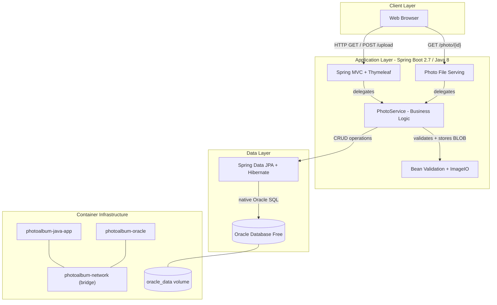
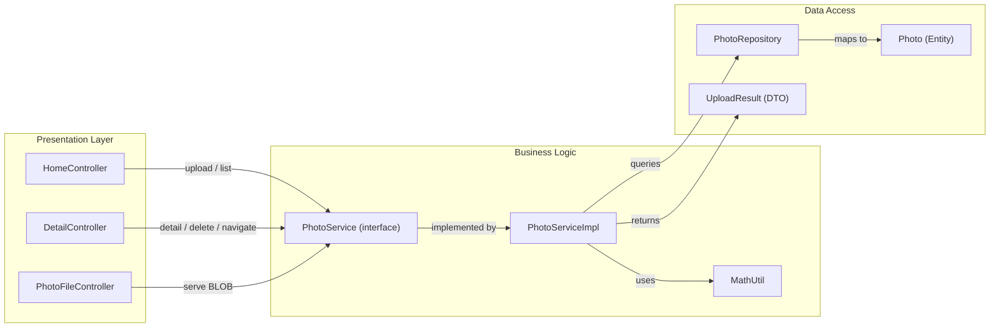

# Architecture Diagram

A Spring Boot 2.7 photo album application using Thymeleaf for server-side rendering, Spring Data JPA for data access, and Oracle Database for persistent photo (BLOB) storage, deployed via Docker Compose.

## Application Architecture

## Component Relationships

