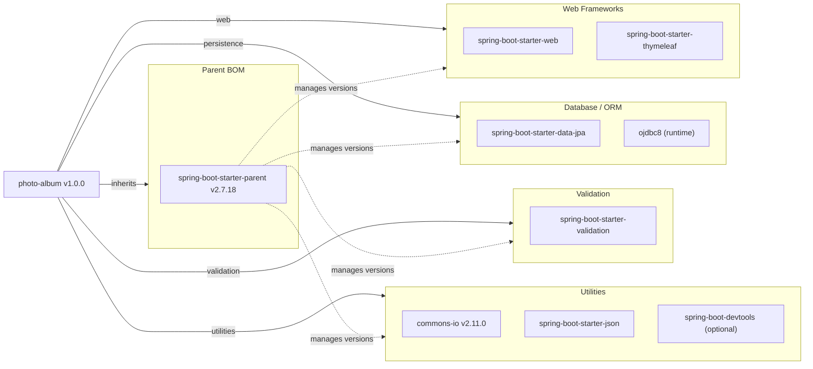

# Dependency Map

The Photo Album application (photo-album v1.0.0) declares 9 non-test external dependencies managed via Spring Boot 2.7.18 parent BOM.

## Dependencies

```mermaid
flowchart LR
    App["photo-album v1.0.0"]

    subgraph BOM["Parent BOM"]
        ParentBOM["spring-boot-starter-parent v2.7.18"]
    end

    subgraph Web["Web Frameworks"]
        StarterWeb["spring-boot-starter-web"]
        Thymeleaf["spring-boot-starter-thymeleaf"]
    end

    subgraph DB["Database / ORM"]
        StarterJPA["spring-boot-starter-data-jpa"]
        OracleDriver["ojdbc8 (runtime)"]
    end

    subgraph Val["Validation"]
        StarterVal["spring-boot-starter-validation"]
    end

    subgraph Util["Utilities"]
        CommonsIO["commons-io v2.11.0"]
        StarterJSON["spring-boot-starter-json"]
        DevTools["spring-boot-devtools (optional)"]
    end

    App -->|"inherits"| BOM
    App -->|"web"| Web
    App -->|"persistence"| DB
    App -->|"validation"| Val
    App -->|"utilities"| Util
    ParentBOM -.->|"manages versions"| Web
    ParentBOM -.->|"manages versions"| DB
    ParentBOM -.->|"manages versions"| Val
    ParentBOM -.->|"manages versions"| Util
```
