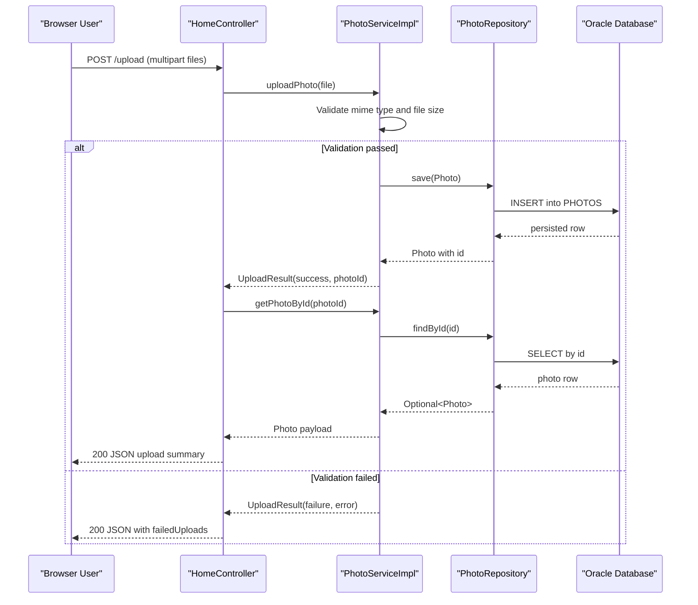

# API & Service Communication Contracts

The application exposes a small HTTP API surface through Spring MVC controllers, combining server-rendered pages and JSON responses for upload workflows. Communication is synchronous and in-process between controllers, service, and repository.

## Service Catalog

| Service | Port | Category | Purpose |
|---|---:|---|---|
| photo-album (single module) | 8080 | API Layer + Business | Hosts UI pages, upload/delete actions, and photo retrieval |
| oracle-db (runtime dependency) | 1521 | Infrastructure | Stores photo metadata and BLOB payloads |

## API Endpoints Inventory

| Service | Method | Path | Request Type | Response Type |
|---|---|---|---|---|
| photo-album / HomeController | GET | `/` | None | Thymeleaf `index` view model with photo list |
| photo-album / HomeController | POST | `/upload` | Multipart form (`files`) | JSON map with `uploadedPhotos` and `failedUploads` |
| photo-album / DetailController | GET | `/detail/{id}` | Path parameter `id` | Thymeleaf `detail` view model |
| photo-album / DetailController | POST | `/detail/{id}/delete` | Path parameter `id` | Redirect response to `/` with flash message |
| photo-album / PhotoFileController | GET | `/photo/{id}` | Path parameter `id` | Binary image `Resource` with MIME type |

## Management & Observability Endpoints

| Service | Endpoint | Custom Metrics (if any) |
|---|---|---|
| photo-album | None explicitly configured (no Actuator routes declared) | None detected |

## DTOs & Contracts

- `Photo` acts as the primary response model for view rendering and JSON upload success payload composition.
- `UploadResult` is a service-level contract object used to communicate upload success/failure and generated photo ID.
- Request contracts are primarily multipart file inputs (`List<MultipartFile>`) and path IDs (`String id`).
- No OpenAPI/Swagger specification, protobuf schema, or GraphQL schema is present.
- Serialization is provided by Spring Boot JSON stack for map/DTO responses.

## Communication Patterns

- **Synchronous patterns:** Controllers call `PhotoService` directly in-process; service calls `PhotoRepository` synchronously through Spring Data JPA.
- **Asynchronous patterns:** None detected (no message broker clients or event-stream integrations found).
- **Resilience patterns:** No explicit circuit breaker/retry libraries detected; controllers use local try/catch and fallback redirects/error responses.
- **Service discovery/gateway:** Not used; single service with direct endpoint exposure.
- **Startup dependency chain:** API availability depends on Oracle connectivity at startup/runtime.
- **Security posture:** No explicit API authentication, authorization annotations, or HTTPS/TLS termination settings were identified in application code/configuration.

## Service Technology Matrix

| Service | Web | Data Access | Discovery | Gateway | Actuator | Cache | Metrics |
|---|---|---|---|---|---|---|---|
| photo-album | Spring MVC + Thymeleaf | Spring Data JPA + native Oracle SQL | None | None | No explicit Actuator endpoints | None detected | None detected |

## Service Communication Sequence

