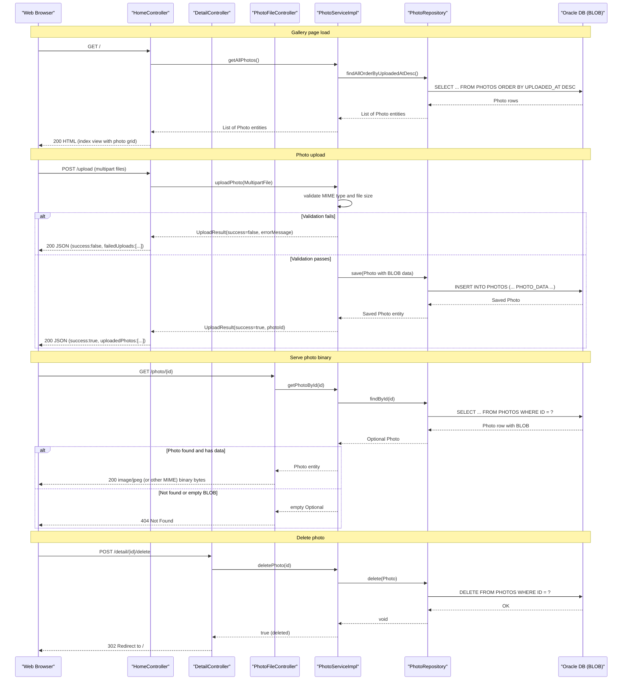

# API & Service Communication Contracts

The application exposes 5 HTTP endpoints across 3 Spring MVC controllers, all served synchronously by a single deployable unit with no inter-service communication or asynchronous messaging.

## Service Catalog

| Service | Port | Category | Purpose |
|---|---|---|---|
| photoalbum-java-app | 8080 | Business | Spring Boot web application — photo gallery, upload, and serving |
| oracle-db (infrastructure) | 1521 | Infrastructure | Oracle Database Free 23ai container; primary data store (third-party image, not source-built) |

## API Endpoints Inventory

| Service | Method | Path | Request Type | Response Type |
|---|---|---|---|---|
| HomeController | GET | / | — | HTML (Thymeleaf `index` view with photo list) |
| HomeController | POST | /upload | Multipart form-data (`files` param, list of `MultipartFile`) | JSON `200 OK` with `uploadedPhotos` / `failedUploads` lists; `400` if no files provided |
| DetailController | GET | /detail/{id} | Path param `id` (String UUID) | HTML (Thymeleaf `detail` view); redirects to `/` if not found |
| DetailController | POST | /detail/{id}/delete | Path param `id` (String UUID) | Redirect to `/` with flash attributes (`successMessage` or `errorMessage`) |
| PhotoFileController | GET | /photo/{id} | Path param `id` (String UUID) | Binary image bytes (`Content-Type` from stored MIME type); `404` if not found; `500` on error |

> Note: No API versioning scheme is in use; all paths are unversioned.

## Management & Observability Endpoints

| Service | Endpoint | Notes |
|---|---|---|
| photoalbum-java-app | None detected | Spring Boot Actuator is not declared as a dependency; no `/actuator/health`, `/actuator/info`, or custom metric endpoints are exposed |

No custom Micrometer metrics, `@Timed` annotations, or health indicators were found in the source code.

## DTOs & Contracts

Two model classes participate in the API contract:

- **`Photo`** (service-level domain entity / response model): Used as the model attribute for Thymeleaf views and as the internal lookup result within JSON upload responses. Full field details are in `data-architecture.md`. Not immutable — standard getter/setter POJO.
- **`UploadResult`** (service-level response DTO): Returned by `PhotoService.uploadPhoto()` and consumed by `HomeController` to construct the JSON upload response body. Carries `success` (boolean), `fileName`, `photoId`, and `errorMessage`. A static factory method (`UploadResult.failure(...)`) provides a read-only construction path for error results, but the class is not immutable overall.

The JSON upload response is an ad-hoc `Map<String, Object>` assembled in `HomeController` rather than a typed DTO class; it contains the keys `success`, `uploadedPhotos` (array of inline maps), and `failedUploads` (array of inline maps).

No OpenAPI/Swagger specification, protobuf schemas, or GraphQL schemas are present. Jackson serialization is managed automatically by Spring Boot's autoconfiguration (`spring-boot-starter-json` / `spring-boot-starter-web`); no custom serializers or `ObjectMapper` configuration were found.

## Communication Patterns

**Synchronous only**: All communication is synchronous HTTP/HTML. There are no message queues, event buses, Kafka topics, or other asynchronous patterns.

**No inter-service REST calls**: The application makes no outbound HTTP calls to other services. The only external I/O is JDBC to Oracle via Spring Data JPA.

**No resilience patterns**: No circuit breaker (Resilience4j, Spring Retry, Polly), retry policy, timeout configuration, or bulkhead pattern is implemented at the application level. Oracle connection pooling and timeout defaults are provided by HikariCP (bundled with Spring Boot), but no application-level resilience is configured.

**No service discovery**: Services communicate via hardcoded hostnames. In Docker Compose the app connects to Oracle using the hostname `oracle-db` (Docker internal DNS); there is no Eureka, Consul, or Kubernetes DNS abstraction.

**Startup dependency chain**: `docker-compose.yml` defines `photoalbum-java-app` with `depends_on: oracle-db: condition: service_healthy`, relying on Oracle's `healthcheck.sh` (30 s interval, 15 retries, 180 s start period). The Spring app will restart on failure (`restart: on-failure`) if Oracle is not yet ready.

**Security posture**: No authentication or authorization is configured at any level. Spring Security is not a declared dependency. All 5 endpoints are publicly accessible with no TLS, no JWT/OAuth2 token validation, and no role-based access control. The photo upload and deletion endpoints (`POST /upload`, `POST /detail/{id}/delete`) are unauthenticated and open to anyone who can reach port 8080.

## Service Technology Matrix

| Service | Web Framework | Data Access | Discovery | Gateway | Actuator/Health | Cache | Metrics |
|---|---|---|---|---|---|---|---|
| photoalbum-java-app | Spring MVC (servlet) | Spring Data JPA / Hibernate + Oracle JDBC | None (hardcoded hostnames) | None | None | None | None |
| oracle-db | N/A (infrastructure) | N/A | N/A | N/A | Docker `healthcheck.sh` | N/A | N/A |

## Service Communication Sequence

