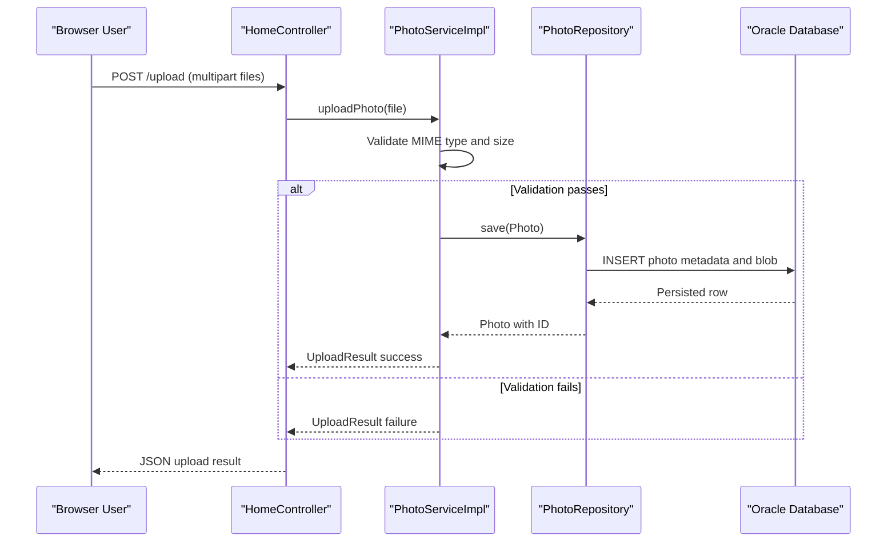

# API & Service Communication Contracts

The application exposes a compact HTTP API surface for gallery rendering, file upload, image retrieval, and photo deletion. Communication is synchronous and in-process within a single deployable service.

## Service Catalog

| Service | Port | Category | Purpose |
|---|---:|---|---|
| photo-album | 8080 | API Layer + Business | Hosts MVC endpoints for gallery, upload, detail view, and image streaming |

## API Endpoints Inventory

| Service | Method | Path | Request Type | Response Type |
|---|---|---|---|---|
| photo-album | GET | `/` | None | HTML view (`index`) with photo list model |
| photo-album | POST | `/upload` | Multipart form field `files` (list of images) | JSON object (`success`, `uploadedPhotos`, `failedUploads`) |
| photo-album | GET | `/detail/{id}` | Path variable `id` | HTML view (`detail`) or redirect |
| photo-album | POST | `/detail/{id}/delete` | Path variable `id` | Redirect to `/` with flash message |
| photo-album | GET | `/photo/{id}` | Path variable `id` | Binary resource (`image/*`) or `404/500` |

## Management & Observability Endpoints

| Service | Endpoint | Custom Metrics (if any) |
|---|---|---|
| photo-album | None detected (no Actuator endpoints configured) | None detected |

## DTOs & Contracts

`Photo` is the core persistence/domain object returned to MVC views and used to drive image retrieval. Upload responses are represented by `UploadResult` and wrapped into controller response maps for success/failure reporting. No OpenAPI document, protobuf schema, or GraphQL schema is present; serialization is handled by Spring Boot Jackson defaults for JSON responses.

## Communication Patterns

All interactions are synchronous: controller handlers call `PhotoService`, which calls `PhotoRepository` and Oracle DB in the same process boundary. There is no message broker, queue, service discovery, API gateway, or circuit breaker/retry policy configured. Security posture is minimal at API contract level: no explicit authentication, authorization annotations, or TLS termination settings are defined in application code.

## Service Technology Matrix

| Service | Web | Data Access | Discovery | Gateway | Actuator | Cache | Metrics |
|---|---|---|---|---|---|---|---|
| photo-album | Spring MVC + Thymeleaf | Spring Data JPA (Oracle) | None | No | No | None | Logging only |

## Service Communication Sequence

