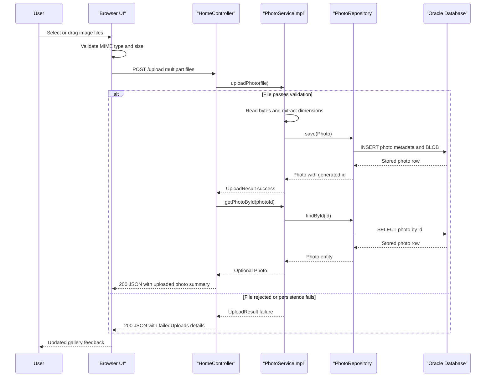

# API & Service Communication Contracts

This application exposes a small HTTP surface made up of five user-facing endpoints. Communication stays inside a single Spring Boot process, with synchronous controller-to-service-to-repository calls and an AJAX upload flow from the browser.

## Service Catalog

| Service | Port | Category | Purpose |
|---|---|---|---|
| photoalbum-java-app | 8080 | API Layer | Serves the gallery UI, accepts uploads, returns photo detail pages, and streams image bytes |
| oracle-db | 1521 | Infrastructure | Stores photo metadata and BLOB content for the application |

## API Endpoints Inventory

| Service | Method | Path | Request Type | Response Type |
|---|---|---|---|---|
| photoalbum-java-app | GET | `/` | None | Thymeleaf `index` view with `photos` model |
| photoalbum-java-app | POST | `/upload` | `multipart/form-data` with `files` list | JSON object containing `success`, `uploadedPhotos`, and `failedUploads` |
| photoalbum-java-app | GET | `/photo/{id}` | Path parameter `id` | Binary image response with MIME type from `Photo.mimeType` |
| photoalbum-java-app | GET | `/detail/{id}` | Path parameter `id` | Thymeleaf `detail` view with `photo`, `previousPhotoId`, and `nextPhotoId` |
| photoalbum-java-app | POST | `/detail/{id}/delete` | Path parameter `id` | Redirect to `/` with flash status message |

## Management & Observability Endpoints

| Service | Endpoint | Custom Metrics (if any) |
|---|---|---|
| photoalbum-java-app | None detected | No actuator or custom metrics endpoints are configured |

## DTOs & Contracts

The public HTTP contract is thin and mostly view-oriented. The upload endpoint returns a JSON payload assembled from `Map<String, Object>` instances, with uploaded photo entries derived from the `Photo` entity and failure entries derived from `UploadResult`. The gallery and detail endpoints are server-rendered contracts backed by Thymeleaf templates rather than typed REST DTO classes, and binary image retrieval is exposed directly from `PhotoFileController` as a raw `Resource` response. JSON serialization is handled by Spring Boot's Jackson support from `spring-boot-starter-json`.

## Communication Patterns

All server-side communication is synchronous: controllers invoke `PhotoServiceImpl`, which then calls `PhotoRepository` for persistence and query operations. The only asynchronous interaction is on the client, where `upload.js` sends a `fetch('/upload')` request and updates the DOM when the response arrives. There is no service discovery, API gateway, retry policy, circuit breaker, message queue, or external API client. Startup order matters in Docker deployments because the application depends on the Oracle container reaching a healthy state first. No authentication, authorization, or TLS configuration is defined in the application code or properties; the endpoints are publicly accessible by default.

## Service Technology Matrix

| Service | Web | Data Access | Discovery | Gateway | Actuator | Cache | Metrics |
|---|---|---|---|---|---|---|---|
| photoalbum-java-app | Spring MVC + Thymeleaf | Spring Data JPA + Hibernate | None | No | No | None | None |
| oracle-db | N/A | Oracle SQL engine | None | No | No | N/A | None |

## Service Communication Sequence

