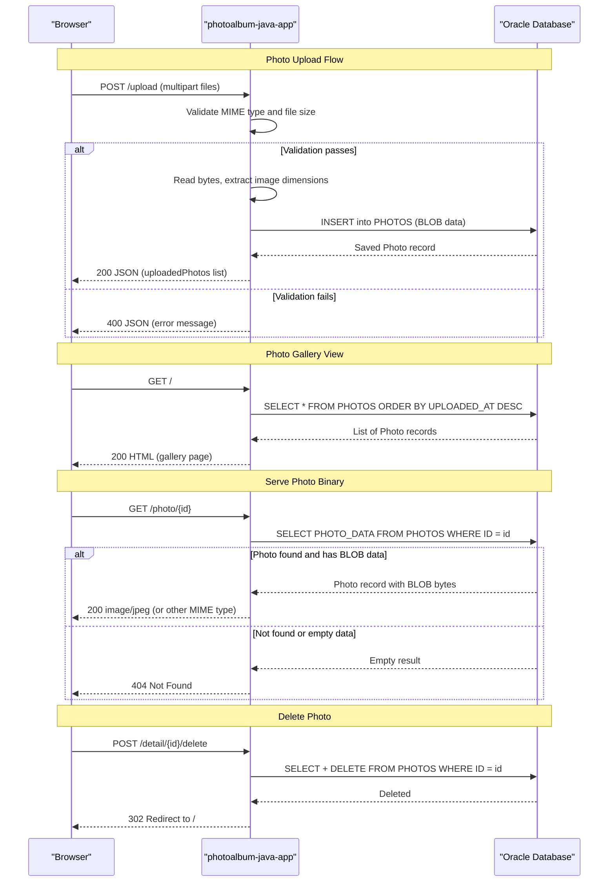

# API & Service Communication Contracts

The application exposes 5 HTTP endpoints across 3 Spring MVC controllers — all synchronous, all unauthenticated — with no API gateway, no service discovery, and no asynchronous messaging.

## Service Catalog

| Service | Port | Category | Purpose | Key Framework |
|---------|------|----------|---------|--------------|
| photoalbum-java-app | 8080 | Business | Photo gallery web application; handles upload, display, file serving, and deletion | Spring Boot 2.7.18, Spring MVC, Thymeleaf |
| oracle-db | 1521 | Infrastructure | Oracle Database Free 23ai — third-party container; primary data store (not source-built) | gvenzl/oracle-free (Docker image) |

## API Endpoints Inventory

| Controller | Method | Path | Request Type | Response Type | Notes |
|------------|--------|------|-------------|---------------|-------|
| HomeController | GET | `/` | — | HTML (Thymeleaf `index` view) | Returns full photo gallery page; 200 on success |
| HomeController | POST | `/upload` | `multipart/form-data` — param `files` (List of MultipartFile) | JSON `Map` (uploadedPhotos, failedUploads) — 200/400 | Returns 400 if no files provided; returns 200 with per-file success/failure details |
| DetailController | GET | `/detail/{id}` | Path param `id` (String UUID) | HTML (Thymeleaf `detail` view) | Redirects to `/` if ID is blank or not found |
| DetailController | POST | `/detail/{id}/delete` | Path param `id` (String UUID) | Redirect 302 to `/` | Flash attributes carry success/error message |
| PhotoFileController | GET | `/photo/{id}` | Path param `id` (String UUID) | Binary image (`ResponseEntity<Resource>`) | Serves raw BLOB bytes from Oracle; Content-Type from stored MIME type; no-cache headers set |

No API versioning scheme (URL path, header, or query parameter) is implemented.

## Management & Observability Endpoints

| Service | Endpoint | Custom Metrics |
|---------|----------|---------------|
| photoalbum-java-app | None — Spring Boot Actuator is not declared | None |

No health check, metrics, info, or Prometheus endpoints are available. The Docker Compose healthcheck uses Oracle's built-in `healthcheck.sh` script on the database container; the application container itself has no readiness or liveness probe.

## DTOs & Contracts

**Service-level classes (all owned by the single monolithic service):**

| Class | Package | API Role | Immutability | Notes |
|-------|---------|----------|-------------|-------|
| `Photo` | `com.photoalbum.model` | Response model: photo metadata surfaced in gallery/detail views and in the upload JSON response (fields extracted into a `Map`) | Mutable (plain POJO with getters/setters) | Also a JPA entity — see `data-architecture.md` for field and persistence details |
| `UploadResult` | `com.photoalbum.model` | Internal transfer object — values are unpacked into a raw `Map<String, Object>` by `HomeController` before being serialized to JSON | Mutable (plain POJO) | Not serialized directly; provides `isSuccess()`, `getPhotoId()`, `getErrorMessage()` |

There are no formal request DTO classes; upload requests are handled via Spring's `MultipartFile` parameter binding directly on the controller method.

**No OpenAPI/Swagger specification, no protobuf schemas, and no GraphQL schema are present.** Jackson (via `spring-boot-starter-json`) is the JSON serializer used for the `/upload` response; Thymeleaf handles HTML view rendering for all other endpoints. No custom Jackson serializers or module registrations are configured.

## Communication Patterns

**Synchronous communication only.** All client-to-application interactions are direct HTTP requests to the Spring MVC application. There is no inter-service REST communication (no `RestTemplate`, `WebClient`, or Feign client); the monolith handles all logic internally.

**Asynchronous messaging:** None. No Kafka, RabbitMQ, Azure Service Bus, or any other message broker is declared or used.

**Resilience patterns:** None. No circuit breaker (Resilience4j, Spring Retry), no timeout configuration beyond the default Tomcat request timeout, and no retry or bulkhead policies are implemented.

**Service discovery:** None. The application connects to Oracle using a hardcoded JDBC URL (`jdbc:oracle:thin:@oracle-db:1521/FREEPDB1`); service resolution relies on Docker Compose bridge networking (DNS alias `oracle-db`), not a service registry.

**API gateway:** None. There is no Spring Cloud Gateway, Nginx reverse proxy, or any gateway layer in front of the application.

**Startup dependency chain:** The Docker Compose definition requires `oracle-db` to pass its health check before `photoalbum-java-app` starts. See `configuration-inventory.md` for full probe and wait mechanism details.

**Security posture:** No authentication, authorization, or transport security is configured at any level. `spring-boot-starter-security` is not declared. All 5 endpoints — including the upload (`POST /upload`) and delete (`POST /detail/{id}/delete`) mutation endpoints — are publicly accessible with no credentials, session, token, or role checks. No HTTPS/TLS is configured; the application listens on plain HTTP port 8080.

## Service Technology Matrix

| Service | Web Framework | Data Access | Discovery | Gateway | Actuator | Cache | Metrics |
|---------|--------------|-------------|-----------|---------|----------|-------|---------|
| photoalbum-java-app | Spring MVC (Servlet/MVC) | Spring Data JPA + Hibernate 5.x | None | None | None | None | None |
| oracle-db | N/A (third-party) | N/A | None | None | Oracle healthcheck.sh | N/A | None |

## Service Communication Sequence

