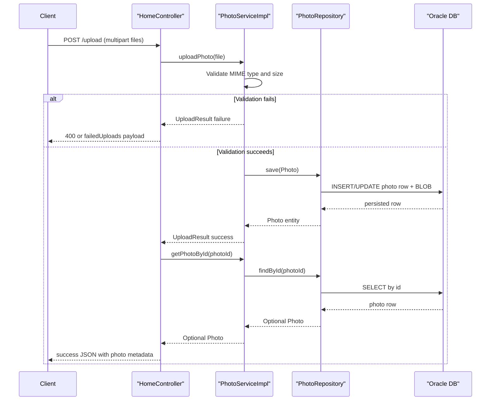

# API & Service Communication Contracts

The application exposes a small HTTP surface for gallery browsing, uploads, detail navigation, and serving binary image payloads. Communication is synchronous in-process calls from MVC controllers to a single service and repository.

## Service Catalog

| Service | Port | Category | Purpose |
|---|---:|---|---|
| photo-album (single module) | 8080 | API Layer + Business | Handles UI rendering, upload processing, and photo retrieval/deletion |
| oracle-db (docker-compose dependency) | 1521 | Infrastructure | Stores photo metadata and BLOB image content |

## API Endpoints Inventory

| Service | Method | Path | Request Type | Response Type |
|---|---|---|---|---|
| HomeController | GET | `/` | None | Thymeleaf `index` view with `photos` model |
| HomeController | POST | `/upload` | `files` multipart form list | JSON map (`success`, `uploadedPhotos`, `failedUploads`) |
| DetailController | GET | `/detail/{id}` | Path param `id` | Thymeleaf `detail` view or redirect |
| DetailController | POST | `/detail/{id}/delete` | Path param `id` | Redirect to `/` with flash message |
| PhotoFileController | GET | `/photo/{id}` | Path param `id` | Binary body (`Resource`) with image media type |

## Management & Observability Endpoints

| Service | Endpoint | Custom Metrics (if any) |
|---|---|---|
| photo-album | No actuator endpoint configuration detected | None detected |

## DTOs & Contracts

Contract objects are lightweight and mostly controller-level:

- `Photo` (domain entity, used as response model for server-rendered views and service return types).
- `UploadResult` (service-level upload result contract used to classify success/failure outcomes).
- Upload responses are assembled as `Map<String, Object>` structures rather than formal typed API DTOs.

No OpenAPI/Swagger spec, protobuf schema, or GraphQL schema was found. Serialization uses Spring Boot defaults (Jackson via `spring-boot-starter-json`).

## Communication Patterns

- **Synchronous:** Browser → MVC controller over HTTP; controller → service → repository via direct method calls.
- **Asynchronous:** None detected (no queue/event infrastructure).
- **Resilience patterns:** No explicit retry, timeout, or circuit-breaker library configuration found.
- **Service discovery / gateway:** Not applicable for this single-service architecture.
- **Startup dependency note:** Application availability depends on Oracle database reachability (especially in Docker profile).
- **Security posture:** No explicit API authentication, authorization annotations, or TLS termination settings were found in the application layer.

## Service Technology Matrix

| Service | Web | Data Access | Discovery | Gateway | Actuator | Cache | Metrics |
|---|---|---|---|---|---|---|---|
| photo-album | Spring MVC + Thymeleaf | Spring Data JPA + Oracle | None | No | No | No explicit app-level cache | No explicit metrics export |

## Service Communication Sequence

