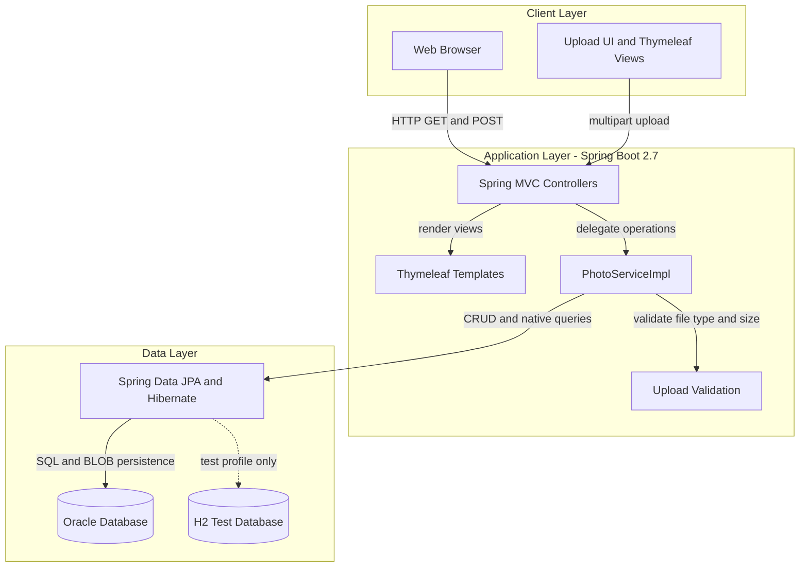
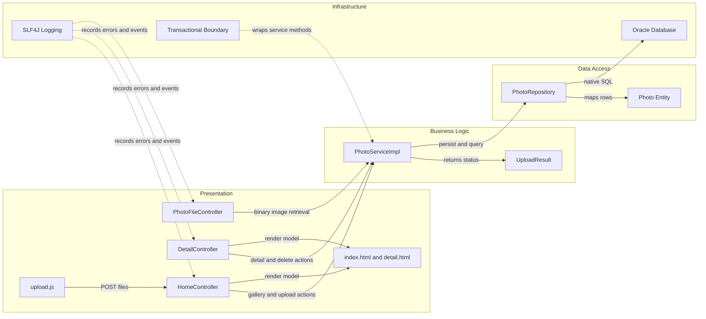

# Architecture Diagram

This document summarizes the Photo Album application's high-level architecture and the main runtime components that participate in photo upload, gallery browsing, and image retrieval.

## Application Architecture

### Technology Stack Summary

| Layer | Technology | Version | Purpose |
|---|---|---|---|
| Presentation | Spring MVC + Thymeleaf + Bootstrap | Spring Boot 2.7.18, Bootstrap 5.3.0 | Server-rendered gallery UI with JavaScript-enhanced uploads |
| Business Logic | Spring Service Layer | Spring Framework 5.3.x via Boot 2.7.18 | Validates uploads, orchestrates storage, and resolves navigation |
| Data Access | Spring Data JPA + Hibernate | Spring Boot managed | Persists photo metadata and BLOB content through a repository abstraction |
| Data Storage | Oracle Database | Container image `gvenzl/oracle-free:latest` | Stores the `PHOTOS` table and binary image data |
| Test Support | H2 in-memory database | Maven test scope | Supports isolated Spring Boot tests without Oracle |
| Packaging | Maven + Docker multi-stage build | Maven 3.9.6 image, Temurin 8 runtime | Builds and packages the application for container deployment |

### Data Storage & External Services

The production application persists all photo metadata and image bytes directly in Oracle, using a single `PHOTOS` table with BLOB storage. There are no outbound third-party APIs or message brokers; the only external runtime dependency is the Oracle database container, while tests switch to an in-memory H2 database.

### Key Architectural Decisions

- Uses a single Spring Boot monolith with server-rendered Thymeleaf pages instead of splitting API and UI tiers.
- Stores uploaded images as Oracle BLOB data, avoiding filesystem dependencies in containerized deployments.
- Keeps navigation and gallery ordering in the service and repository layers through timestamp-based queries.

## Component Relationships

### Component Inventory

| Component | Layer | Type | Responsibility |
|---|---|---|---|
| HomeController | Presentation | MVC Controller | Loads the gallery view and handles multipart uploads |
| DetailController | Presentation | MVC Controller | Displays one photo, resolves previous and next navigation, and deletes photos |
| PhotoFileController | Presentation | MVC Controller | Streams image bytes back to the browser with image content headers |
| upload.js | Presentation | Browser script | Validates client-selected files and submits asynchronous upload requests |
| PhotoServiceImpl | Business Logic | Spring Service | Applies upload rules, extracts metadata, and orchestrates repository access |
| UploadResult | Business Logic | Operation result model | Carries per-file upload success or error outcomes |
| PhotoRepository | Data Access | Spring Data repository | Executes photo queries and Oracle-specific native SQL |
| Photo | Data Access | JPA Entity | Represents stored photo metadata and BLOB payload |
| Oracle Database | Infrastructure | Relational database | Persists the `PHOTOS` table and image BLOBs |
