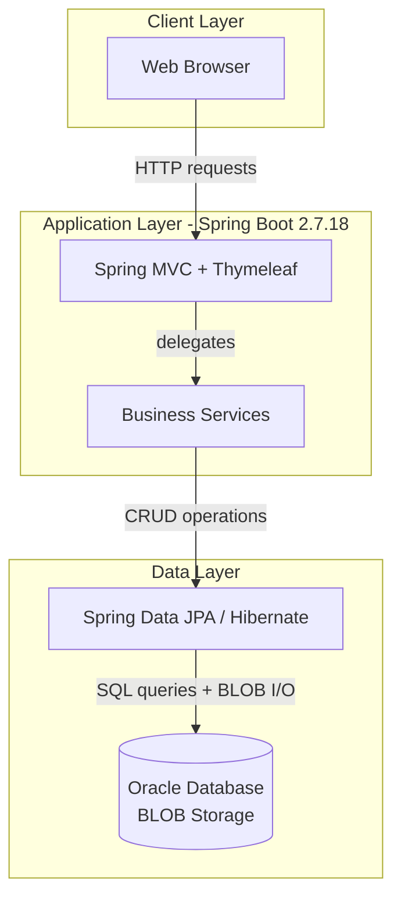
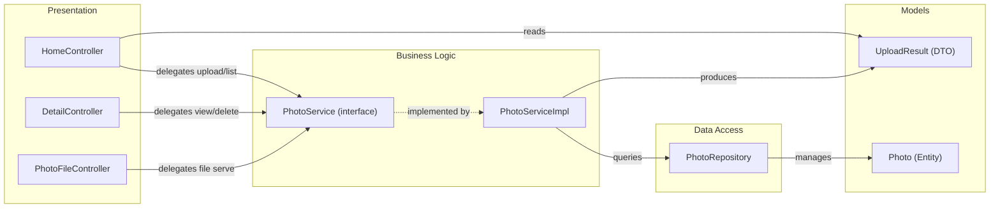

# Architecture Diagram

Photo Album is a monolithic Spring Boot 2.7 web application that stores and serves photos using Oracle Database BLOB storage and Thymeleaf server-side rendering.

## Application Architecture

### Technology Stack Summary

| Layer | Technology | Version | Purpose |
|-------|-----------|---------|---------|
| Presentation | Spring MVC | 2.7.18 (managed) | HTTP request routing and view rendering |
| Presentation | Thymeleaf | 3.0.x (managed) | Server-side HTML templating |
| Business Logic | Spring Boot Service | 2.7.18 | Photo upload, validation, retrieval, deletion |
| Data Access | Spring Data JPA | 2.7.18 (managed) | Repository abstraction for Photo entity |
| Data Access | Hibernate ORM | 5.6.x (managed) | JPA provider / ORM implementation |
| Data Storage | Oracle Database | XE / FREEPDB1 | Primary data store with BLOB photo storage |
| Runtime | Java SE | 8 | Application runtime |
| Build | Maven | 3.x | Dependency management and packaging |

### Data Storage & External Services

The application uses a single Oracle Database instance (`FREEPDB1`) as its only data store. All photo binary data is persisted as BLOB columns directly in the `PHOTOS` table — no external file system or object storage (e.g., S3) is used. The Oracle JDBC driver (`ojdbc8`) is used at runtime; H2 is available as an in-memory alternative for test execution only. There are no external service integrations (no email, no CDN, no message broker, no caching layer).

### Key Architectural Decisions

- **BLOB-in-database storage**: Photo binary data is stored directly in an Oracle BLOB column rather than on a file system or object store, simplifying deployment at the cost of database size growth and potential migration complexity.
- **Native SQL queries**: `PhotoRepository` uses Oracle-specific native SQL (e.g., `ROWNUM`, `TO_CHAR`, `NVL`, analytic functions) rather than JPQL/criteria API, creating a tight vendor dependency on Oracle.
- **Stateless monolith**: All application concerns (upload, gallery, detail view, file serving) are handled by a single deployable JAR with no caching tier, no session store, and no horizontal scaling support.

## Component Relationships

### Component Inventory

| Component | Layer | Type | Responsibility |
|-----------|-------|------|---------------|
| HomeController | Presentation | Spring MVC Controller | Renders gallery index page; handles multi-file upload via POST `/upload` |
| DetailController | Presentation | Spring MVC Controller | Renders single-photo detail page (`/detail/{id}`); handles photo deletion via POST |
| PhotoFileController | Presentation | Spring MVC Controller | Serves raw photo bytes from Oracle BLOB via GET `/photo/{id}` |
| PhotoService | Business Logic | Service Interface | Defines contract for photo CRUD and navigation operations |
| PhotoServiceImpl | Business Logic | Service Implementation | Validates uploads (MIME type, size), reads image dimensions, persists to Oracle, handles deletions and navigation queries |
| PhotoRepository | Data Access | Spring Data JPA Repository | Extends `JpaRepository`; provides native Oracle SQL queries for listing, pagination, navigation, and analytics |
| Photo | Models | JPA Entity | Maps `PHOTOS` table; stores metadata and BLOB binary data |
| UploadResult | Models | DTO | Carries upload success/failure status and photo ID back to the controller |
| MathUtil | Utilities | Utility Class | Provides GCD calculation for aspect-ratio computations |
| PhotoAlbumApplication | Infrastructure | Spring Boot Entry Point | Bootstraps the application context |
