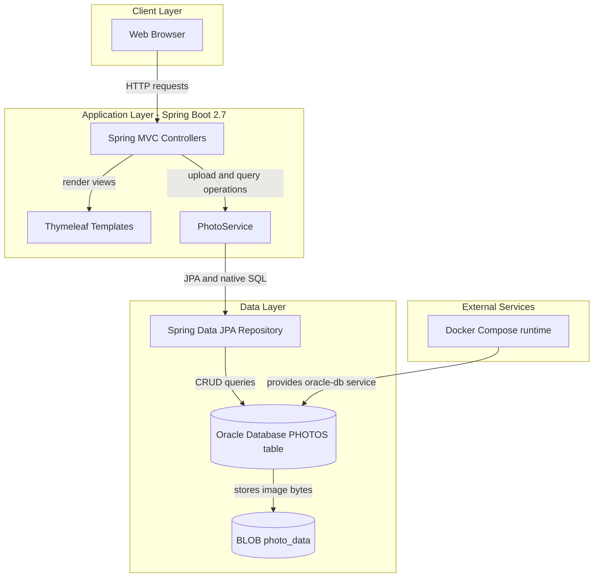
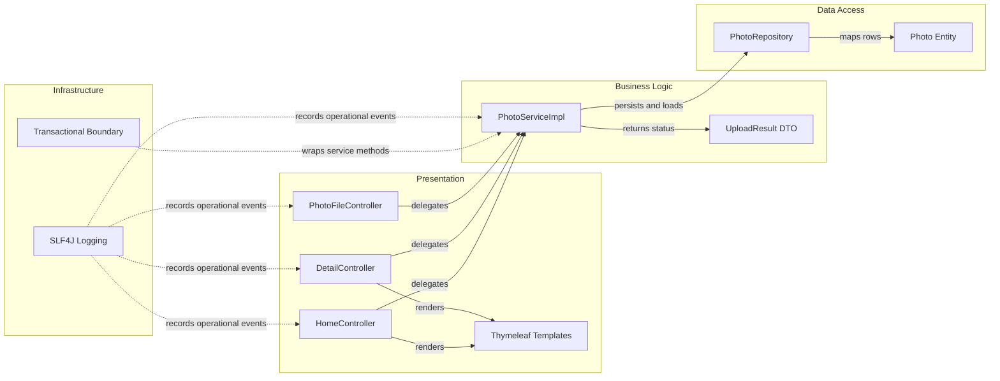

# Architecture Diagram

This document summarizes the Photo Album application's runtime architecture and key component relationships based on the current codebase and deployment configuration.

## Application Architecture



### Technology Stack Summary

| Layer | Technology | Version | Purpose |
|---|---|---|---|
| Presentation | Spring MVC + Thymeleaf | Spring Boot 2.7.18 | Serves gallery/detail pages and upload interaction |
| Business | Spring Service Layer | Spring Framework 5.3.x (via Boot 2.7.18) | Handles upload validation, metadata extraction, and navigation logic |
| Data | Spring Data JPA + Hibernate | Hibernate 5.6.x (via Boot 2.7.18) | Persists and queries photo metadata and BLOB content |
| Database | Oracle Database | Oracle Free (docker image latest) | Primary persistent store for PHOTOS table |
| Runtime | Java | 8 | Application runtime for packaged Spring Boot JAR |

### Data Storage & External Services

The application persists all photo metadata and binary content in Oracle (`PHOTOS` table with `PHOTO_DATA` BLOB). There is no external cache or message broker; the only external dependency is the Oracle container/service provisioned through Docker Compose.

### Key Architectural Decisions

- Uses a layered MVC → Service → Repository pattern with a single deployable Spring Boot service.
- Stores image bytes directly in Oracle BLOB columns rather than local/shared filesystem storage.
- Uses server-rendered Thymeleaf pages for gallery and detail views, with JSON upload responses for asynchronous UI updates.

## Component Relationships



### Component Inventory

| Component | Layer | Type | Responsibility |
|---|---|---|---|
| HomeController | Presentation | MVC Controller | Serves gallery page and multi-file upload API |
| DetailController | Presentation | MVC Controller | Serves detail page and handles delete action |
| PhotoFileController | Presentation | MVC Controller | Streams binary image content by photo ID |
| PhotoServiceImpl | Business Logic | Service | Validates uploads, extracts metadata, orchestrates persistence, and photo navigation |
| UploadResult | Business Logic | DTO | Conveys upload success/failure details to UI/API response |
| PhotoRepository | Data Access | Spring Data Repository | Executes native Oracle queries and CRUD operations |
| Photo | Data Access | JPA Entity | Represents persisted photo metadata and BLOB payload |
```
