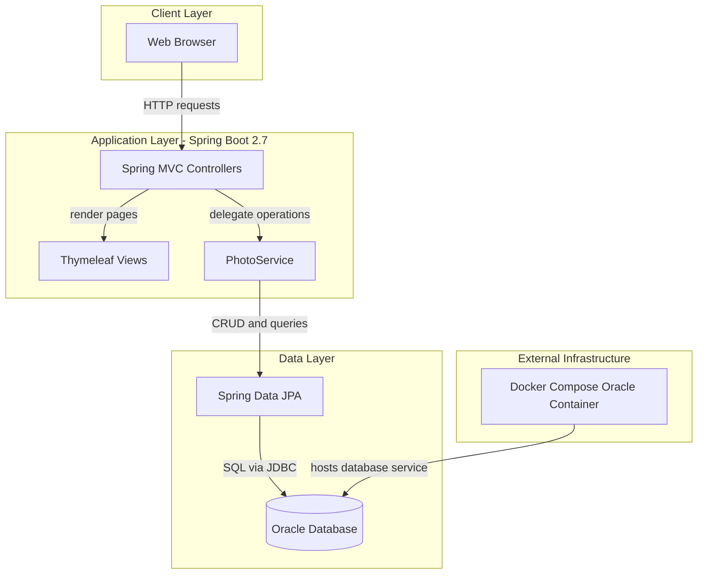
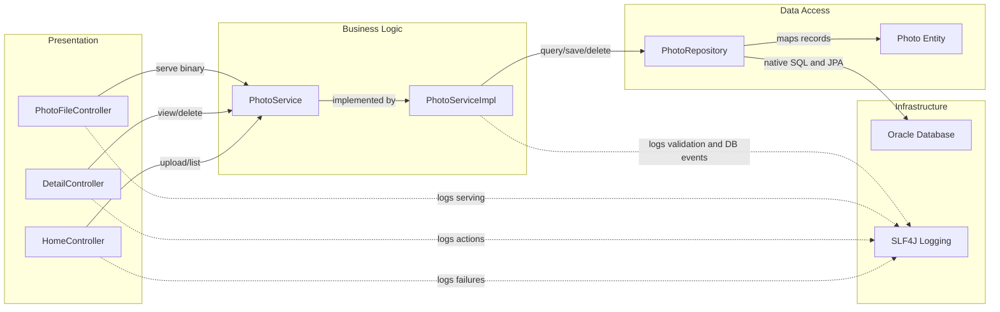

# Architecture Diagram

This application is a single Spring Boot web service that provides photo upload, gallery viewing, and image serving capabilities backed by Oracle Database storage.

## Application Architecture

### Technology Stack Summary

| Layer | Technology | Version | Purpose |
|---|---|---|---|
| Presentation | Spring MVC + Thymeleaf | Spring Boot 2.7.18 | Serve gallery/detail pages and upload interactions |
| Business | PhotoService / PhotoServiceImpl | Project code | Validate uploads and orchestrate persistence |
| Data Access | Spring Data JPA + Hibernate | Via Spring Boot 2.7.18 | Repository abstraction and ORM mapping |
| Database | Oracle Database + ojdbc8 | Runtime driver from Maven BOM | Persist photo metadata and BLOB image data |

### Data Storage & External Services

The application stores image binaries and metadata in a single Oracle table (`photos`) through JPA. No external APIs, message brokers, or cache services are integrated.

### Key Architectural Decisions

- Uses a layered MVC pattern (controllers → service → repository) to isolate web and persistence concerns.
- Stores uploaded image bytes directly in Oracle BLOB columns instead of filesystem/object storage.
- Uses profile-based database configuration (`default` and `docker`) for local/runtime environment switching.

## Component Relationships

### Component Inventory

| Component | Layer | Type | Responsibility |
|---|---|---|---|
| HomeController | Presentation | MVC Controller | Gallery page rendering and multi-file upload endpoint |
| DetailController | Presentation | MVC Controller | Single-photo view navigation and delete action |
| PhotoFileController | Presentation | MVC Controller | Stream image bytes by photo ID |
| PhotoService | Business | Service Interface | Defines upload/query/delete/navigation contracts |
| PhotoServiceImpl | Business | Service Implementation | Enforces upload rules and orchestrates persistence |
| PhotoRepository | Data Access | Spring Data Repository | Executes JPA and native Oracle photo queries |
| Photo | Data Access | JPA Entity | Photo metadata and BLOB payload persistence model |
