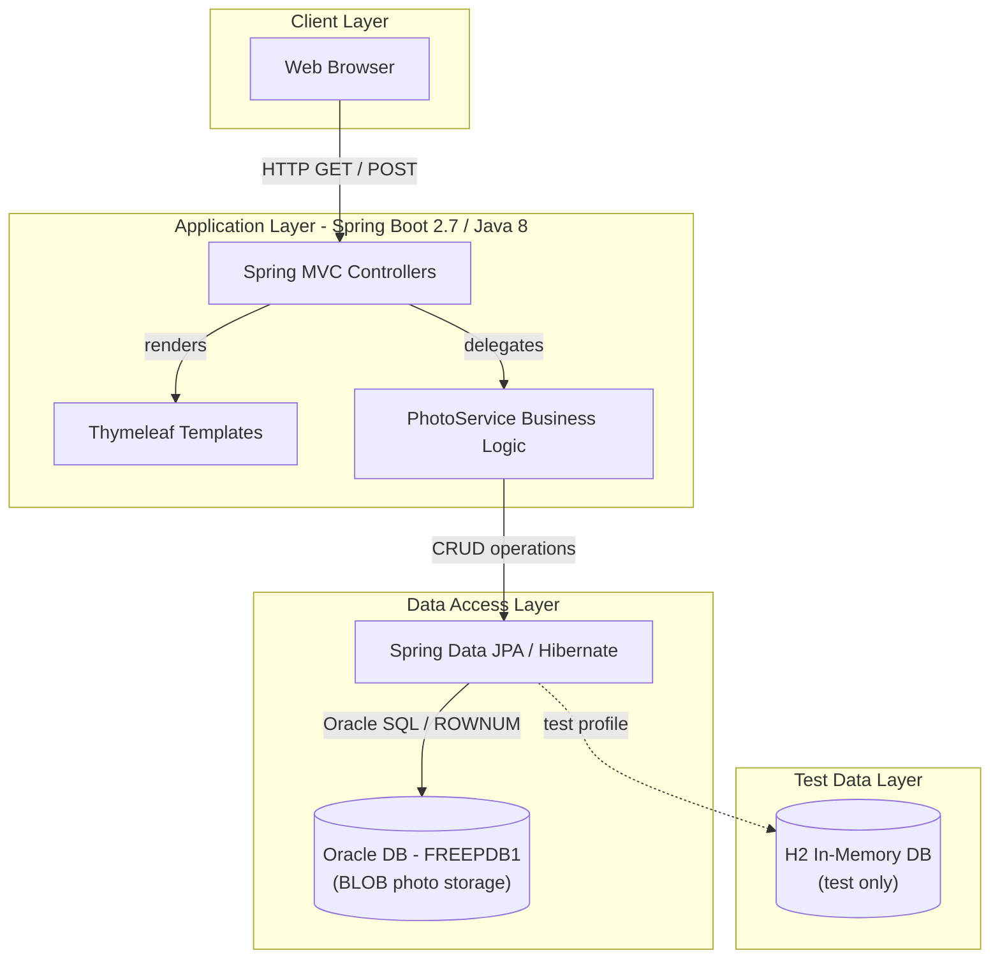
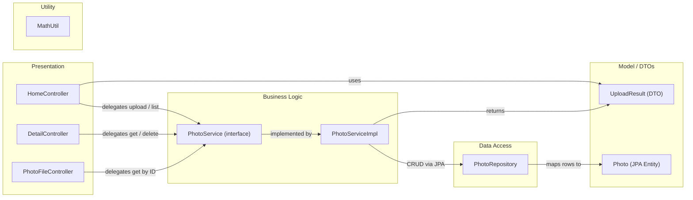

# Architecture Diagram

PhotoAlbum-Java is a Spring Boot 2.7 web application for uploading, viewing, and managing photos, with binary photo data stored as BLOBs in an Oracle database.

## Application Architecture

### Technology Stack Summary

| Layer | Technology | Version | Purpose |
|---|---|---|---|
| Presentation | Spring MVC | 2.7.18 (Boot) | HTTP request handling, REST endpoints |
| Presentation | Thymeleaf | 3.x (Boot managed) | Server-side HTML templating |
| Business Logic | Spring Boot Service | 2.7.18 | Photo upload validation, navigation, deletion |
| Data Access | Spring Data JPA | 2.7.18 (Boot managed) | Repository abstraction over Hibernate ORM |
| Data Access | Hibernate ORM | 5.6.x (Boot managed) | ORM with Oracle dialect |
| Database | Oracle Database XE / Free | FREEPDB1 | Primary data store; photos stored as BLOB |
| Runtime | Java | 8 (1.8) | Application runtime |
| Build | Spring Boot Maven Plugin | 2.7.18 | Packaging as executable JAR |
| Testing | H2 | Boot managed | In-memory database for unit/integration tests |

### Data Storage & External Services

The application uses a single Oracle Database instance (`FREEPDB1`) as its sole data store. Photo binary data (JPEG, PNG, GIF, WebP) is persisted directly as `BLOB` columns in the `PHOTOS` table, eliminating the need for a separate file system or object storage. Metadata (original file name, stored file name, MIME type, file size, dimensions, and upload timestamp) is stored alongside the binary data. There are no external messaging, caching, or third-party API integrations; the application is entirely self-contained beyond the database.

### Key Architectural Decisions

- **BLOB-based photo storage**: Binary image data is stored directly in Oracle rather than on disk or in object storage, simplifying deployment but coupling the app tightly to Oracle-specific SQL (`ROWNUM`, `NVL`, `TO_CHAR`, analytical functions).
- **Single-module, layered Spring Boot application**: Classic Controller → Service → Repository layering with constructor-injection throughout, making dependencies explicit and testable.
- **Dual-profile datasource**: The default profile connects to Oracle; the `test` profile substitutes H2 in-memory, enabling CI tests without a live database.

## Component Relationships

### Component Inventory

| Component | Layer | Type | Responsibility |
|---|---|---|---|
| HomeController | Presentation | Spring MVC Controller | Renders gallery page (GET /), accepts multi-file upload (POST /upload), returns JSON response |
| DetailController | Presentation | Spring MVC Controller | Renders single photo detail page (GET /detail/{id}), handles deletion (POST /detail/{id}/delete) |
| PhotoFileController | Presentation | Spring MVC Controller | Serves raw photo binary data from Oracle BLOB (GET /photo/{id}) with cache-control headers |
| PhotoService | Business Logic | Service Interface | Declares contract: getAllPhotos, getPhotoById, uploadPhoto, deletePhoto, getPreviousPhoto, getNextPhoto |
| PhotoServiceImpl | Business Logic | Service Implementation | Validates MIME type and file size, reads byte array, extracts image dimensions via ImageIO, persists via PhotoRepository |
| PhotoRepository | Data Access | Spring Data JPA Repository | Extends JpaRepository; native Oracle SQL queries for ordered listing, pagination (ROWNUM), navigation, and analytical statistics |
| Photo | Model | JPA Entity | Maps PHOTOS table; holds UUID PK, original/stored filenames, BLOB photo_data, file metadata, and upload timestamp |
| UploadResult | Model | DTO / Value Object | Carries upload operation outcome: success flag, file name, photo ID, or error message |
| MathUtil | Utility | Utility Class | Static GCD calculation (used for aspect-ratio computation in templates) |
