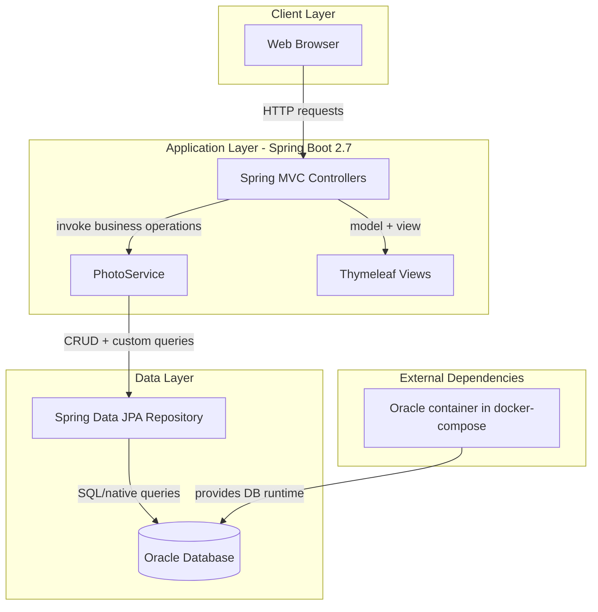
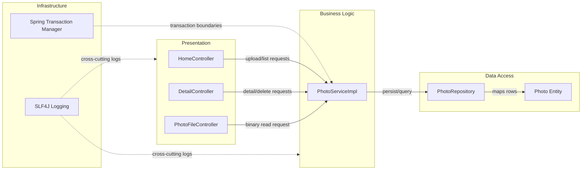

# Architecture Diagram

This application is a single-service Spring Boot photo gallery with server-rendered pages and file upload endpoints. It persists photo metadata and binary data in Oracle using JPA.

## Application Architecture



### Technology Stack Summary

| Layer | Technology | Version | Purpose |
|---|---|---|---|
| Presentation | Spring MVC + Thymeleaf | Spring Boot 2.7.18 | Render gallery and detail pages |
| Business | Spring Service + Transactions | Spring Framework 5.x (via Boot 2.7.18) | Upload validation and photo lifecycle operations |
| Data Access | Spring Data JPA + Hibernate | Spring Data JPA (via Boot 2.7.18) | Persistence and native SQL querying |
| Data Store | Oracle | Oracle Free (docker image) / ojdbc8 runtime | Store photo metadata and BLOB content |

### Data Storage & External Services

The application uses a single Oracle database as the system of record. The `photos` table stores both metadata and binary image data (`@Lob`). No external API or message broker integration is present; the only external runtime dependency is the Oracle database service in Docker Compose.

### Key Architectural Decisions

- Uses a layered monolith (controller → service → repository) with constructor-based dependency injection.
- Stores image bytes directly in Oracle BLOB columns instead of object storage or filesystem paths.
- Uses native Oracle SQL in repository methods for ordering, pagination, and Oracle-specific functions.

## Component Relationships



### Component Inventory

| Component | Layer | Type | Responsibility |
|---|---|---|---|
| HomeController | Presentation | MVC Controller | Gallery page rendering and multi-file upload endpoint |
| DetailController | Presentation | MVC Controller | Single-photo view and delete flow |
| PhotoFileController | Presentation | MVC Controller | Serves stored photo bytes with media type headers |
| PhotoServiceImpl | Business | Spring Service | File validation, metadata extraction, transactional orchestration |
| PhotoRepository | Data Access | Spring Data JPA Repository | Native SQL/JPA CRUD for photo retrieval and navigation |
| Photo | Data Access | JPA Entity | Photo metadata + BLOB payload mapping |
```
