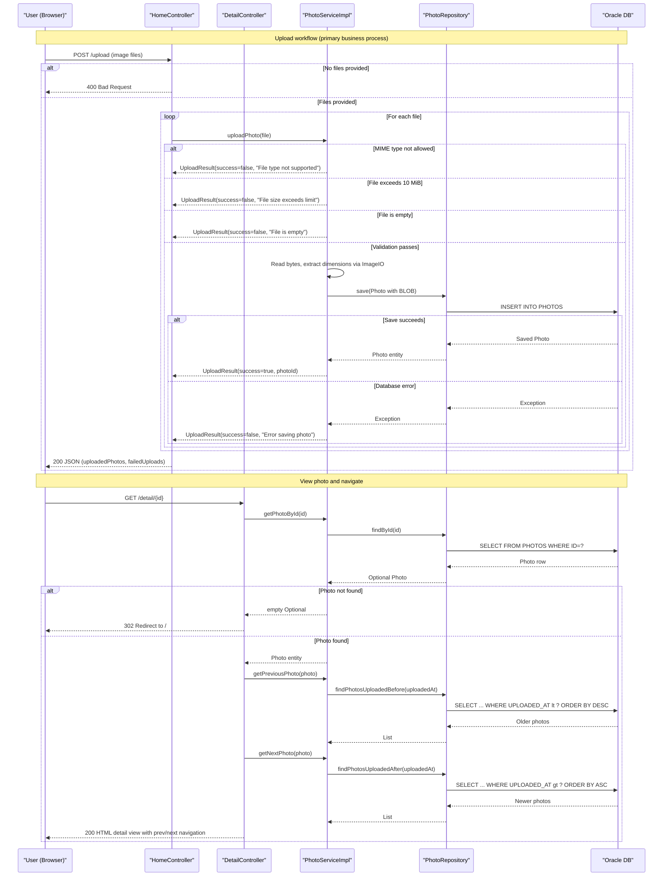

# Core Business Workflows

PhotoAlbum is a personal photo gallery application that lets users upload, browse, view, and delete images stored in a database. All interactions are web-based and unauthenticated.

## Domain Entities

| Entity | Service / Bounded Context | Description | Key Relationships |
|---|---|---|---|
| `Photo` | Photo Management (sole context) | Represents an uploaded image together with its binary data and metadata (file name, size, MIME type, dimensions, upload timestamp) | No relationships to other entities; self-contained aggregate root |

## Service-to-Domain Mapping

| Service | Domain Context | Owned Entities | External Dependencies |
|---|---|---|---|
| `photoalbum-java-app` | Photo Management | `Photo` | Oracle Database (BLOB persistence via Spring Data JPA / Hibernate) |

The application is a single-module monolith. There are no separate micro-services, bounded-context boundaries, or cross-service data flows. All business logic lives in `PhotoServiceImpl`, which is the sole service implementation, and all data access goes through `PhotoRepository`.

## Primary Workflows

### Workflow 1: Browse Photo Gallery

A user navigates to the home page (`GET /`) to see all uploaded photos ordered from newest to oldest.

**Steps:**
1. `HomeController` calls `PhotoService.getAllPhotos()`.
2. `PhotoServiceImpl` delegates to `PhotoRepository.findAllOrderByUploadedAtDesc()`.
3. Repository executes a native Oracle SQL query: all rows from `PHOTOS` table ordered by `UPLOADED_AT DESC`.
4. The controller adds the resulting list and a cache-busting timestamp to the Thymeleaf model.
5. The `index` template renders the gallery grid.

**Error handling**: If the repository throws any exception, the controller catches it, logs the error, and renders the `index` view with an empty photo list rather than propagating an error page.

---

### Workflow 2: Upload One or More Photos

A user selects one or more image files and submits them via the gallery page form (`POST /upload`). The controller processes files individually and returns a JSON response listing successes and failures.

**Steps:**
1. `HomeController` receives the multipart request. If the `files` list is null or empty it returns immediately with HTTP 400.
2. For each file, `PhotoService.uploadPhoto(MultipartFile)` is called:
   a. **MIME-type validation** — the content type must be one of the configured allowed types (`image/jpeg`, `image/png`, `image/gif`, `image/webp`). Rejected files are returned as failures without database access.
   b. **File-size validation** — the file must not exceed the configured maximum (default 10 MiB). Oversized files are returned as failures.
   c. **Empty-file validation** — `file.getSize()` must be greater than zero.
   d. File bytes are read into memory (`file.getBytes()`).
   e. Image dimensions are extracted via `javax.imageio.ImageIO` (optional; failure to parse dimensions does not abort the upload).
   f. A `Photo` entity is constructed with a UUID primary key, the raw binary bytes, a generated stored filename, and all metadata.
   g. The entity is persisted to Oracle via `PhotoRepository.save(photo)`.
3. `HomeController` builds a JSON response containing two arrays: `uploadedPhotos` (successfully persisted photos with id, name, path, size, and dimensions) and `failedUploads` (files that failed validation or persistence, with error messages).
4. The overall `success` flag is `true` if at least one file was persisted successfully.

**Error handling**: If `photoRepository.save()` throws, `PhotoServiceImpl` logs the error, sets `success=false` with a user-facing message, and continues processing remaining files. The transaction wraps each individual save call implicitly.

---

### Workflow 3: View Photo Detail

A user clicks a photo in the gallery to view it full-size with navigation controls (`GET /detail/{id}`).

**Steps:**
1. `DetailController` validates that the path parameter `id` is non-null and non-blank.
2. `PhotoService.getPhotoById(id)` retrieves the `Photo` entity.
3. If no photo is found, the user is redirected to `/`.
4. `PhotoService.getPreviousPhoto(photo)` and `PhotoService.getNextPhoto(photo)` are called to find adjacent photos for navigation arrows.
   - *Previous* (older): `PhotoRepository.findPhotosUploadedBefore(uploadedAt)` — returns up to 10 photos; the first one is selected.
   - *Next* (newer): `PhotoRepository.findPhotosUploadedAfter(uploadedAt)` — returns photos uploaded after; the first one is selected.
5. The `detail` template is rendered with the photo and optional `previousPhotoId` / `nextPhotoId` for navigation links.

**Error handling**: Any exception during retrieval is caught, logged, and results in a redirect to `/`.

---

### Workflow 4: Serve Photo Binary Data

The browser requests the raw image bytes for display in an `` tag or download (`GET /photo/{id}`).

**Steps:**
1. `PhotoFileController` validates the `id` parameter.
2. `PhotoService.getPhotoById(id)` retrieves the entity, including its `PHOTO_DATA` BLOB column.
3. If the photo is not found or `photoData` is null/empty, HTTP 404 is returned.
4. The byte array is wrapped in a `ByteArrayResource` and returned with the stored MIME type and aggressive no-cache headers (`Cache-Control: no-cache, no-store, must-revalidate, private`).

---

### Workflow 5: Delete a Photo

A user deletes a photo from the detail page (`POST /detail/{id}/delete`).

**Steps:**
1. `DetailController` calls `PhotoService.deletePhoto(id)`.
2. `PhotoServiceImpl` calls `photoRepository.findById(id)`. If not found, logs a warning and returns `false`.
3. If found, `photoRepository.delete(photo)` removes the entity and its BLOB from Oracle.
4. `DetailController` adds either a `successMessage` or `errorMessage` as a redirect flash attribute and redirects to `/`.

**Error handling**: Any repository exception is caught, logged, and re-thrown as `RuntimeException`, which propagates to the controller. The controller catches it, adds an error flash message, and redirects to `/`.

## Cross-Service Data Flows

The application has no inter-service communication. All data originates from and is persisted to a single Oracle database accessed by a single service. There is no gateway aggregation, no event-driven composition, and no circuit-breaker fallback path for cross-service scenarios.

## Business Workflow Sequence

## Business Rules & Decision Logic

### Validation Rules (upload)

| Rule | Check | On Failure |
|---|---|---|
| Allowed MIME type | Content type must be one of: `image/jpeg`, `image/png`, `image/gif`, `image/webp` | `UploadResult(success=false, "File type not supported")` — file skipped |
| Maximum file size | `file.getSize()` ≤ 10,485,760 bytes (10 MiB) | `UploadResult(success=false, "File size exceeds NMB limit")` — file skipped |
| Non-empty file | `file.getSize()` > 0 | `UploadResult(success=false, "File is empty")` — file skipped |
| Non-null file list | `files` list is not null or empty | HTTP 400 returned immediately before processing any file |

> Note: The `app.file-upload.max-files-per-upload=10` property is configured but **not enforced** in the current controller or service code. More than 10 files can be submitted in a single request.

### Business Constraints

- **No authentication or ownership**: Any user can view, upload, or delete any photo. There is no concept of user accounts or resource ownership.
- **Destructive schema strategy**: `spring.jpa.hibernate.ddl-auto=create` drops and recreates the `PHOTOS` table on every application restart, permanently deleting all stored photos. This is suitable only for development/demo use.
- **Photo binary stored in database**: Image data is persisted as an Oracle BLOB inside the `PHOTOS` table rather than on a file system or object store. This design limits scalability but simplifies deployment.

### State Transitions

Photos have no lifecycle state machine. The entity exists in a single state from creation until deletion; there are no draft, published, or archived states.

### Transactions

- `PhotoServiceImpl` is class-level `@Transactional`.
- Read operations (`getAllPhotos`, `getPhotoById`, `getPreviousPhoto`, `getNextPhoto`) use `@Transactional(readOnly = true)` for optimized read behaviour.
- `uploadPhoto` and `deletePhoto` operate within a default read-write transaction.
- Each file in a multi-file upload is processed independently; a failure on one file does not roll back successful saves for other files in the same HTTP request (there is no outer transaction wrapping the full batch).

### Error Handling

- Repository exceptions in `getAllPhotos` are caught by `HomeController` and result in an empty photo list (silent degradation).
- Repository exceptions in `getPhotoById`, `getPreviousPhoto`, and `getNextPhoto` are caught by `DetailController` and result in a redirect to `/`.
- `deletePhoto` re-throws exceptions after logging; the controller catches them and adds a user-facing error flash message.
- No dead-letter queues, compensating transactions, or saga patterns are implemented.

### Audit / Logging

- All controllers and `PhotoServiceImpl` use SLF4J/Logback with `DEBUG` level for development and `INFO` level for Docker/production.
- Photo upload success and failure, photo retrieval, and deletion are logged with the photo ID and filename.
- There is no formal audit trail, change history, or event log.

### Authorization

No authorization logic exists anywhere in the codebase. All endpoints are publicly accessible without authentication.
