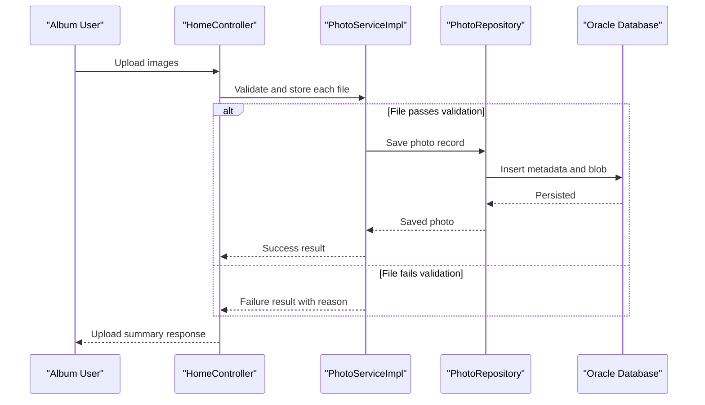

# Core Business Workflows

The application supports a simple photo album domain where users upload images, browse gallery content, view image details, and delete unwanted photos.

## Domain Entities

| Entity | Service / Bounded Context | Description | Key Relationships |
|---|---|---|---|
| Photo | Photo Management | Represents an uploaded image and associated metadata for gallery display | Central entity used by upload, listing, detail, and deletion workflows |
| UploadResult | Photo Management | Captures upload outcome for each submitted file | Returned by upload workflow to classify success/failure |

## Service-to-Domain Mapping

| Service | Domain Context | Owned Entities | External Dependencies |
|---|---|---|---|
| photo-album | Photo Management | Photo, UploadResult | Oracle database |

## Primary Workflows

### Workflow 1: Upload Photos to Album

1. User submits one or more files through the upload form (`POST /upload`).
2. Controller validates request presence and loops through files.
3. Service validates MIME type, file size, and non-empty content.
4. Service reads image bytes, extracts dimensions when possible, and persists a new Photo record.
5. Controller assembles successful and failed upload collections and returns JSON response.

Business rules involved: allowed MIME type whitelist, file size threshold, and non-empty payload requirement.

### Workflow 2: View Photo Detail and Navigate

1. User opens a detail page (`GET /detail/{id}`).
2. Controller loads the requested photo by ID.
3. Service retrieves neighboring photos using upload-time ordering for previous/next navigation.
4. Controller returns detail view or redirects to gallery if photo is missing.

Business rules involved: valid non-empty ID, graceful redirect when record does not exist.

### Workflow 3: Delete Photo

1. User submits deletion request (`POST /detail/{id}/delete`).
2. Service verifies the photo exists.
3. Repository deletes the persisted record.
4. Controller redirects with success or error flash message.

Business rules involved: delete only existing records; return user feedback for missing/failed deletes.

## Cross-Service Data Flows

No multi-service orchestration exists; all workflow operations occur within one service boundary. Data composition happens inside the same application service and repository layer, with no external service fallback path required.

## Business Workflow Sequence

## Business Rules & Decision Logic

- Upload acceptance requires valid MIME type, positive non-zero size, and size within configured maximum.
- Image dimension extraction is best-effort; upload can continue when dimension parsing fails.
- Detail and delete flows require an existing photo ID; missing IDs trigger redirects or not-found outcomes.
- Service methods are transaction-scoped, ensuring repository writes and deletes are atomic per operation.
