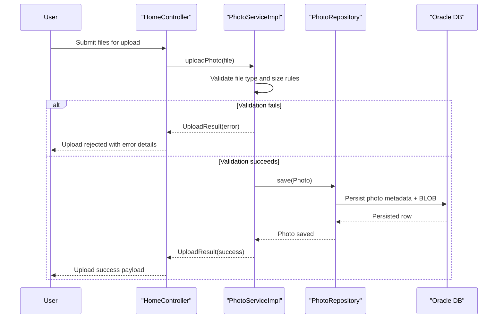

# Core Business Workflows

The application supports a focused photo management workflow: upload photos, browse a gallery, view individual photo detail, and delete photos. Business logic emphasizes upload validation and reliable metadata persistence.

## Domain Entities

| Entity | Service / Bounded Context | Description | Key Relationships |
|---|---|---|---|
| Photo | Photo Management | Core aggregate representing an uploaded image and its metadata | Referenced by gallery, detail, file-serving, and deletion flows |
| UploadResult | Photo Management | Operation result contract for per-file upload success/failure | Produced by service and consumed by upload controller response assembly |

## Service-to-Domain Mapping

| Service | Domain Context | Owned Entities | External Dependencies |
|---|---|---|---|
| HomeController + DetailController + PhotoFileController + PhotoServiceImpl | Photo Management | Photo, UploadResult | Oracle DB via `PhotoRepository` |

## Primary Workflows

### Workflow 1: Upload Photos to Gallery

1. User submits one or more image files to `POST /upload`.
2. Service validates MIME type and size constraints.
3. Service extracts image dimensions and creates `Photo` aggregate values.
4. Repository persists metadata and image bytes.
5. Controller assembles success/failed result lists and returns JSON summary.

### Workflow 2: View and Manage Photo Details

1. User opens `GET /detail/{id}` from the gallery.
2. Service fetches current photo and computes previous/next navigation candidates.
3. User may trigger `POST /detail/{id}/delete`.
4. Service verifies existence and deletes persisted photo record.
5. UI redirects back to gallery with success/failure feedback message.

## Cross-Service Data Flows

There are no multi-service aggregation flows in this codebase. Data flows occur within a single service boundary (controller → service → repository → Oracle). If Oracle is unavailable, user-facing workflows degrade immediately (upload/view/delete cannot complete).

## Business Workflow Sequence

## Business Rules & Decision Logic

- Upload accepts only configured image MIME types and rejects empty/oversized files.
- Successful upload requires both metadata and image byte payload persistence.
- Detail workflow redirects to home when ID is invalid or photo not found.
- Deletion workflow checks entity existence before removal and returns user feedback.
- Transaction boundaries are service-level (`@Transactional` on `PhotoServiceImpl`), with read-only transactions for retrieval operations.
- Business-level authorization rules are not explicitly implemented in controller/service code.
