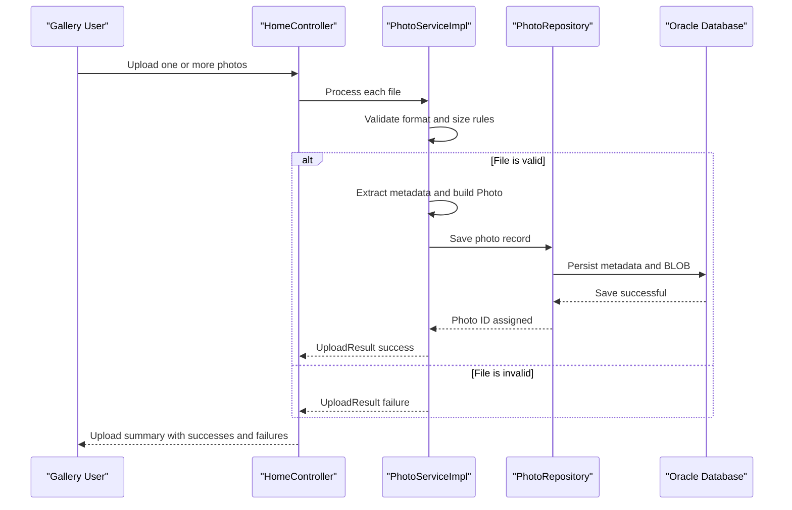

# Core Business Workflows

The application supports a focused photo management domain where users upload, browse, view, and delete photos. Business behavior is centered on validating incoming media, preserving metadata, and serving chronologically navigable gallery content.

## Domain Entities

| Entity | Service / Bounded Context | Description | Key Relationships |
|---|---|---|---|
| Photo | Photo Management | Represents a user-uploaded image plus metadata and binary content | Core aggregate used by upload, gallery, detail, and deletion workflows |
| UploadResult | Photo Management | Conveys success/failure outcome for each attempted file upload | Links upload validation outcomes to UI/API response payloads |

## Service-to-Domain Mapping

| Service | Domain Context | Owned Entities | External Dependencies |
|---|---|---|---|
| photo-album | Photo Management | Photo, UploadResult | Oracle DB via repository layer |

## Primary Workflows

### Workflow 1: Upload Photos to Gallery

1. User submits files through the upload interface (`POST /upload`).
2. Service validates MIME type, size, and non-empty content.
3. Service extracts image metadata (dimensions) and creates a new photo record.
4. Repository persists metadata and BLOB payload.
5. Controller returns structured success/failure details to update gallery state.

### Workflow 2: View Photo Details and Navigate

1. User opens a detail page (`GET /detail/{id}`).
2. Service fetches current photo and computes previous/next photo using upload timestamp ordering.
3. Detail page renders metadata and navigation controls.
4. When image content is requested (`GET /photo/{id}`), binary payload is streamed to client.

### Workflow 3: Delete Photo

1. User triggers delete action (`POST /detail/{id}/delete`).
2. Service verifies record exists.
3. Repository deletes persisted photo data.
4. User is redirected to gallery with status message.

## Cross-Service Data Flows

The project operates as a single service, so data flow is intra-service rather than cross-service. Composition happens within controller/service boundaries: upload responses combine persisted `Photo` data with per-file `UploadResult` status, and detail navigation combines current photo with chronological lookup results. No circuit-breaker fallback or downstream service degradation paths were detected.

## Business Workflow Sequence

## Business Rules & Decision Logic

- Only JPEG/PNG/GIF/WebP file types are accepted for uploads.
- File size must be greater than zero and not exceed configured maximum (10 MB).
- Detail navigation relies on upload timestamp ordering to determine previous/next photo transitions.
- Delete operations require entity existence checks before removal.
- Service methods are wrapped in transactional boundaries, and failures are surfaced with fallback user-facing error messaging.
