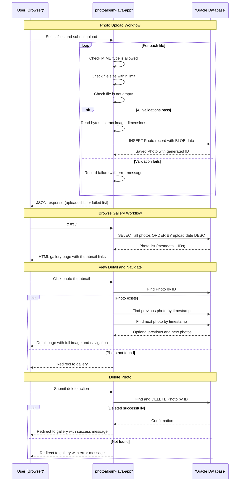

# Core Business Workflows

Photo Album is a personal photo management application that allows users to upload image files, browse them in a gallery, view individual photos with navigation, and delete photos they no longer want.

## Domain Entities

| Entity | Service / Bounded Context | Description | Key Relationships |
|--------|--------------------------|-------------|------------------|
| Photo | Photo Management (sole bounded context) | A digital image uploaded by a user, carrying binary content and descriptive metadata (original name, MIME type, dimensions, file size, and upload timestamp) | Self-contained; no relationships to other entities. Navigation between photos is derived from upload timestamp ordering rather than entity associations. |

## Service-to-Domain Mapping

| Service | Domain Context | Owned Entities | External Dependencies |
|---------|---------------|---------------|----------------------|
| photoalbum-java-app | Photo Management | Photo | Oracle Database (sole data store for all photo data and metadata) |

The application is a single-service monolith with one bounded context. There are no cross-service data exchanges, no event bus, and no shared-database anti-patterns across services.

## Primary Workflows

### Workflow 1: Photo Upload

A user selects one or more image files from their device and submits them. The system processes each file independently and returns a combined result.

**Steps:**
1. User selects one or more files and submits the upload form (via browser JavaScript client).
2. For each submitted file the system checks:
   - **MIME type validation**: file content type must be in the allowed list (JPEG, PNG, GIF, WebP); rejected files return an error immediately.
   - **File size validation**: file must not exceed the configured maximum (default 10 MB); over-size files are rejected.
   - **Empty file check**: zero-byte files are rejected.
3. For files that pass validation, the system reads the full byte array into memory.
4. The system attempts to decode the byte array as an image to extract pixel dimensions (width × height); if decoding fails the upload continues without dimensions.
5. A unique UUID-based storage filename is generated; the full byte array and all metadata are persisted to Oracle as a new `Photo` record.
6. The system returns a JSON response listing all successfully uploaded photos (with their IDs and metadata) and all failed uploads (with per-file error messages).

**Business rules applied:** MIME type whitelist, file size ceiling, non-empty file requirement, UUID identity generation.

---

### Workflow 2: Browse Gallery

A user visits the home page to see all uploaded photos.

**Steps:**
1. User navigates to the gallery root URL.
2. The system retrieves all `Photo` records ordered newest-first by upload timestamp.
3. The gallery page is rendered; each photo is displayed as a thumbnail image loaded directly from the database BLOB via a per-photo URL.
4. If the database query fails, the gallery renders an empty list rather than an error page, preserving a usable UI.

---

### Workflow 3: View Photo Detail and Navigate

A user clicks on a gallery thumbnail to see the full-size photo and navigate to adjacent photos.

**Steps:**
1. User requests the detail page for a specific photo by UUID.
2. The system looks up the `Photo` by ID; if not found or ID is blank, the user is redirected back to the gallery.
3. The system queries for the immediately preceding photo (older by timestamp) and the immediately following photo (newer by timestamp) to populate the navigation arrows.
4. The detail page is rendered showing the full-size image, the original filename, and previous/next navigation links.

---

### Workflow 4: Serve Photo Binary

The browser requests the raw image bytes for display inside an `` tag.

**Steps:**
1. Browser issues a request for a photo binary by UUID.
2. The system retrieves the `Photo` record including its BLOB data.
3. If the record is missing or the BLOB is empty, a 404 is returned.
4. Otherwise, the raw byte array is returned with the stored MIME type as the response content type, and aggressive no-cache headers to prevent stale image display after deletion or re-upload.

---

### Workflow 5: Delete Photo

A user removes a photo from the album.

**Steps:**
1. User submits the delete action from the photo detail page.
2. The system looks up the `Photo` by ID.
3. If found, the record (including its BLOB data) is deleted from Oracle.
4. The user is redirected to the gallery with a success flash message. If the photo was not found, a "not found" flash message is shown instead. If deletion fails due to an exception, an error flash message is shown.

## Cross-Service Data Flows

The application is a single-service monolith; there are no cross-service data flows, gateway aggregation patterns, or circuit-breaker fallback paths involving multiple services. All data originates from and is written to the single Oracle Database instance directly managed by `photoalbum-java-app`.

The only composition that occurs is within the **View Photo Detail** workflow, where the service makes two additional database queries (for the previous and next photo) alongside the primary photo lookup in order to assemble the navigation context — all within the same service and transactional session.

## Business Workflow Sequence



## Business Rules & Decision Logic

### Validation Rules

| Rule | Applies To | Condition | Outcome if Violated |
|------|-----------|-----------|---------------------|
| MIME type whitelist | Upload | Content type must be one of: `image/jpeg`, `image/png`, `image/gif`, `image/webp` | File rejected with "File type not supported" message |
| Maximum file size | Upload | File must not exceed `app.file-upload.max-file-size-bytes` (default 10 MB) | File rejected with size-limit error message |
| Non-empty file | Upload | File byte size must be > 0 | File rejected with "File is empty" message |
| Non-null file list | Upload | Request must contain at least one file | Entire request rejected with 400 Bad Request |
| Valid photo ID | View / Delete | UUID path parameter must be non-blank and must correspond to an existing record | Redirect to gallery |

### Decision Logic

- **Per-file result aggregation**: Each file in a batch upload is processed independently. A partial success response (some files uploaded, some rejected) is valid — the caller receives distinct `uploadedPhotos` and `failedUploads` lists.
- **Image dimension extraction is best-effort**: If the system cannot decode the byte array as an image (e.g., corrupted file that passes MIME check), the upload proceeds without width/height values rather than rejecting the file.
- **Gallery renders empty on error**: If the database query for the gallery fails, the controller catches the exception and renders an empty gallery rather than propagating a 500 error to the user.

### State Transitions

Photos have a simple two-state lifecycle:

```
[Uploaded] ──► [Deleted]
```

There are no intermediate states (no draft, no approval, no archive). A `Photo` record either exists in the database or it does not.

### Transactions

All service methods execute within a Spring `@Transactional` boundary. Read-only operations (gallery listing, photo lookup, navigation queries) use `@Transactional(readOnly = true)`. Write operations (upload save, delete) use the default read-write transaction. There are no distributed transactions, saga patterns, or compensating actions.

### Error Handling

- Upload failures per file are captured and returned in the response rather than aborting the entire batch.
- Detail and delete operations catch all exceptions and redirect to the gallery rather than exposing stack traces.
- No business-specific exception types or dead-letter handling mechanisms are defined.

### Audit / Logging

- Upload success and failure are logged at INFO/WARN level with filename and photo ID.
- Delete success and failure are logged at INFO/ERROR level with photo ID.
- No structured audit trail, change-history table, or event sourcing is implemented.

### Authorization

No authentication or authorisation is implemented. Any user with network access can upload, view, and delete any photo without credentials. See `api-service-contracts.md` for the full security posture.
