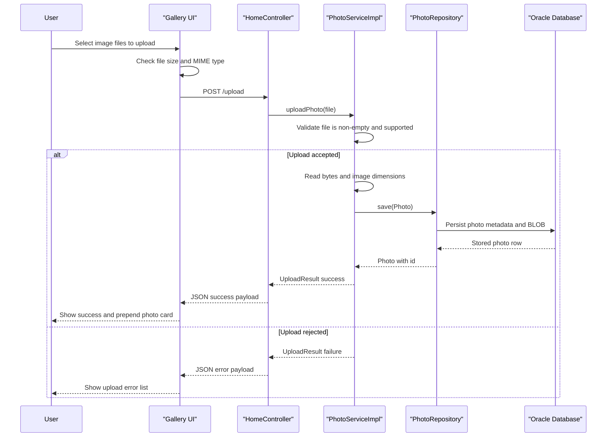

# Core Business Workflows

The Photo Album application helps users upload, browse, inspect, and delete personal photos through a browser-based gallery. Its business behavior centers on managing a single collection of photos and the metadata needed to navigate that collection.

## Domain Entities

| Entity | Service / Bounded Context | Description | Key Relationships |
|---|---|---|---|
| Photo | Photo Management | Represents one user-uploaded image and its metadata for gallery, detail, and deletion scenarios | Central record used by gallery listing, detail lookup, image streaming, and navigation |
| UploadResult | Photo Management | Represents the outcome of processing one uploaded file | Links upload validation and persistence outcomes back to the gallery UI |

## Service-to-Domain Mapping

| Service | Domain Context | Owned Entities | External Dependencies |
|---|---|---|---|
| photoalbum-java-app | Photo Management | Photo, UploadResult | Oracle database, browser clients, Docker runtime profile |

## Primary Workflows

### Workflow 1: Upload Photos

A user selects or drags image files onto the gallery page. The browser performs client-side validation for file type and size before sending a multipart request to `/upload`. `PhotoServiceImpl` repeats the validation on the server, reads the image bytes, optionally extracts width and height, creates a UUID-backed stored filename, and saves the new `Photo` record. The controller then reloads the saved photo so the browser can immediately prepend it to the gallery.

### Workflow 2: Browse Gallery and Photo Detail

The gallery page loads from `/` by requesting all photos ordered by upload timestamp descending. When a user opens `/detail/{id}`, the application loads the selected photo and queries older and newer photos to support previous and next navigation. The detail page also exposes the image metadata that the service collected during upload.

### Workflow 3: Delete Photo

From the detail page, a user submits a delete request to `/detail/{id}/delete`. The service first checks whether the photo exists, then removes the record from Oracle and redirects the user back to the gallery with a success or error flash message.

## Cross-Service Data Flows

There are no cross-service or cross-context data composition flows in this repository because the system is a single deployable Spring Boot application. The only runtime data exchange is between the browser and the monolith, and between the monolith and Oracle. If the database is unavailable, gallery, upload, detail, and delete operations all fail directly because there is no fallback cache or alternative data source.

## Business Workflow Sequence

## Business Rules & Decision Logic

- Only JPEG, PNG, GIF, and WebP files are accepted.
- Individual files must be greater than zero bytes and no larger than 10 MB.
- Every stored photo receives a generated UUID-based filename so the browser can request a unique URL for fresh content.
- Image width and height are captured when the uploaded bytes can be parsed as an image; missing dimensions do not block storage.
- Photo navigation is based on the `uploadedAt` timestamp, with older photos treated as previous and newer photos treated as next.
- Delete operations succeed only when the referenced photo exists; otherwise the user receives a not-found message.
- Transaction boundaries are defined at the service layer, so upload, query, and delete operations run inside Spring-managed transactions.
