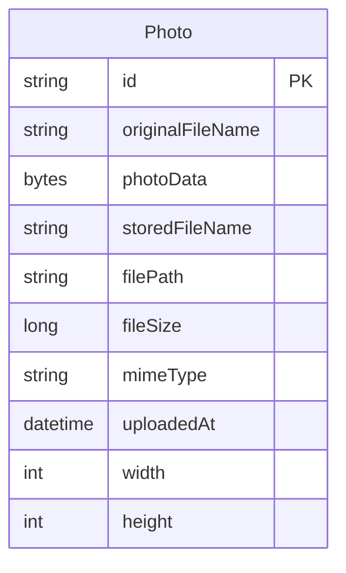

# Data Architecture & Persistence Layer

The data layer is intentionally compact: one JPA entity is persisted to a relational database, and all photo bytes are stored as BLOB content alongside photo metadata. Oracle is the primary runtime database, while tests switch to an H2 in-memory database.

## Database Configuration

| Service/Module | DB Type | Profile | Driver | Connection | Migration Tool |
|---|---|---|---|---|---|
| photo-album | Oracle Database | default | `oracle.jdbc.OracleDriver` | `jdbc:oracle:thin:@oracle-db:1521/FREEPDB1` from `application.properties` | None; Hibernate creates schema at startup |
| photo-album | Oracle Database | docker | `oracle.jdbc.OracleDriver` | `jdbc:oracle:thin:@oracle-db:1521:XE` in `application-docker.properties`, overridden to `FREEPDB1` in Docker Compose env vars | None; Hibernate creates schema at startup |
| photo-album tests | H2 in-memory | test | `org.h2.Driver` | `jdbc:h2:mem:testdb` from `application-test.properties` | None; Hibernate creates and drops schema for tests |

## Data Ownership per Service

| Service | Tables Owned | ORM Framework | Caching | Notes |
|---|---|---|---|---|
| photo-album | `PHOTOS` | Spring Data JPA with Hibernate | None | Single-service ownership; Oracle init scripts provision the database user, and Hibernate manages schema creation |

## Entity Model

## Key Repository Methods

| Service | Repository | Notable Methods | Purpose |
|---|---|---|---|
| photo-album | `PhotoRepository` (`src/main/java/com/photoalbum/repository/PhotoRepository.java`) | `findAllOrderByUploadedAtDesc()` | Returns gallery photos in newest-first order |
| photo-album | `PhotoRepository` | `findPhotosUploadedBefore(LocalDateTime uploadedAt)` | Fetches older photos for previous-photo navigation |
| photo-album | `PhotoRepository` | `findPhotosUploadedAfter(LocalDateTime uploadedAt)` | Fetches newer photos for next-photo navigation |
| photo-album | `PhotoRepository` | `findPhotosByUploadMonth(String year, String month)` | Supports month-based Oracle querying patterns |
| photo-album | `PhotoRepository` | `findPhotosWithPagination(int startRow, int endRow)` | Uses Oracle `ROWNUM` pagination for page-window queries |
| photo-album | `PhotoRepository` | `findPhotosWithStatistics()` | Demonstrates analytical queries with `RANK()` and running totals |

## Caching Strategy

No application-side caching layer is implemented. The service always reads from the repository, and the photo streaming controller actively disables HTTP caching with `Cache-Control`, `Pragma`, and `Expires` headers. The browser upload script instead uses timestamp query parameters to force fresh image fetches after uploads.

## Data Ownership Boundaries

All persistent data is owned by a single Spring Boot service and stored in one relational schema, so there are no cross-service joins, shared-database ownership conflicts, or CQRS patterns to document. The application reads and writes through the same JPA repository, and all business operations use direct database access rather than calling downstream services or integrating with a separate cache.

### Data Classification & Sensitivity

| Entity | Sensitive Fields | Classification (PII/PHI/PCI/None) | Controls in Place |
|---|---|---|---|
| Photo | `originalFileName`, `photoData` | PII | No encryption-at-rest, masking, or field-level access controls are configured in the repository |

The `photoData` BLOB can contain personal images, and filenames can also reveal personal information. Those records should therefore be treated as personal data even though the application does not currently apply explicit protection controls.
