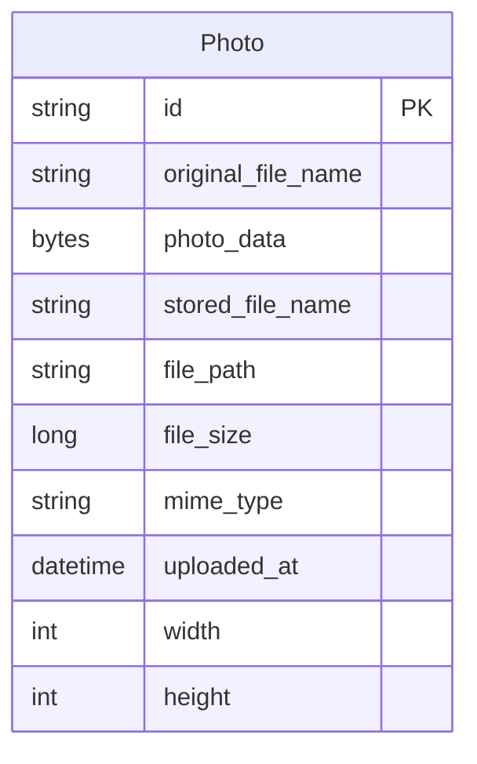

# Data Architecture & Persistence Layer

The persistence layer is centered on a single Oracle-backed photo domain model using Spring Data JPA with native SQL for several read patterns. One main entity stores both metadata and image binary content.

## Database Configuration

| Service/Module | DB Type | Profile | Driver | Connection | Migration Tool |
|---|---|---|---|---|---|
| photo-album | Oracle | default | oracle.jdbc.OracleDriver (`ojdbc8`) | JDBC thin URL targeting `oracle-db:1521/FREEPDB1` | None detected |
| photo-album | Oracle | docker | oracle.jdbc.OracleDriver (`ojdbc8`) | JDBC thin URL targeting `oracle-db:1521:XE` | None detected |
| tests | H2 (in-memory) | test | H2 JDBC | Spring test profile runtime | None detected |

## Data Ownership per Service

| Service | Tables Owned | ORM Framework | Caching | Notes |
|---|---|---|---|---|
| photo-album | `photos` | Spring Data JPA / Hibernate | None detected | Stores image bytes in BLOB column and metadata in same row |

## Entity Model

## Key Repository Methods

| Service | Repository | Notable Methods | Purpose |
|---|---|---|---|
| photo-album | PhotoRepository (`src/main/java/com/photoalbum/repository/PhotoRepository.java`) | `findAllOrderByUploadedAtDesc()` | Gallery listing sorted by latest uploads |
| photo-album | PhotoRepository | `findPhotosUploadedBefore(LocalDateTime)` | Navigation to older images from detail page |
| photo-album | PhotoRepository | `findPhotosUploadedAfter(LocalDateTime)` | Navigation to newer images from detail page |
| photo-album | PhotoRepository | `findPhotosByUploadMonth(String,String)` | Oracle `TO_CHAR`-based month filtering |
| photo-album | PhotoRepository | `findPhotosWithPagination(int,int)` | Oracle `ROWNUM`-based paging query |
| photo-album | PhotoRepository | `findPhotosWithStatistics()` | Oracle analytical ranking and running total query |

## Caching Strategy

No explicit cache provider or cache annotations are configured. Reads are served directly from Oracle through repository queries and transaction-scoped service methods.

## Data Ownership Boundaries

Data ownership is fully centralized in a single service and a single table. There are no cross-service data access patterns, no shared schema between multiple services, and no CQRS split between write/read stores.

### Data Classification & Sensitivity

| Entity | Sensitive Fields | Classification (PII/PHI/PCI/None) | Controls in Place |
|---|---|---|---|
| Photo | `originalFileName`, `photoData` (image content can contain personal information) | PII | No explicit field-level masking/encryption controls in application code |
