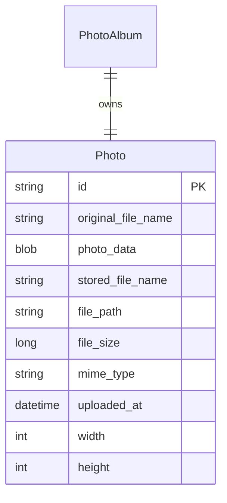

# Data Architecture & Persistence Layer

The data layer is centered on a single Oracle-backed JPA entity for uploaded photos, with Spring Data repository access and native SQL for retrieval patterns. Persistence includes both metadata and binary image payloads.

## Database Configuration

| Service/Module | DB Type | Profile | Driver | Connection | Migration Tool |
|---|---|---|---|---|---|
| photo-album | Oracle | default | `oracle.jdbc.OracleDriver` | JDBC to `oracle-db:1521/FREEPDB1` | None detected |
| photo-album | Oracle | docker | `oracle.jdbc.OracleDriver` | JDBC to `oracle-db:1521:XE` (profile file) | None detected |

## Data Ownership per Service

| Service | Tables Owned | ORM Framework | Caching | Notes |
|---|---|---|---|---|
| photo-album | `PHOTOS` | Spring Data JPA + Hibernate | None detected | Single-service ownership of both metadata and BLOB content |

## Entity Model

## Key Repository Methods

| Service | Repository | Notable Methods | Purpose |
|---|---|---|---|
| photo-album | `PhotoRepository` (`src/main/java/com/photoalbum/repository/PhotoRepository.java`) | `findAllOrderByUploadedAtDesc()` | Retrieves gallery list sorted by newest uploads |
| photo-album | `PhotoRepository` | `findPhotosUploadedBefore(uploadedAt)` | Fetches older photos for detail-page previous navigation |
| photo-album | `PhotoRepository` | `findPhotosUploadedAfter(uploadedAt)` | Fetches newer photos for detail-page next navigation |
| photo-album | `PhotoRepository` | `findPhotosByUploadMonth(year, month)` | Oracle-specific month/year filtering |
| photo-album | `PhotoRepository` | `findPhotosWithPagination(startRow, endRow)` | Oracle-specific paginated retrieval |
| photo-album | `PhotoRepository` | `findPhotosWithStatistics()` | Returns analytics-oriented rows with ranking/running totals |

## Caching Strategy

No dedicated caching provider or cache annotations were detected. Read operations query Oracle directly via repository methods, and binary payloads are returned from persisted BLOB data at request time.

## Data Ownership Boundaries

The application uses a single shared data store and a single service boundary, so ownership is straightforward: the photo service is authoritative for all persisted records. There are no cross-service database access paths, CQRS projections, or event-driven synchronization flows.

### Data Classification & Sensitivity

| Entity | Sensitive Fields | Classification (PII/PHI/PCI/None) | Controls in Place |
|---|---|---|---|
| Photo | `originalFileName`, `photoData` (potentially sensitive image content) | PII (possible, user-provided media/filenames) | No explicit field masking or encryption-at-rest configuration in application code |

