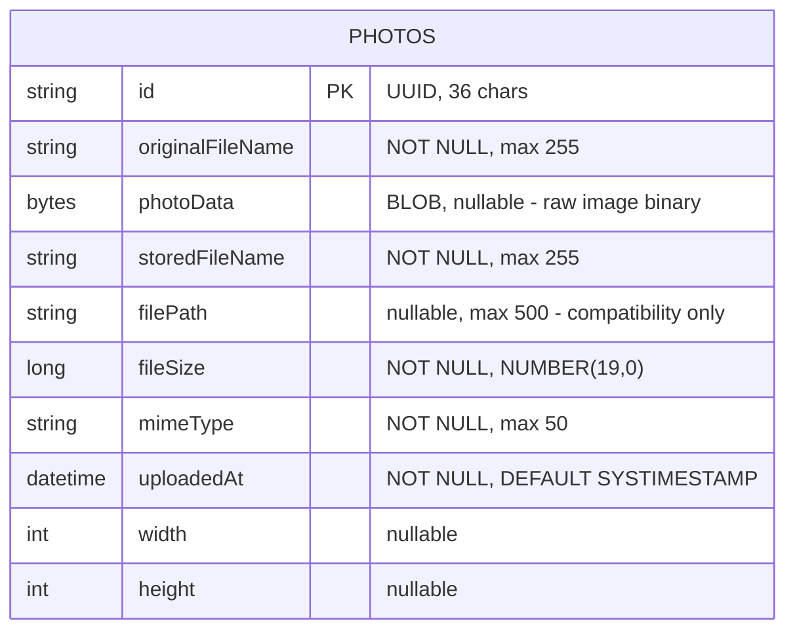

# Data Architecture & Persistence Layer

The application manages a single JPA entity (`Photo`) persisted via Hibernate to an Oracle database, with an H2 in-memory substitute used exclusively in the test profile; no caching layer or schema migration tool is in use.

## Database Configuration

| Service / Module | DB Type | Profile | Driver | Connection / Behavior | Migration Tool |
|---|---|---|---|---|---|
| photoalbum-java-app | Oracle Database Free (FREEPDB1) | default | `oracle.jdbc.OracleDriver` (ojdbc8) | Connects to `oracle-db:1521/FREEPDB1`; Hibernate auto-creates schema on every startup (`ddl-auto=create`); HikariCP default pool | None (DDL auto-generation only) |
| photoalbum-java-app | Oracle Database XE | docker | `oracle.jdbc.OracleDriver` (ojdbc8) | Connects to `oracle-db:1521:XE`; same Hibernate `create` strategy | None |
| photoalbum-java-app | H2 In-Memory (`testdb`) | test | `org.h2.Driver` | In-memory; Hibernate `create-drop` (schema created on start, dropped on shutdown) | None |

Schema initialisation relies entirely on Hibernate DDL auto-generation (`create`). No Flyway, Liquibase, or SQL migration scripts are used for the application schema. Database user creation for Oracle is handled by container-init SQL scripts (`oracle-init/01-create-user.sql`) that run when the Oracle Docker container first starts; these scripts are not a migration tool and do not version the schema.

> For raw property key-value pairs per profile, see `configuration-inventory.md`.

## Data Ownership per Service

| Service | Tables Owned | ORM Framework | Caching | Notes |
|---|---|---|---|---|
| photoalbum-java-app | `PHOTOS` | Hibernate 5.6.x via Spring Data JPA | None | Single-module monolith; no shared or cross-service data access. BLOB column `PHOTO_DATA` stores raw image bytes. Index `idx_photos_uploaded_at` on `UPLOADED_AT` supports ordered listing and navigation queries. |

## Entity Model

> The application has a single entity. No inter-entity relationships exist.

**Transaction management**: `PhotoServiceImpl` is annotated `@Transactional` at class level. Read operations (`getAllPhotos`, `getPhotoById`, `getPreviousPhoto`, `getNextPhoto`) override with `@Transactional(readOnly = true)`. Write operations (`uploadPhoto`, `deletePhoto`) participate in the default read-write transaction.

## Key Repository Methods

| Repository | Entity | Method | Query Mechanism | Purpose |
|---|---|---|---|---|
| `PhotoRepository` | `Photo` | `findAllOrderByUploadedAtDesc()` | Native Oracle SQL — `SELECT ... FROM PHOTOS ORDER BY UPLOADED_AT DESC` | Retrieve all photos newest-first for gallery display |
| `PhotoRepository` | `Photo` | `findPhotosUploadedBefore(LocalDateTime uploadedAt)` | Native Oracle SQL with `ROWNUM <= 10` | Fetch up to 10 older photos for backward navigation |
| `PhotoRepository` | `Photo` | `findPhotosUploadedAfter(LocalDateTime uploadedAt)` | Native Oracle SQL with `NVL(FILE_PATH, 'default_path')` | Fetch newer photos for forward navigation; uses Oracle `NVL` |
| `PhotoRepository` | `Photo` | `findPhotosByUploadMonth(String year, String month)` | Native Oracle SQL with `TO_CHAR(UPLOADED_AT, 'YYYY')` | Filter photos by year/month using Oracle `TO_CHAR` |
| `PhotoRepository` | `Photo` | `findPhotosWithPagination(int startRow, int endRow)` | Native Oracle SQL with nested `ROWNUM` | Oracle-specific keyset pagination using `ROWNUM` wrapper |
| `PhotoRepository` | `Photo` | `findPhotosWithStatistics()` | Native Oracle SQL with `RANK() OVER (...)` and `SUM(...) OVER (...)` | Returns `Object[]` with analytical window-function results; not currently called by any service method |

> Standard inherited CRUD methods (`findById`, `save`, `delete`) from `JpaRepository<Photo, String>` are also used directly by `PhotoServiceImpl`.

**Note**: All custom queries use Oracle-specific syntax (`ROWNUM`, `NVL`, `TO_CHAR`, analytical window functions). These queries are not portable to other databases and are not exercised by the H2-based test suite.

## Caching Strategy

No caching layer is configured. There are no Spring Cache annotations (`@Cacheable`, `@CacheEvict`), no Hibernate second-level cache provider, and no Redis, EhCache, or Caffeine dependency declared in `pom.xml`. Every photo retrieval request results in a direct database query to Oracle.

## Data Ownership Boundaries

The application is a single-module monolith owning a single database schema (`PHOTOALBUM` user in Oracle / `testdb` in H2). There is no micro-service split, no shared database pattern, and no cross-service data access of any kind. All reads and writes go through `PhotoServiceImpl` → `PhotoRepository` → Oracle.

The database schema is wholly managed by Hibernate DDL auto-generation (`create`), which drops and recreates the `PHOTOS` table on every application start. This means **all photo data is destroyed on every restart** — a significant operational risk for any persistent deployment.

The `findPhotosWithStatistics()` repository method (returning `Object[]` with Oracle analytical function results) is defined but never invoked by any current service or controller, suggesting an incomplete or abandoned feature.

### Data Classification & Sensitivity

| Entity | Sensitive Fields | Classification | Controls in Place |
|---|---|---|---|
| `Photo` | None — stores image binaries and file metadata only (filename, size, MIME type, dimensions, upload timestamp) | None (no PII, PHI, or PCI data) | N/A |

No personally identifiable information (PII), protected health information (PHI), or payment card data (PCI) is stored in the entity model. The application does not collect user accounts, names, addresses, or any other identity-linked data. Image binary content (BLOB) is stored without encryption at rest; if user-uploaded photos could contain sensitive imagery, at-rest encryption at the database or storage layer should be considered for production deployments.
