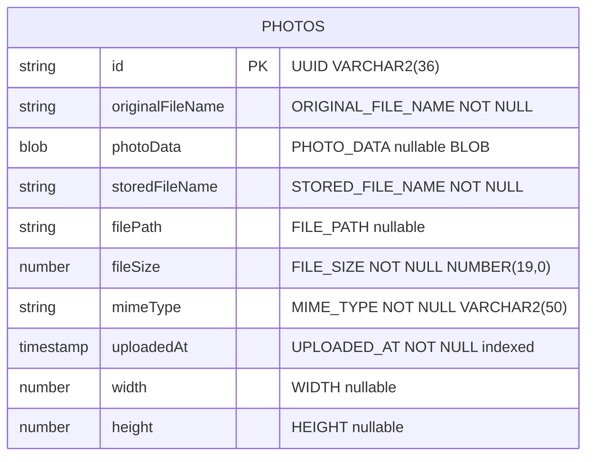

# Data Architecture & Persistence Layer

The application has a single JPA entity (`Photo`) backed by an Oracle Database, with no inter-entity relationships; all binary photo data is persisted as an Oracle BLOB column and retrieved via Hibernate 5.x / Spring Data JPA.

## Database Configuration

| Service/Module | DB Type | Profile | Driver | Connection Behavior | Migration Tool |
|---------------|---------|---------|--------|--------------------|----|
| photoalbum-java-app | Oracle Database (FREEPDB1) | default (local dev) | ojdbc8 (runtime, BOM-managed) | HikariCP connection pool (Spring Boot default); connects to `oracle-db:1521/FREEPDB1` | None — Hibernate `ddl-auto=create` drops and recreates the schema on each startup |
| photoalbum-java-app | Oracle Database (FREEPDB1) | docker | ojdbc8 (runtime, BOM-managed) | Same as default; JDBC URL and credentials supplied via Docker Compose environment variables | None — Hibernate `ddl-auto=create` |
| photoalbum-java-app (tests) | H2 (in-memory) | test | H2 (test-scoped BOM-managed) | In-memory JDBC; used by JUnit tests to substitute Oracle | None — Hibernate auto-creates schema from entity metadata |

No Flyway, Liquibase, or any versioned migration tool is in use. Schema management is fully delegated to Hibernate's DDL generation with `create` strategy, meaning **every application restart drops and recreates all tables**. The `oracle-init/` directory contains user provisioning scripts (`01-create-user.sql`, `02-verify-user.sql`) run by the Oracle container on first launch — these grant privileges to the `photoalbum` schema user but do not define the `PHOTOS` table (Hibernate does this). No `data.sql`, `import.sql`, or programmatic seed data files are present.

## Data Ownership per Service

| Service | Tables Owned | ORM Framework | Caching | Notes |
|---------|-------------|--------------|---------|-------|
| photoalbum-java-app | PHOTOS | Hibernate 5.6.x via Spring Data JPA | None | Single-table schema; BLOB column stores full photo binary data; non-CRUD queries use Oracle-specific native SQL |

## Entity Model

The `Photo` entity is the sole JPA entity in the application. It is a flat, self-contained entity with no relationships to other entities (no `@OneToMany`, `@ManyToOne`, or join columns). Navigation between photos (previous/next) is implemented at the repository query level using timestamp comparisons rather than entity associations.

**Transaction management:** `PhotoServiceImpl` is annotated `@Transactional` at the class level, with individual read methods overriding to `@Transactional(readOnly = true)`. There are no nested transactions, no `@Transactional` propagation customisations, and no distributed transaction (XA) configuration.

**Entity source file:** `src/main/java/com/photoalbum/model/Photo.java`

## Key Repository Methods

| Repository | Entity | Method | Return Type | Purpose |
|-----------|--------|--------|------------|---------|
| `PhotoRepository` | `Photo` | `findAllOrderByUploadedAtDesc()` | `List<Photo>` | Full table scan ordered descending by `UPLOADED_AT`; used for the gallery index page |
| `PhotoRepository` | `Photo` | `findPhotosUploadedBefore(LocalDateTime uploadedAt)` | `List<Photo>` | Oracle native query with `ROWNUM <= 10`; retrieves up to 10 photos older than the given timestamp for backward navigation |
| `PhotoRepository` | `Photo` | `findPhotosUploadedAfter(LocalDateTime uploadedAt)` | `List<Photo>` | Oracle native query; retrieves photos newer than the given timestamp ordered ascending for forward navigation |
| `PhotoRepository` | `Photo` | `findPhotosByUploadMonth(String year, String month)` | `List<Photo>` | Oracle-specific `TO_CHAR(UPLOADED_AT, 'YYYY'/'MM')` filter; enables month-based browsing |
| `PhotoRepository` | `Photo` | `findPhotosWithPagination(int startRow, int endRow)` | `List<Photo>` | Oracle `ROWNUM`-based offset pagination (nested subquery pattern) |
| `PhotoRepository` | `Photo` | `findPhotosWithStatistics()` | `List<Object[]>` | Oracle analytic functions: `RANK() OVER (ORDER BY FILE_SIZE DESC)` and `SUM(FILE_SIZE) OVER (...)` running total |

**Repository source file:** `src/main/java/com/photoalbum/repository/PhotoRepository.java`

All custom methods use Oracle-specific native SQL (`nativeQuery = true`). Standard inherited CRUD methods (`save`, `findById`, `delete`) are also used by the service layer. The heavy reliance on native queries with Oracle-specific syntax (`ROWNUM`, `TO_CHAR`, `NVL`, analytical functions) makes this repository non-portable without query rewrites.

## Caching Strategy

No caching layer is configured. There are no `@Cacheable`, `@CacheEvict`, or `@EnableCaching` annotations in the codebase, no Spring Cache abstraction in use, and no second-level Hibernate cache configured. Every photo listing, detail view, and BLOB retrieval results in a direct database round-trip. Given that photo BLOB data can be up to 10 MB per file, the absence of any response-level or query-result cache represents a significant I/O concern under concurrent load.

## Data Ownership Boundaries

The application is a single-service monolith with one Oracle database instance. There is only one data store and one service accessing it — there are no cross-service data access patterns, no shared-database anti-patterns across services, and no CQRS separation. The `PHOTOS` table is the sole data store for all reads and writes performed by `photoalbum-java-app`.

Read/write split is minimal: read operations use `@Transactional(readOnly = true)` on the service methods, which hints HikariCP to use a read connection, but there is no read replica, no event sourcing, and no separate read model.

### Data Classification & Sensitivity

| Entity | Fields | Classification | Controls in Place |
|--------|--------|---------------|------------------|
| Photo | `originalFileName` | Low — filename string provided by the uploader; may contain user-identifiable naming patterns | None |
| Photo | `photoData` (BLOB) | Potentially sensitive — binary image content may include faces, personal scenes, or metadata embedded in image files (EXIF) | None — no encryption-at-rest, no EXIF stripping, no content scanning |
| Photo | `storedFileName`, `filePath`, `mimeType`, `fileSize`, `width`, `height`, `uploadedAt` | Non-sensitive operational metadata | None required |

No explicit PII fields (names, email addresses, phone numbers), PHI, or PCI data are declared in the entity model. However, the `photoData` BLOB stores raw uploaded image files, which may contain embedded EXIF metadata (GPS coordinates, device identifiers, author names) or personally identifiable visual content. No EXIF stripping, content moderation, or encryption-at-rest is implemented. The database password is stored in plain text in `application.properties` and Docker Compose environment variables; see `configuration-inventory.md` for secrets configuration details.
