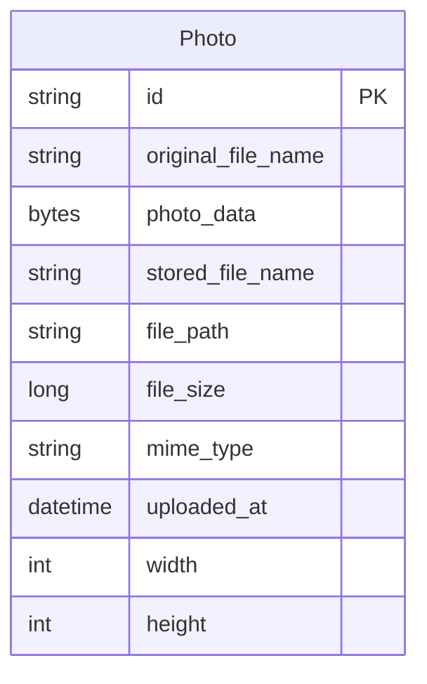

# Data Architecture & Persistence Layer

The data layer is centered on a single JPA entity (`Photo`) persisted in Oracle, including binary image content as BLOB. Persistence logic is implemented with Spring Data JPA plus native Oracle SQL queries.

## Database Configuration

| Service/Module | DB Type | Profile | Driver | Connection | Migration Tool |
|---|---|---|---|---|---|
| photo-album | Oracle | default | `oracle.jdbc.OracleDriver` (`ojdbc8`) | JDBC Thin URL to `oracle-db:1521/FREEPDB1` | None detected |
| photo-album | Oracle | docker | `oracle.jdbc.OracleDriver` (`ojdbc8`) | JDBC Thin URL to `oracle-db:1521:XE` | None detected |
| tests | H2 | test scope dependency | H2 driver (test-only) | In-memory (framework-managed in tests) | None detected |

## Data Ownership per Service

| Service | Tables Owned | ORM Framework | Caching | Notes |
|---|---|---|---|---|
| photo-album | `PHOTOS` | Spring Data JPA / Hibernate | No explicit cache provider configured | Single bounded context, single persistence unit |

## Entity Model

## Key Repository Methods

| Service | Repository | Notable Methods | Purpose |
|---|---|---|---|
| photo-album | `PhotoRepository` | `findAllOrderByUploadedAtDesc()` | Gallery listing ordered by newest uploads |
| photo-album | `PhotoRepository` | `findPhotosUploadedBefore(LocalDateTime)` | Navigate to previous photo in detail view |
| photo-album | `PhotoRepository` | `findPhotosUploadedAfter(LocalDateTime)` | Navigate to next photo in detail view |
| photo-album | `PhotoRepository` | `findPhotosByUploadMonth(String,String)` | Oracle `TO_CHAR`-based month filtering |
| photo-album | `PhotoRepository` | `findPhotosWithPagination(int,int)` | Oracle `ROWNUM` pagination |
| photo-album | `PhotoRepository` | `findPhotosWithStatistics()` | Oracle analytic ranking and running totals |

## Caching Strategy

No explicit cache abstraction (`@Cacheable`) or external cache provider configuration was detected. Reads and writes are fulfilled directly against Oracle via repository queries.

## Data Ownership Boundaries

The system uses a single shared store owned by one service/module, so there are no cross-service ownership boundaries. Read and write operations occur through `PhotoServiceImpl` into `PhotoRepository`, with no CQRS split and no external data composition.

### Data Classification & Sensitivity

| Entity | Sensitive Fields | Classification (PII/PHI/PCI/None) | Controls in Place |
|---|---|---|---|
| Photo | `originalFileName` (may contain personal info), `photoData` (image content) | PII (potential) | No explicit masking or field-level access controls detected in application code |

No PHI or PCI-specific fields were identified in the current entity model.
