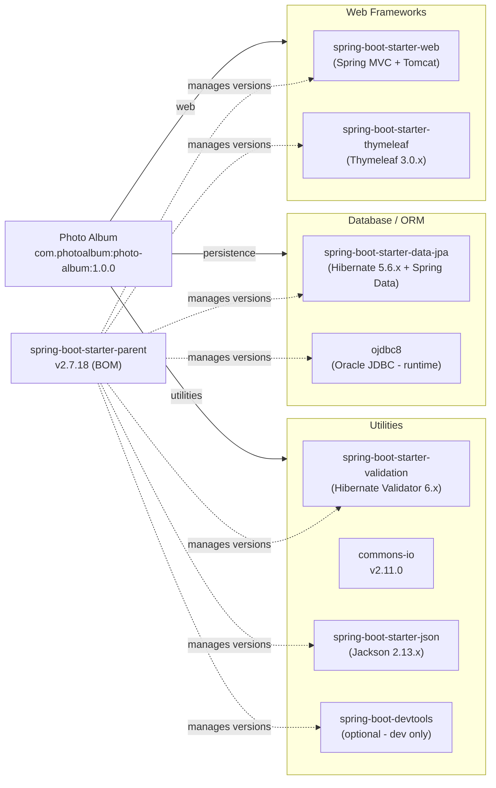

# Dependency Map

Photo Album declares 8 non-test external dependencies (all version-managed by the `spring-boot-starter-parent` 2.7.18 BOM except `commons-io` which carries an explicit version), plus 2 test-scoped dependencies.

## Dependencies

### Dependency Summary

| Category | Count | Key Libraries | Notes |
|----------|-------|--------------|-------|
| Web Frameworks | 2 | spring-boot-starter-web (MVC + embedded Tomcat 9.x), spring-boot-starter-thymeleaf 3.0.x | Standard Spring Boot MVC stack |
| Database / ORM | 2 | spring-boot-starter-data-jpa (Hibernate 5.6.x), ojdbc8 (Oracle JDBC runtime) | Oracle vendor lock-in; Hibernate 5.x is legacy |
| Utilities | 4 | spring-boot-starter-validation (Hibernate Validator 6.x), commons-io 2.11.0, spring-boot-starter-json (Jackson 2.13.x), spring-boot-devtools (optional) | Validation and file I/O utilities |

### Version & Compatibility Risks

The project targets **Java 8** with **Spring Boot 2.7.18** — the last patch release of the Spring Boot 2.7 line, which reached end-of-life in November 2023. Spring Boot 2.x depends on **Hibernate 5.6.x** and **Jakarta EE 8** (`javax.*` namespace), both of which are superseded by Hibernate 6.x and Jakarta EE 10 (`jakarta.*` namespace) in Spring Boot 3.x. Migrating to Spring Boot 3 requires a Java 17 baseline, namespace migration (`javax` → `jakarta`), and Hibernate 6 API changes. The Oracle JDBC driver (`ojdbc8`) is runtime-scoped and version-managed by the BOM; while `ojdbc8` is compatible with Oracle 12c–23c, its version is not explicitly pinned, which can lead to unexpected upgrades. `commons-io` 2.11.0 is a stable release, though 2.16+ is available with additional improvements.

### Notable Observations

- **No caching layer declared**: There is no Redis, EhCache, or Spring Cache abstraction in the dependency list; all photo BLOBs are loaded directly from Oracle on every request with no in-memory or distributed cache.
- **No security framework**: `spring-boot-starter-security` is absent — all endpoints are unauthenticated and publicly accessible without any authentication or authorisation layer.
- **No observability dependencies**: There are no Micrometer, Actuator, or tracing libraries declared; the application cannot expose metrics or health endpoints for operational monitoring.
- **BOM manages most versions implicitly**: Only `commons-io` carries an explicit version (`2.11.0`); all other dependency versions are inherited from the parent BOM, meaning an upgrade of `spring-boot-starter-parent` will transitively update Hibernate, Tomcat, Jackson, and the Oracle JDBC driver simultaneously.

## Test Dependencies

| Framework | Version | Notes |
|-----------|---------|-------|
| spring-boot-starter-test | 2.7.18 (BOM) | Bundles JUnit 5 (Jupiter), Mockito, AssertJ, Spring Test |
| H2 Database | 2.1.x (BOM) | In-memory JDBC alternative used to replace Oracle in test runs |

Total test-scope dependencies: 2

The test setup relies on H2 as an Oracle substitute, which may mask Oracle-specific SQL issues (e.g., `ROWNUM`, `TO_CHAR`, `NVL`, analytic functions used in native queries) during testing. No integration test framework (e.g., Testcontainers with a real Oracle image) is declared, leaving Oracle-specific query correctness untested in CI.
