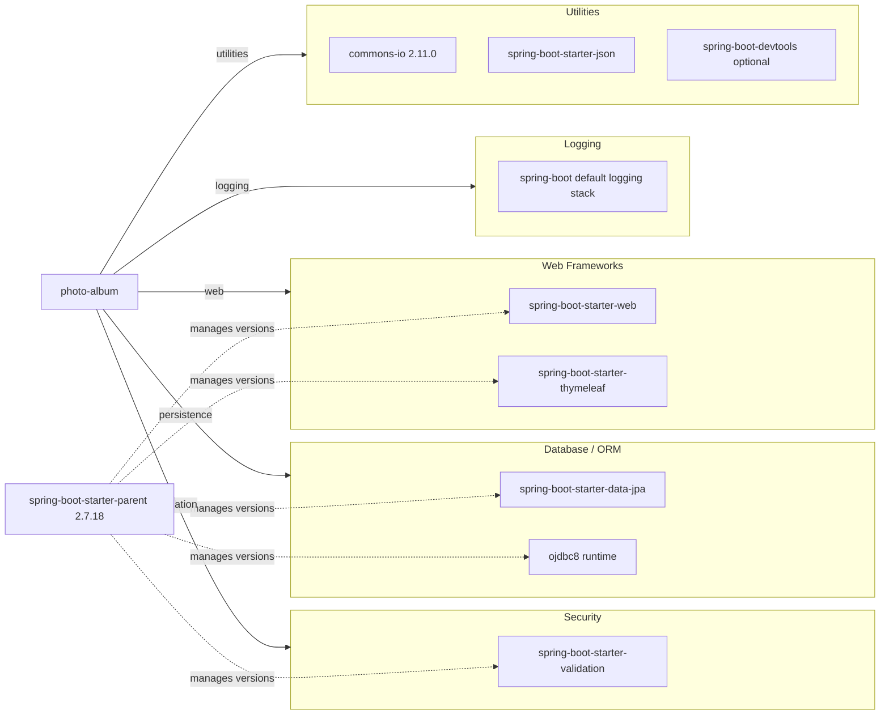

# Dependency Map

This Spring Boot module declares 7 primary (non-test) dependencies plus 2 test-scoped dependencies. The dependency graph is centered on web MVC, data access, and Oracle runtime connectivity.

## Dependencies

### Dependency Summary

| Category | Count | Key Libraries | Notes |
|---|---:|---|---|
| Web Frameworks | 2 | spring-boot-starter-web, spring-boot-starter-thymeleaf | Server-rendered MVC + template views |
| Database / ORM | 2 | spring-boot-starter-data-jpa, ojdbc8 | Oracle-backed JPA and native queries |
| Security | 1 | spring-boot-starter-validation | Bean validation for upload/domain constraints |
| Logging | 1 | spring-boot default logging | Via Spring Boot logging defaults |
| Utilities | 3 | commons-io, spring-boot-starter-json, spring-boot-devtools | File helpers, JSON support, local development tooling |

### Version & Compatibility Risks

The codebase is pinned to Java 8 and Spring Boot 2.7.x, both of which are modernization targets in current cloud migration guidance. Oracle JDBC usage is runtime-only and ties execution to Oracle-specific SQL behavior found in repository queries.

### Notable Observations

- Oracle (`ojdbc8`) is not explicitly version-pinned in the POM and is managed by the Spring Boot parent BOM.
- The repository layer includes Oracle-specific SQL features (e.g., `TO_CHAR`, `ROWNUM`, analytic functions), increasing database portability effort.
- `spring-boot-devtools` is included as optional; ensure it is excluded from production images.

## Test Dependencies

| Framework | Version | Notes |
|---|---|---|
| spring-boot-starter-test | Managed by Spring Boot 2.7.18 | Aggregates JUnit/Mockito/assertion tooling |
| h2 | Managed by Spring Boot 2.7.18 | In-memory DB used for tests |

Total test-scope dependencies: 2

Test infrastructure is minimal but sufficient for unit/integration checks. No contract-testing or containerized integration test dependency is declared.
