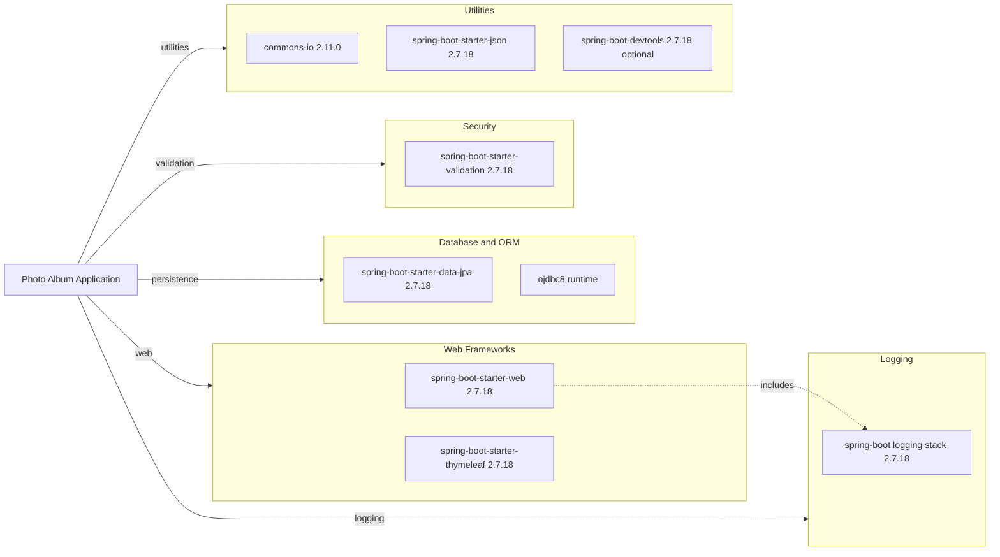

# Dependency Map

This document summarizes declared external dependencies for Photo Album from Maven configuration, organized by functional category. The project declares 7 non-test dependencies and 2 test-scope dependencies.

## Dependencies

### Dependency Summary

| Category | Count | Key Libraries | Notes |
|---|---:|---|---|
| Web Frameworks | 2 | spring-boot-starter-web, spring-boot-starter-thymeleaf | MVC controllers with server-side HTML rendering |
| Database / ORM | 2 | spring-boot-starter-data-jpa, ojdbc8 | JPA/Hibernate plus Oracle runtime JDBC driver |
| Security | 1 | spring-boot-starter-validation | Bean validation used for model constraints |
| Logging | 1 | Spring Boot logging stack | SLF4J-backed logging via Boot defaults |
| Utilities | 3 | commons-io, spring-boot-starter-json, spring-boot-devtools | File helpers, JSON support, optional development tooling |

### Version & Compatibility Risks

The runtime is pinned to Java 8 and Spring Boot 2.7.18, which is in maintenance mode. Oracle-specific native queries and `ojdbc8` dependency can increase migration effort when changing database engines or upgrading to newer Java/Spring baselines.

### Notable Observations

- The Oracle JDBC driver is runtime-scoped and central to production execution.
- Several repository queries use Oracle-specific SQL constructs (`ROWNUM`, `NVL`, `TO_CHAR`) that increase portability risk.
- `spring-boot-devtools` is optional and development-only but still present in declared dependencies.
- `spring-boot-starter-json` overlaps with web starter transitive JSON support, so utility overlap exists.

## Test Dependencies

| Framework | Version | Notes |
|---|---|---|
| spring-boot-starter-test | 2.7.18 | Primary test bundle (JUnit/Mockito ecosystem via starter) |
| h2 | Managed by Spring Boot 2.7.18 | In-memory database for test scope |

Total test-scope dependencies: 2

Test infrastructure is present and functional with Maven test execution. Integration-specific tooling (e.g., Testcontainers) is not declared.
