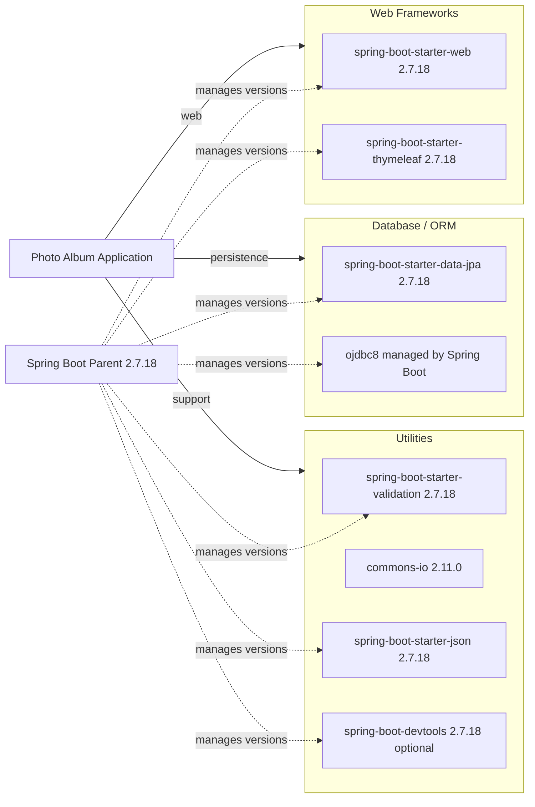

# Dependency Map

This project is a single-module Maven application with 8 declared runtime or development dependencies and 2 test-scope dependencies. The map below groups declared dependencies by their primary role in the application.

## Dependencies

### Dependency Summary

| Category | Count | Key Libraries | Notes |
|---|---:|---|---|
| Web Frameworks | 2 | spring-boot-starter-web, spring-boot-starter-thymeleaf | Delivers MVC routing, embedded server support, and server-rendered views |
| Database / ORM | 2 | spring-boot-starter-data-jpa, ojdbc8 | Couples the app to JPA plus an Oracle-specific JDBC driver |
| Utilities | 4 | spring-boot-starter-validation, commons-io, spring-boot-starter-json, spring-boot-devtools | Covers validation, file handling, JSON support, and local developer reloads |

### Version & Compatibility Risks

The dependency set is anchored to Spring Boot 2.7.18 and Java 8, which aligns with the AppCAT upgrade findings and implies near-term framework and runtime modernization work for Azure targets. Oracle-specific database access, including the `ojdbc8` driver and native SQL tailored to Oracle behavior, will also require attention if the application moves to a managed Azure database service.

### Notable Observations

- The `spring-boot-starter-parent` BOM manages most dependency versions, so framework upgrades will cascade through the majority of the stack.
- No explicit security, metrics, or cloud integration starters are declared, so the application currently exposes only its core web and persistence behavior.
- `spring-boot-devtools` is included as an optional dependency, which is convenient for local development but not relevant to production deployments.
- `spring-boot-starter-json` is declared explicitly even though JSON support is normally available transitively from the web starter.

## Test Dependencies

| Framework | Version | Notes |
|---|---|---|
| spring-boot-starter-test | 2.7.18 | Supplies JUnit 5 and Spring Boot test support for application context testing |
| H2 Database | managed by Spring Boot 2.7.18 | Provides an in-memory relational database for test execution |

Total test-scope dependencies: 2

The test setup is intentionally light: one Spring Boot test plus H2-backed persistence. No dedicated integration-test container framework or API contract-testing library is declared.
