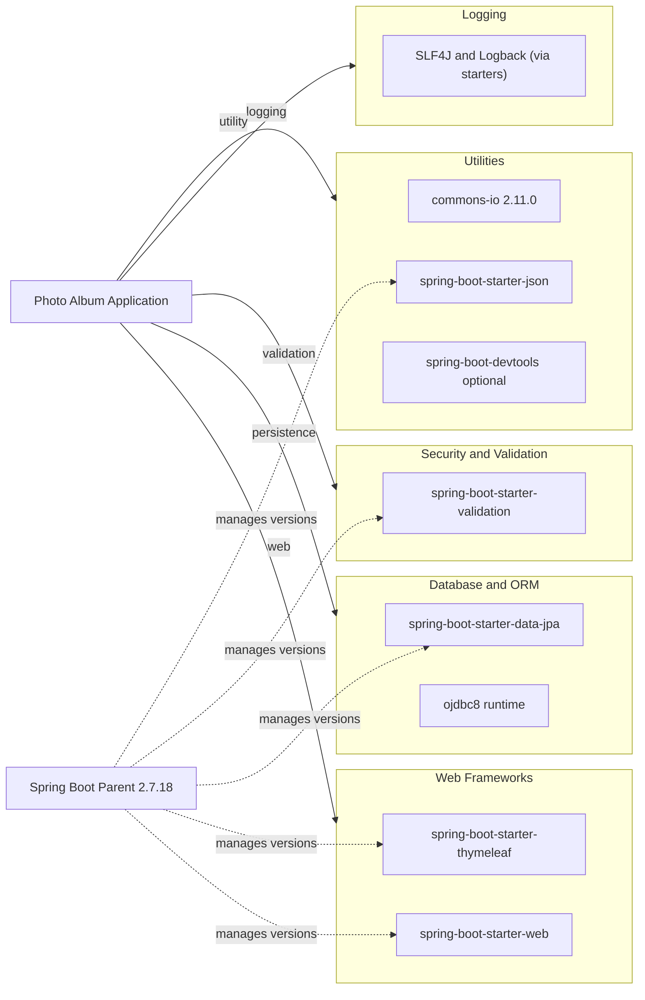

# Dependency Map

Photo Album declares 8 primary dependencies (excluding test scope), centered on Spring Boot web, templating, and JPA persistence for Oracle.

## Dependencies

### Dependency Summary

| Category | Count | Key Libraries | Notes |
|---|---:|---|---|
| Web Frameworks | 2 | spring-boot-starter-web, spring-boot-starter-thymeleaf | MVC + server-side template rendering |
| Database / ORM | 2 | spring-boot-starter-data-jpa, ojdbc8 | JPA/Hibernate with Oracle JDBC runtime driver |
| Security | 1 | spring-boot-starter-validation | Bean validation for upload and entity constraints |
| Logging | 1 | SLF4J/Logback (starter transitives) | Logging from Spring Boot starter stack |
| Utilities | 3 | commons-io, spring-boot-starter-json, spring-boot-devtools | File helpers, JSON handling, local dev hot reload |

### Version & Compatibility Risks

The project targets Java 8 and Spring Boot 2.7.18, which is in maintenance mode and approaching ecosystem end-of-support for new modernization features. Oracle-specific SQL in repositories and the runtime `ojdbc8` coupling increase migration effort when targeting cloud-managed data stores.

### Notable Observations

- Oracle database and native Oracle SQL functions are deeply embedded in repository queries.
- Both `spring-boot-starter-web` and `spring-boot-starter-json` are present; JSON support is already included transitively via web starter.
- Validation is handled through starter-based Bean Validation rather than custom frameworks.
- Dependency versions are mostly BOM-managed by Spring Boot parent for consistency.

## Test Dependencies

| Framework | Version | Notes |
|---|---|---|
| spring-boot-starter-test | Managed by Spring Boot 2.7.18 | JUnit 5 and Spring test support |
| H2 Database | Managed by Spring Boot 2.7.18 | In-memory DB for test profile execution |

Total test-scope dependencies: 2

Test infrastructure is lightweight and currently focused on Spring context loading rather than rich integration test coverage.
