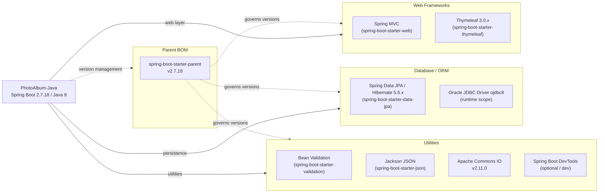

# Dependency Map

PhotoAlbum-Java declares 8 runtime/compile-scope external dependencies (all managed through the Spring Boot 2.7.18 parent BOM) plus 2 test-scope dependencies, totalling 10 declared library entries in `pom.xml`.

## Dependencies

### Dependency Summary

| Category | Count | Key Libraries | Notes |
|---|---|---|---|
| Web Frameworks | 2 | Spring MVC (Boot 2.7.18), Thymeleaf 3.0.x | Legacy Spring Boot 2.x; Spring Boot 3.x requires Java 17+ |
| Database / ORM | 2 | Spring Data JPA / Hibernate 5.6.x, Oracle JDBC ojdbc8 | Oracle-specific SQL used throughout repository (ROWNUM, NVL, TO_CHAR); tight vendor lock-in |
| Utilities | 4 | Bean Validation, Jackson JSON, Apache Commons IO 2.11.0, Spring Boot DevTools | DevTools is optional and excluded from production JARs |

### Version & Compatibility Risks

Spring Boot 2.7.18 is the **last release in the 2.7.x line** and has reached end-of-life (commercial support ended); migrating to Spring Boot 3.x requires upgrading to Java 17 and switching from `javax.*` to `jakarta.*` namespaces, both of which are significant migration efforts for this application. Java 8 is still receiving security updates under long-term support agreements but is three LTS versions behind (11, 17, 21) and is not compatible with Spring Boot 3+. Apache Commons IO 2.11.0 is several minor versions behind the current 2.17.x release; while not a critical risk, updating reduces exposure to any patched CVEs. The Oracle JDBC driver (`ojdbc8`) version is delegated to the Spring Boot BOM (21.x.x series), which is current, but the use of Oracle-dialect SQL in every repository query creates a hard dependency on Oracle that would need significant rework for any database portability.

### Notable Observations

- **Java 8 + Spring Boot 2.x**: The combination is end-of-life for community support and blocks adoption of Spring Boot 3, Jakarta EE 10, and Java 17/21 LTS features. Any cloud modernisation effort should plan a Java and framework upgrade alongside containerisation.
- **Oracle BLOB storage pattern**: Storing binary photo data directly in Oracle rather than in object storage (e.g., Azure Blob Storage) is an unconventional architectural choice that increases database I/O and complicates migration; the database and the application are unusually tightly coupled.
- **`javax.*` namespace in use**: All JPA annotations (`javax.persistence.*`) and validation annotations (`javax.validation.*`) rely on the old Java EE namespace; Spring Boot 3 migration will require a namespace replacement across all model and service classes.
- **No security or observability dependencies**: The application includes no Spring Security, authentication library, or observability tooling (Micrometer, OpenTelemetry), which would need to be added for any production cloud deployment.

## Test Dependencies

| Framework | Version | Notes |
|---|---|---|
| spring-boot-starter-test | 2.7.18 (Boot managed) | Bundles JUnit 5, Mockito, AssertJ, Spring Test |
| H2 Database | Boot managed (test scope) | In-memory database substituting Oracle during tests |

Total test-scope dependencies: **2**

The test setup uses `spring-boot-starter-test` (which transitively includes JUnit 5, Mockito, and AssertJ) along with H2 as a drop-in Oracle replacement for integration tests. This is a minimal but functional testing infrastructure; there is no Testcontainers setup for Oracle-specific behaviour validation, which means Oracle-dialect SQL quirks (`ROWNUM`, analytical functions) are not exercised by the current test suite.
