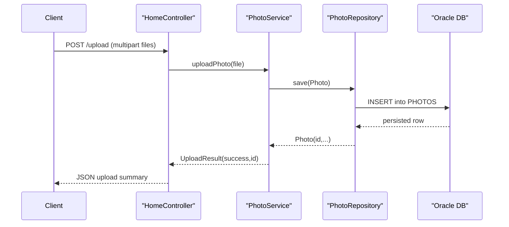

# API & Service Communication Contracts

The application exposes a small HTTP surface for gallery browsing, upload, binary media retrieval, and deletion. Communication is synchronous within a single deployable service.

## Service Catalog

| Service | Port | Category | Purpose |
|---|---:|---|---|
| photo-album | 8080 | API Layer + Business | Serves UI pages and photo CRUD/upload operations |

## API Endpoints Inventory

| Service | Method | Path | Request Type | Response Type |
|---|---|---|---|---|
| photo-album (HomeController) | GET | `/` | None | Thymeleaf `index` page |
| photo-album (HomeController) | POST | `/upload` | Multipart `files` | JSON map with `uploadedPhotos` and `failedUploads` |
| photo-album (DetailController) | GET | `/detail/{id}` | Path param `id` | Thymeleaf `detail` page or redirect |
| photo-album (DetailController) | POST | `/detail/{id}/delete` | Path param `id` | Redirect to `/` with flash message |
| photo-album (PhotoFileController) | GET | `/photo/{id}` | Path param `id` | Binary image (`Resource`) with MIME content type |

## Management & Observability Endpoints

| Service | Endpoint | Custom Metrics (if any) |
|---|---|---|
| photo-album | None detected | None detected |

## DTOs & Contracts

Request/response contracts are lightweight and primarily represented by framework types (`MultipartFile`, `Model`, redirect responses) and map-based JSON payloads for uploads. `UploadResult` acts as an internal upload outcome model, while `Photo` is used as a service/domain model returned to templates and binary endpoint logic. No OpenAPI or protobuf contract files were detected.

## Communication Patterns

The app uses synchronous in-process calls: controller → service → repository → Oracle database. No asynchronous messaging, service discovery, client-side load balancing, or circuit-breaker/retry library usage was detected. API-level security controls (authN/authZ/TLS termination config) were not explicitly configured in the application code.

## Service Technology Matrix

| Service | Web | Data Access | Discovery | Gateway | Actuator | Cache | Metrics |
|---|---|---|---|---|---|---|---|
| photo-album | Spring MVC + Thymeleaf | Spring Data JPA + native SQL | none | none | none | none | none |

## Service Communication Sequence

