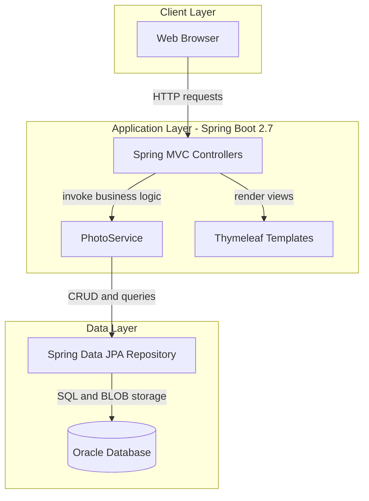
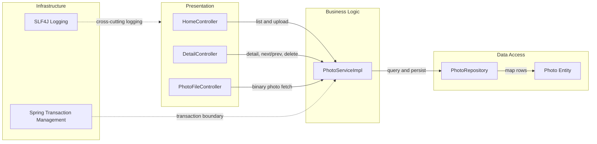

# Architecture Diagram

This application is a monolithic Spring Boot web app that serves a photo gallery UI and manages photo lifecycle operations backed by Oracle.

## Application Architecture

### Technology Stack Summary

| Layer | Technology | Version | Purpose |
|---|---|---|---|
| Presentation | Spring MVC + Thymeleaf | Spring Boot 2.7.18 | Handles page rendering and request routing |
| Business | PhotoService | App code | Upload validation, navigation, deletion |
| Data Access | Spring Data JPA + Hibernate | Spring Boot managed | Persistence abstraction for photo entities |
| Database | Oracle | JDBC ojdbc8 runtime | Stores photo metadata and binary image content |

### Data Storage & External Services

The application stores all photo metadata and image binary data (BLOB) in an Oracle database. No external API integrations or message brokers were detected.

### Key Architectural Decisions

- Uses a layered monolith (controller → service → repository).
- Persists image binary payloads directly in Oracle instead of filesystem/object storage.
- Uses Thymeleaf server-side rendering for the gallery and detail pages.

## Component Relationships

### Component Inventory

| Component | Layer | Type | Responsibility |
|---|---|---|---|
| HomeController | Presentation | MVC Controller | Gallery page and multi-file upload endpoint |
| DetailController | Presentation | MVC Controller | Photo detail view and delete action |
| PhotoFileController | Presentation | MVC Controller | Serves photo bytes by id |
| PhotoServiceImpl | Business Logic | Service | Validation, metadata extraction, photo lifecycle logic |
| PhotoRepository | Data Access | JpaRepository | Oracle-backed photo queries and persistence |
| Photo | Data Access | JPA Entity | Photo metadata plus BLOB payload model |
