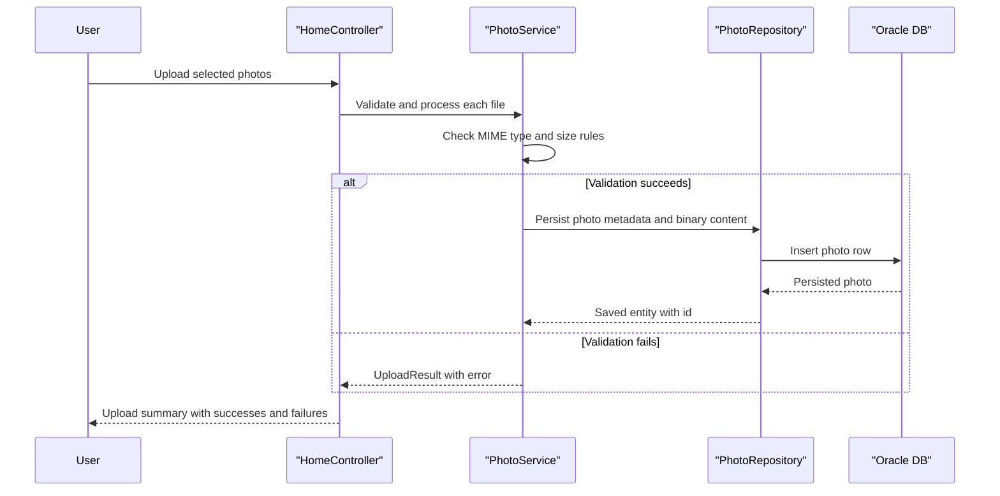

# Core Business Workflows

The application supports photo gallery management workflows for uploading images, browsing them, viewing individual details, and deleting photos.

## Domain Entities

| Entity | Service / Bounded Context | Description | Key Relationships |
|---|---|---|---|
| Photo | Photo Management | Core aggregate representing an uploaded image and display metadata | Accessed by gallery, detail, and file-serving workflows |
| UploadResult | Photo Management | Operation result contract for upload processing outcome | Linked to upload flow responses |

## Service-to-Domain Mapping

| Service | Domain Context | Owned Entities | External Dependencies |
|---|---|---|---|
| photo-album | Photo Management | Photo, UploadResult | Oracle database |

## Primary Workflows

### Workflow 1: Upload Photos

User submits one or more image files, system validates MIME type and size, extracts image dimensions when possible, stores binary image plus metadata, then returns per-file success/failure results.

### Workflow 2: Browse and View Photos

User opens gallery to list photos sorted by upload date; selecting an item opens detail page with previous/next navigation based on upload timestamp queries.

### Workflow 3: Delete Photo

User requests deletion from the detail page; service checks existence and removes the record, then redirects with success or error feedback.

## Cross-Service Data Flows

No cross-service composition was detected. All business flows execute inside a single service boundary and interact directly with the same Oracle data store.

## Business Workflow Sequence

## Business Rules & Decision Logic

- Only allowed image MIME types are accepted (`jpeg`, `png`, `gif`, `webp`).
- Maximum file size is enforced before persistence.
- Empty files are rejected.
- Deletion requires photo existence; otherwise the user receives a not-found message.
- Service methods execute in transactional boundaries managed by Spring.
