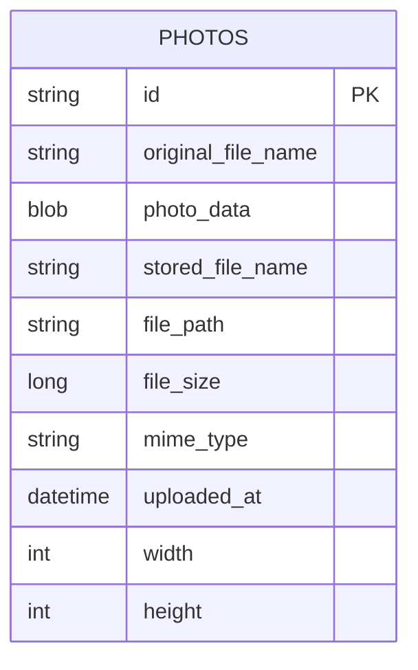

# Data Architecture & Persistence Layer

The data layer is centered on a single Oracle-backed entity persisted through Spring Data JPA/Hibernate with native SQL repository methods.

## Database Configuration

| Service/Module | DB Type | Profile | Driver | Connection | Migration Tool |
|---|---|---|---|---|---|
| photo-album | Oracle | default | oracle.jdbc.OracleDriver | JDBC Oracle URL to `oracle-db:1521/FREEPDB1` | None detected |
| photo-album | Oracle | docker | oracle.jdbc.OracleDriver | JDBC Oracle URL to `oracle-db:1521:XE` | None detected |

## Data Ownership per Service

| Service | Tables Owned | ORM Framework | Caching | Notes |
|---|---|---|---|---|
| photo-album | `PHOTOS` | JPA/Hibernate (Spring Data) | None detected | Stores metadata and `photo_data` BLOB in the same table |

## Entity Model

## Key Repository Methods

| Service | Repository | Notable Methods | Purpose |
|---|---|---|---|
| photo-album | PhotoRepository | `findAllOrderByUploadedAtDesc()` | Gallery listing ordered by most recent uploads |
| photo-album | PhotoRepository | `findPhotosUploadedBefore(uploadedAt)` | Previous-photo navigation query |
| photo-album | PhotoRepository | `findPhotosUploadedAfter(uploadedAt)` | Next-photo navigation query |
| photo-album | PhotoRepository | `findPhotosByUploadMonth(year, month)` | Oracle `TO_CHAR` based month filtering |
| photo-album | PhotoRepository | `findPhotosWithPagination(startRow, endRow)` | Oracle `ROWNUM` paging |

## Caching Strategy

No explicit application cache provider (`@Cacheable`, Redis, Caffeine, JCache) was detected. The primary optimization approach is direct repository query patterns against Oracle.

## Data Ownership Boundaries

The application is a single bounded context with one owned table and no cross-service data sharing. Read and write operations are handled within the same service and transaction boundary; no CQRS split or cross-service aggregation pattern is present.

### Data Classification & Sensitivity

| Entity | Sensitive Fields | Classification (PII/PHI/PCI/None) | Controls in Place |
|---|---|---|---|
| Photo | `originalFileName` (potential personal naming), `photoData` (image content) | PII (potential) | No field-level masking or encryption controls detected in code |
