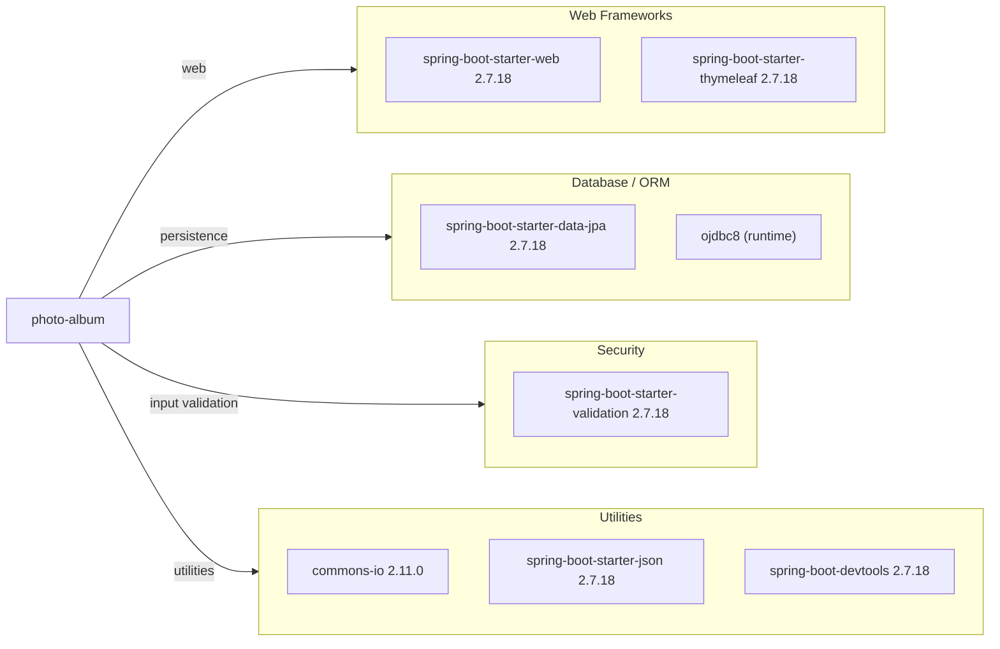

# Dependency Map

The `photo-album` project uses a focused Spring Boot stack with Oracle persistence and Thymeleaf rendering.

## Dependencies

### Dependency Summary

| Category | Count | Key Libraries | Notes |
|---|---:|---|---|
| Web Frameworks | 2 | spring-boot-starter-web, spring-boot-starter-thymeleaf | MVC plus server-side HTML rendering |
| Database / ORM | 2 | spring-boot-starter-data-jpa, ojdbc8 | Oracle-specific persistence |
| Security | 1 | spring-boot-starter-validation | Bean validation for input checks |
| Utilities | 3 | commons-io, spring-boot-starter-json, devtools | JSON handling and dev productivity |

### Version & Compatibility Risks

The stack is based on Java 8 and Spring Boot 2.7.x, both of which commonly trigger modernization/upgrade findings for current Azure migration targets. Oracle-specific SQL and the Oracle JDBC driver can increase migration effort when moving to managed PostgreSQL services.

### Notable Observations

- Oracle runtime driver use is explicit and central to persistence.
- Repository layer contains Oracle-specific native SQL patterns.
- Dependency footprint is relatively small and monolithic.

## Test Dependencies

| Framework | Version | Notes |
|---|---|---|
| spring-boot-starter-test | 2.7.18 | Main test umbrella (JUnit/Mockito/assertions via Spring Boot BOM) |
| H2 | Managed by Spring Boot BOM | In-memory database for tests |

Total test-scope dependencies: 2

Test infrastructure is present and supports database-backed tests without requiring a live Oracle instance.
