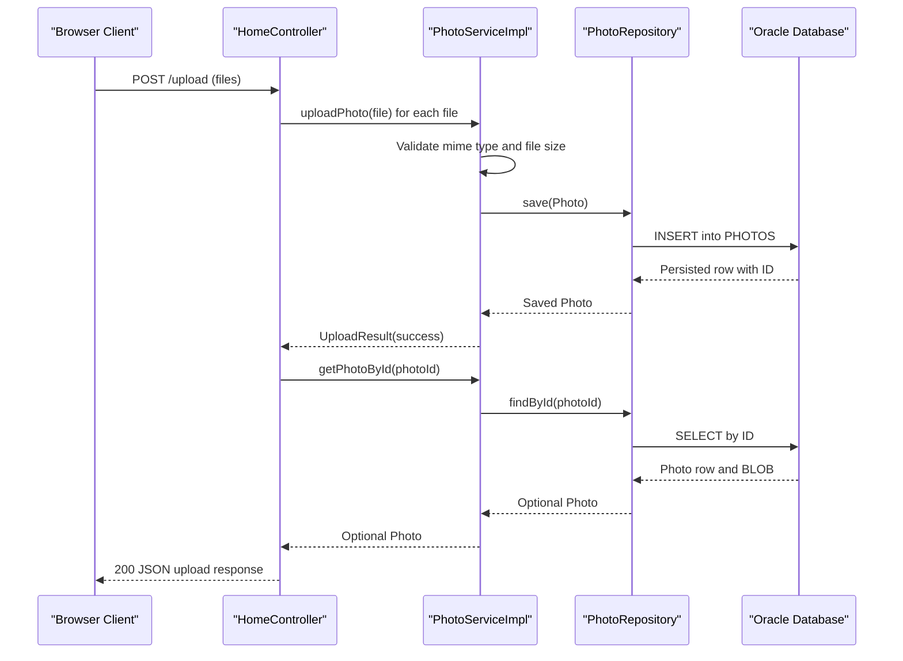

# API & Service Communication Contracts

The application exposes a compact HTTP surface focused on photo gallery browsing, upload, detail navigation, binary file retrieval, and deletion. Communication is fully synchronous within a single deployable service and does not use asynchronous messaging.

## Service Catalog

| Service | Port | Category | Purpose |
| --- | --- | --- | --- |
| photo-album | 8080 | Business | Hosts MVC endpoints and coordinates upload, query, and delete photo flows |
| oracle-db (external dependency) | 1521 | Infrastructure | Stores photo metadata and BLOB image data for the application |

## API Endpoints Inventory

| Service | Method | Path | Request Type | Response Type |
| --- | --- | --- | --- | --- |
| photo-album (HomeController) | GET | / | No body; model rendering request | HTML view (`index`) |
| photo-album (HomeController) | POST | /upload | Multipart form field `files` (list of `MultipartFile`) | JSON map with `success`, `uploadedPhotos`, `failedUploads` |
| photo-album (DetailController) | GET | /detail/{id} | Path parameter `id` (String) | HTML view (`detail`) or redirect to `/` |
| photo-album (DetailController) | POST | /detail/{id}/delete | Path parameter `id` (String) | Redirect to `/` with flash message |
| photo-album (PhotoFileController) | GET | /photo/{id} | Path parameter `id` (String) | Binary resource stream (`Resource`) with media type headers |

## Management & Observability Endpoints

| Service | Endpoint | Custom Metrics (if any) |
| --- | --- | --- |
| photo-album | None detected (no Actuator dependency) | None detected |

## DTOs & Contracts

The request/response contract is implemented with framework and domain classes rather than explicit REST DTO packages:

- **Request contract types**: `MultipartFile` list for upload operations and path parameter IDs for detail/file/delete operations.
- **Response contract types**: HTML views for page requests and `ResponseEntity<Map<String,Object>>` for upload API responses.
- **Domain contract type**: `Photo` serves as the core service-level entity used across controller and service boundaries.
- **Operation result type**: `UploadResult` communicates per-file upload outcomes inside service logic.
- **Immutability**: DTO/entity classes are mutable POJOs; no Java records or immutable value types are defined.
- **Specification/serialization**: No OpenAPI/Swagger or protobuf contracts detected; JSON serialization uses Spring Boot Jackson defaults.

## Communication Patterns

All interactions are synchronous. Browser requests hit MVC controllers, which delegate to `PhotoServiceImpl`, then to `PhotoRepository` for Oracle-backed persistence and retrieval. There is no inter-service REST call, no queue/event broker, and no circuit breaker or retry library configured for downstream dependencies. Startup availability is effectively gated by database readiness in Docker Compose (`depends_on` health condition). API-level security posture is open: no explicit TLS termination, authentication, or authorization framework is configured in the application code.

## Service Technology Matrix

| Service | Web | Data Access | Discovery | Gateway | Actuator | Cache | Metrics |
| --- | --- | --- | --- | --- | --- | --- | --- |
| photo-album | Spring MVC + Thymeleaf | Spring Data JPA + Oracle JDBC | None | None | No | None | None |

## Service Communication Sequence

