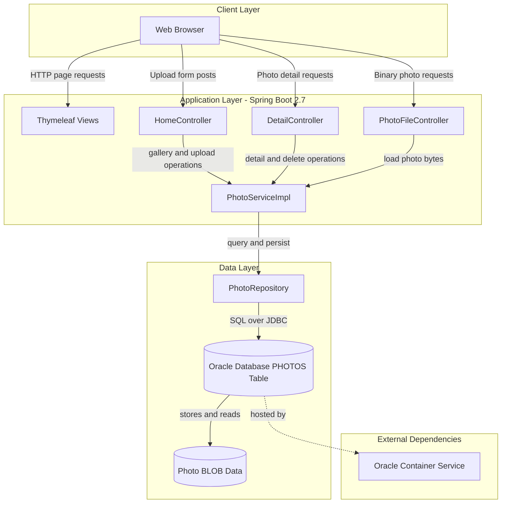
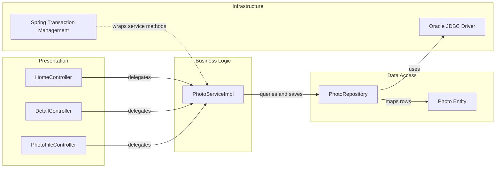

# Architecture Diagram

This document summarizes the Photo Album application's runtime architecture and key internal component interactions. It focuses on the web flow for upload, listing, viewing, and deleting photos persisted in Oracle.

## Application Architecture

### Technology Stack Summary

| Layer | Technology | Version | Purpose |
| --- | --- | --- | --- |
| Presentation | Spring MVC + Thymeleaf + Bootstrap | Spring Boot 2.7.18 | Render gallery/detail pages and handle browser requests |
| Business Logic | Spring Service + Validation | Spring Framework 5.3.x (via Boot 2.7.18) | Enforce upload validation and coordinate repository calls |
| Data Access | Spring Data JPA + Hibernate | Spring Data JPA 2.7.x (via Boot 2.7.18) | Map Photo entity and execute Oracle-focused queries |
| Database | Oracle Database | Oracle Free image | Persist photo metadata and BLOB photo content |

### Data Storage & External Services

The application persists all photo metadata and binary content in a single Oracle database table (`PHOTOS`) accessed through JPA and native SQL. There is no message broker, cache, or third-party API integration; the external runtime dependency is the Oracle database container used by local and containerized deployments.

### Key Architectural Decisions

- Uses server-side rendered MVC pages (Thymeleaf) instead of a separate SPA/API split.
- Stores image bytes directly in Oracle BLOB columns rather than file-system storage.
- Keeps business logic in a single service implementation and central repository interface for all photo operations.

## Component Relationships

### Component Inventory

| Component | Layer | Type | Responsibility |
| --- | --- | --- | --- |
| HomeController | Presentation | MVC Controller | Serves gallery page and handles multi-file upload requests |
| DetailController | Presentation | MVC Controller | Displays single-photo detail page and handles photo deletion |
| PhotoFileController | Presentation | MVC Controller | Streams photo bytes with content headers |
| PhotoServiceImpl | Business Logic | Service | Validates uploads, extracts image metadata, orchestrates persistence and navigation |
| PhotoRepository | Data Access | Spring Data Repository | Executes CRUD and Oracle-native photo query operations |
| Photo | Data Access | JPA Entity | Represents persisted photo metadata and BLOB data |
| Spring Transaction Management | Infrastructure | Cross-cutting | Provides transactional boundaries on service methods |
| Oracle JDBC Driver | Infrastructure | Driver | Enables Oracle connectivity for Hibernate/JPA operations |
