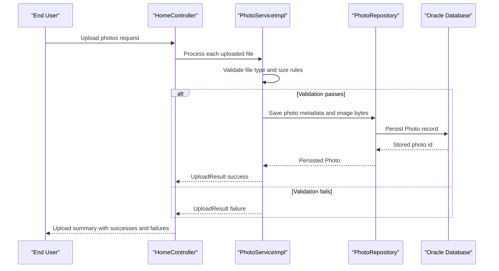

# Core Business Workflows

The application supports a photo management domain where end users upload images, browse them in a gallery, inspect details, and delete unwanted items. Business behavior centers on upload validation, chronological navigation, and reliable persistence of image binaries and metadata.

## Domain Entities

| Entity | Service / Bounded Context | Description | Key Relationships |
| --- | --- | --- | --- |
| Photo | Photo Management | Represents an uploaded image and associated metadata used by gallery/detail experiences | Central entity used by upload, listing, navigation, and delete workflows |
| UploadResult | Photo Management | Captures success/failure outcome for each uploaded file | Produced by service logic and consumed by upload response assembly |

## Service-to-Domain Mapping

| Service | Domain Context | Owned Entities | External Dependencies |
| --- | --- | --- | --- |
| photo-album (HomeController + DetailController + PhotoFileController + PhotoServiceImpl) | Photo Management | Photo, UploadResult | Oracle database via PhotoRepository |

## Primary Workflows

### Workflow 1: Upload Photos to Gallery

Entry point: user submits `POST /upload` with one or multiple files.

1. HomeController receives multipart files and initializes success/failure collections.
2. PhotoServiceImpl validates MIME type and file size constraints.
3. Service extracts bytes and image dimensions, then creates a Photo aggregate.
4. Repository persists the photo; service returns UploadResult.
5. Controller enriches successful results with persisted photo metadata and returns JSON summary.

### Workflow 2: Browse and Inspect Photos

Entry points: `GET /` for gallery and `GET /detail/{id}` for single-photo inspection.

1. Gallery request loads photos sorted by upload time.
2. Detail request resolves one photo by ID.
3. Service computes previous/next navigation candidates from repository queries.
4. UI renders full-size photo metadata and navigation links.

### Workflow 3: Delete Photo

Entry point: user submits `POST /detail/{id}/delete`.

1. Controller calls service delete operation with target ID.
2. Service validates existence then removes the persisted photo.
3. Controller sets success/error flash message and redirects to gallery.

## Cross-Service Data Flows

No cross-service workflow composition is present. All business flows execute within a single service boundary that interacts directly with one database. If database access fails, workflows degrade by returning errors or redirects rather than composing partial responses from alternative services.

## Business Workflow Sequence

## Business Rules & Decision Logic

- Uploads are accepted only for allowed image MIME types and non-empty file content within configured maximum size.
- Upload processing is transactional at service level, ensuring consistent persistence for each accepted file.
- Gallery ordering and detail navigation depend on upload timestamp chronology.
- Delete operation requires existing photo identity; missing IDs produce user-facing "not found" feedback.
- Error handling returns safe fallbacks (empty gallery, redirects, upload failure details) when exceptions occur.
