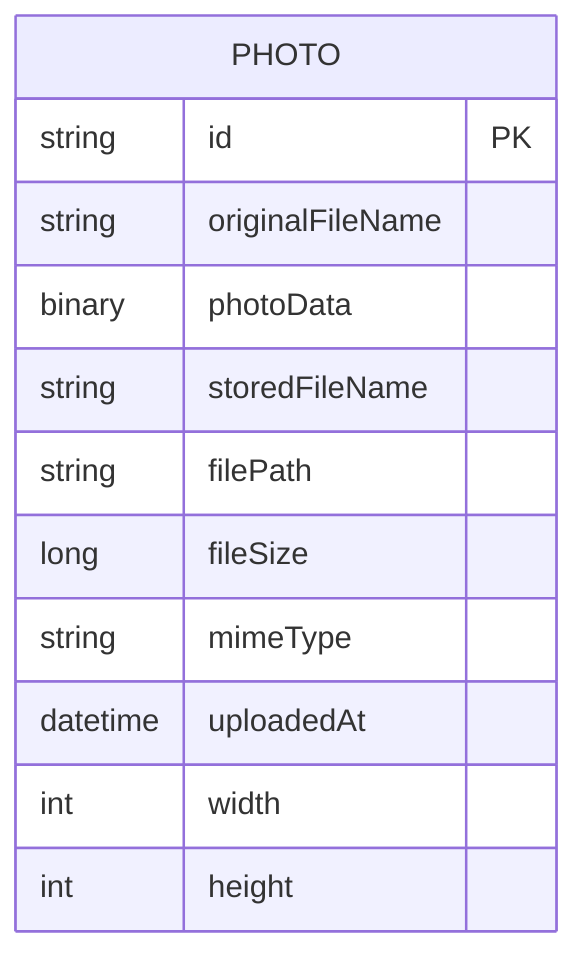

# Data Architecture & Persistence Layer

The data layer is centered on a single relational entity persisted with JPA/Hibernate into Oracle, with BLOB storage used for image binaries. Repository access is consolidated through one Spring Data JPA interface using both inherited CRUD and Oracle-specific native queries.

## Database Configuration

| Service/Module | DB Type | Profile | Driver | Connection | Migration Tool |
| --- | --- | --- | --- | --- | --- |
| photo-album | Oracle | default | oracle.jdbc.OracleDriver (`ojdbc8`) | JDBC thin connection to `oracle-db:1521/FREEPDB1` | None detected |
| photo-album | Oracle | docker | oracle.jdbc.OracleDriver (`ojdbc8`) | JDBC thin connection to `oracle-db:1521:XE` | None detected |
| photo-album (tests) | H2 in-memory | test | org.h2.Driver | `jdbc:h2:mem:testdb` | None detected |

## Data Ownership per Service

| Service | Tables Owned | ORM Framework | Caching | Notes |
| --- | --- | --- | --- | --- |
| photo-album | PHOTOS | Spring Data JPA with Hibernate | None | Single-service ownership of all persisted photo data |

## Entity Model

## Key Repository Methods

| Service | Repository | Notable Methods | Purpose |
| --- | --- | --- | --- |
| photo-album | `PhotoRepository` (`src/main/java/com/photoalbum/repository/PhotoRepository.java`) | `findAllOrderByUploadedAtDesc()` | Return gallery data sorted by newest uploads |
| photo-album | `PhotoRepository` | `findPhotosUploadedBefore(LocalDateTime uploadedAt)` | Fetch previous photo candidates for detail page navigation |
| photo-album | `PhotoRepository` | `findPhotosUploadedAfter(LocalDateTime uploadedAt)` | Fetch next photo candidates for detail page navigation |
| photo-album | `PhotoRepository` | `findPhotosByUploadMonth(String year, String month)` | Oracle `TO_CHAR`-based monthly filtering |
| photo-album | `PhotoRepository` | `findPhotosWithPagination(int startRow, int endRow)` | Oracle `ROWNUM` pagination query |
| photo-album | `PhotoRepository` | `findPhotosWithStatistics()` | Oracle analytic query with rank and running totals |

## Caching Strategy

No dedicated application caching layer is configured. The application serves data directly from Oracle through repository queries, and photo bytes are loaded from BLOB storage per request.

## Data Ownership Boundaries

The application follows a single-service, single-database ownership model. There are no cross-service joins, shared ownership boundaries, CQRS separation, or event-driven persistence patterns. All reads and writes occur through the same service and schema.

### Data Classification & Sensitivity

| Entity | Sensitive Fields | Classification (PII/PHI/PCI/None) | Controls in Place |
| --- | --- | --- | --- |
| Photo | `originalFileName`, `photoData` (user-uploaded content) | PII (potential personal image content) | No explicit field masking or encryption configuration detected in application settings |

