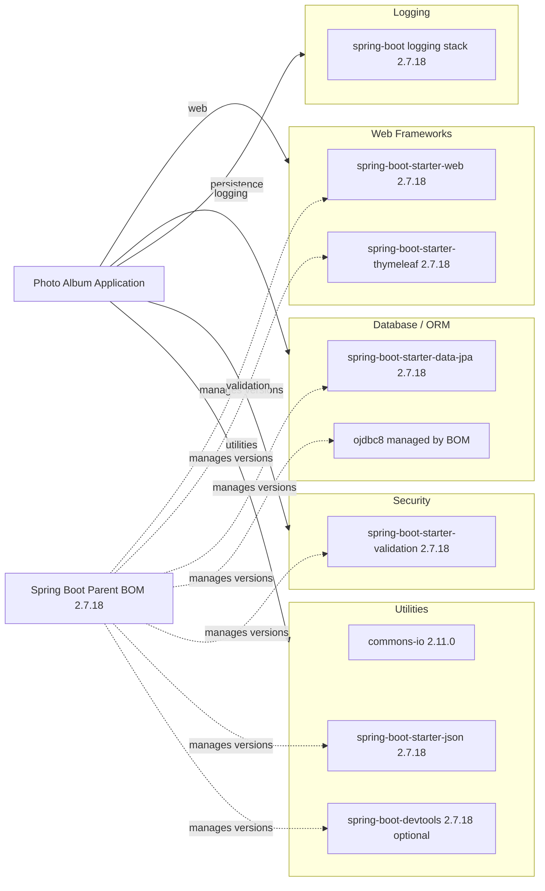

# Dependency Map

This dependency map summarizes the declared external libraries for the Photo Album project and groups them by modernization-relevant capability areas. The project declares 9 primary dependencies (excluding test scope dependencies from the main diagram).

## Dependencies

### Dependency Summary

| Category | Count | Key Libraries | Notes |
| --- | --- | --- | --- |
| Web Frameworks | 2 | spring-boot-starter-web, spring-boot-starter-thymeleaf | Server-rendered MVC web app |
| Database / ORM | 2 | spring-boot-starter-data-jpa, ojdbc8 | Oracle-backed JPA/Hibernate data access |
| Logging | 1 | Spring Boot logging stack | Managed transitively via starter dependencies |
| Security | 1 | spring-boot-starter-validation | Validation only; no auth framework dependency declared |
| Utilities | 3 | commons-io, spring-boot-starter-json, spring-boot-devtools | JSON handling, file utility, and development tooling |

### Version & Compatibility Risks

The project targets Java 8 and Spring Boot 2.7.18, both of which represent older platform baselines for long-term Azure modernization goals. Oracle-specific JDBC and native SQL usage in repositories can increase migration effort if moving to alternative managed database services.

### Notable Observations

- A Spring Boot parent BOM centrally manages most dependency versions.
- Oracle JDBC usage is runtime-scoped and tightly couples runtime behavior to Oracle-compatible environments.
- Validation is present, but no explicit Spring Security starter is declared.
- Test dependencies are isolated via `spring-boot-starter-test` and `h2` in test scope.

## Test Dependencies

| Framework | Version | Notes |
| --- | --- | --- |
| spring-boot-starter-test | 2.7.18 (BOM-managed) | Aggregates JUnit 5, Spring Test, Mockito, AssertJ stack |
| h2 | BOM-managed | In-memory database for test profile |

Total test-scope dependencies: 2

The test setup is minimal but functional for context-load coverage and avoids requiring Oracle for baseline tests.
