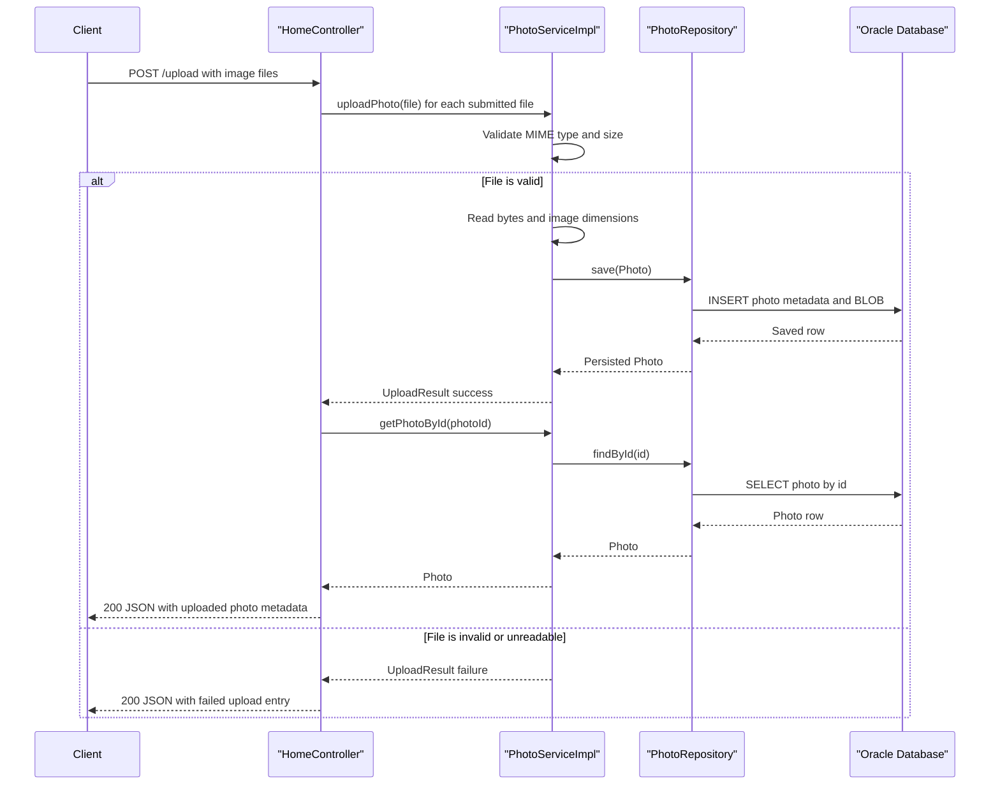

# API & Service Communication Contracts

This application exposes a small HTTP surface centered on a single web service that mixes server-rendered pages with a JSON upload response. Communication is entirely synchronous and stays in-process until the service reaches the Oracle-backed repository layer.

## Service Catalog

| Service | Port | Category | Purpose |
|------|------|------|------|
| `photo-album` | 8080 | API Layer | Hosts the gallery UI, upload endpoint, photo detail flow, binary photo delivery, and delete action |
| `oracle-db` | 1521 | Infrastructure | External Oracle database used by the Spring Boot application for persistent storage |

## API Endpoints Inventory

| Service | Method | Path | Request Type | Response Type |
|------|------|------|------|------|
| `photo-album` | GET | `/` | No body; view request | Thymeleaf `index` page with a model containing `List<Photo>` |
| `photo-album` | POST | `/upload` | Multipart form field `files` with `List<MultipartFile>` | JSON `Map<String,Object>` containing `success`, `uploadedPhotos`, and `failedUploads` |
| `photo-album` | GET | `/detail/{id}` | Path parameter `id` | Thymeleaf `detail` page with `Photo` plus previous/next IDs |
| `photo-album` | POST | `/detail/{id}/delete` | Path parameter `id`; no request body | Redirect to `/` with flash message |
| `photo-album` | GET | `/photo/{id}` | Path parameter `id` | Binary `Resource` with image media type and cache-control headers |

## Management & Observability Endpoints

| Service | Endpoint | Custom Metrics (if any) |
|------|------|------|
| `photo-album` | None detected | No Actuator, Swagger, Prometheus, or custom metric endpoint definitions were found |

## DTOs & Contracts

The API contract is centered on the `Photo` entity and the `UploadResult` model. `Photo` acts as the service-level domain entity returned to the Thymeleaf views and indirectly serialized into the upload response payload, while `UploadResult` represents the per-file outcome for upload processing. Both classes are mutable Java POJOs rather than immutable records.

No OpenAPI, Swagger, GraphQL, or protobuf schema files were found. Serialization for JSON responses is handled by Spring Boot's default Jackson stack through `ResponseEntity<Map<String,Object>>`, with upload results assembled from `Photo` properties and failure messages.

## Communication Patterns

All communication is synchronous. Browser requests hit Spring MVC controllers, which call `PhotoService` directly through Spring dependency injection, and the service performs repository calls against Oracle using Spring Data JPA plus native SQL. No asynchronous messaging, event bus, external REST clients, service discovery, API gateway, retry framework, circuit breaker, or client-side load balancing library was found.

API-level security controls are absent in the inspected source: no HTTPS termination, authentication mechanism, authorization annotations, or Spring Security configuration was found. The application therefore appears to expose all endpoints publicly and relies on deployment environment controls rather than in-application access enforcement.

Startup ordering matters only because the web application needs a reachable Oracle database before repository access succeeds. Docker Compose expresses this dependency with `depends_on` and a database health check for the application container.

## Service Technology Matrix

| Service | Web | Data Access | Discovery | Gateway | Actuator | Cache | Metrics |
|------|------|------|------|------|------|------|------|
| `photo-album` | Spring MVC + Thymeleaf | Spring Data JPA / Oracle native SQL | None | None | None | None | None |

## Service Communication Sequence

