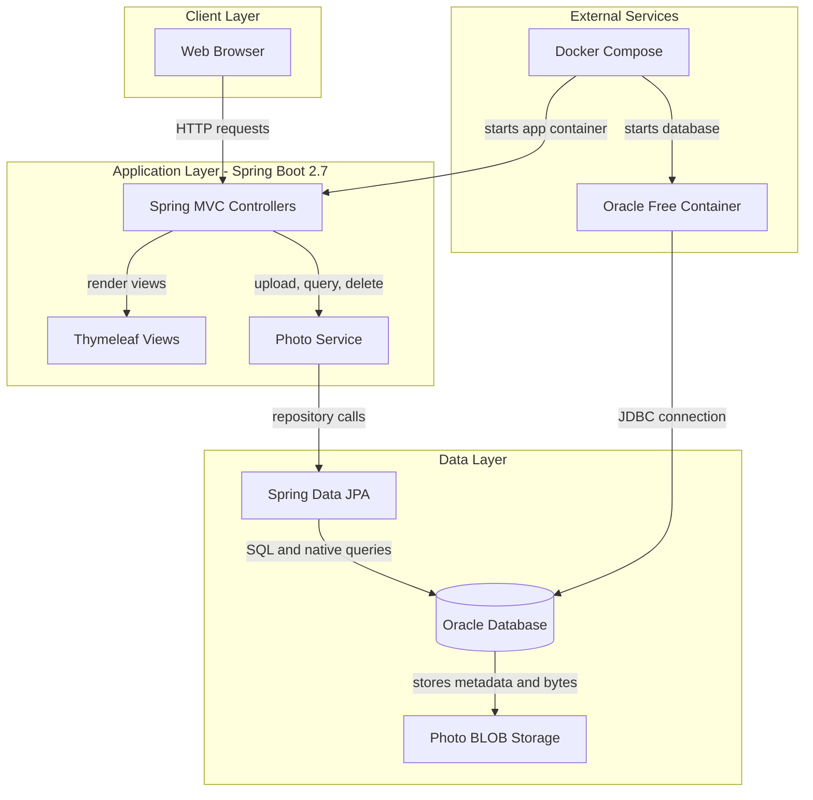
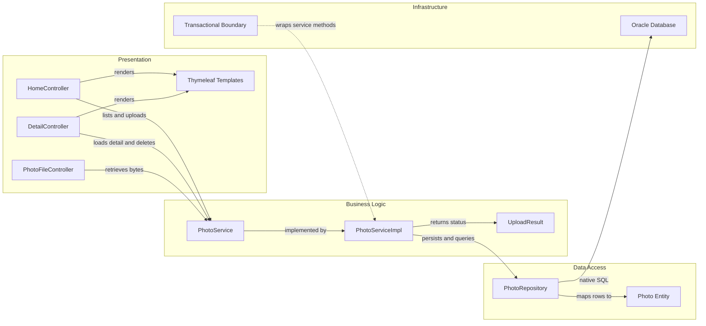

# Architecture Diagram

This document summarizes the Photo Album application's runtime structure and the main component relationships that support photo upload, browsing, retrieval, and deletion.

## Application Architecture

### Technology Stack Summary

| Layer | Technology | Version | Purpose |
|------|------|------|------|
| Presentation | Spring MVC + Thymeleaf | Spring Boot 2.7.18 | Serves gallery pages, detail pages, and upload responses |
| Business Logic | Spring Service layer | Spring Boot 2.7.18 | Validates uploads, extracts image metadata, coordinates persistence |
| Data Access | Spring Data JPA + native SQL | Spring Data JPA bundled with Boot 2.7.18 | Reads and writes photo records and navigation queries |
| Database | Oracle Database | Oracle Free via Docker image | Persists photo metadata and BLOB image content |
| Frontend | Bootstrap 5 + vanilla JavaScript | Bootstrap 5.3.0 | Provides responsive gallery layout and drag-and-drop upload behavior |
| Containerization | Docker + Docker Compose | Repository-managed | Runs the app and Oracle database together for local deployment |

### Data Storage & External Services

The application uses a single Oracle database as its persistent store. Photo metadata and the image bytes themselves are stored together in the `photos` table, while Docker Compose provides the external runtime dependency that starts the Spring Boot application alongside the Oracle container.

### Key Architectural Decisions

- Uses a classic layered Spring Boot MVC design with controllers delegating to a single transactional service and JPA repository.
- Stores uploaded images directly as Oracle BLOB data instead of relying on a separate file share or object store.
- Keeps HTML rendering and JSON upload responses in the same web application rather than splitting UI and API into separate deployable services.

## Component Relationships

### Component Inventory

| Component | Layer | Type | Responsibility |
|------|------|------|------|
| `HomeController` | Presentation | MVC Controller | Renders the gallery home page and handles multi-file upload requests |
| `DetailController` | Presentation | MVC Controller | Shows a selected photo, computes previous/next navigation, and deletes photos |
| `PhotoFileController` | Presentation | MVC Controller | Streams image bytes from database storage back to the browser |
| `PhotoService` | Business Logic | Service interface | Defines photo retrieval, upload, deletion, and navigation operations |
| `PhotoServiceImpl` | Business Logic | Spring service | Validates uploads, extracts metadata, writes photos, and loads navigation context |
| `UploadResult` | Business Logic | DTO | Communicates upload success or failure for each submitted file |
| `PhotoRepository` | Data Access | JPA repository | Executes CRUD and Oracle-specific native queries for photo access patterns |
| `Photo` | Data Access | JPA entity | Represents persisted image metadata and binary content |
| Oracle database | Infrastructure | Data store | Stores the `photos` table and serves native SQL queries |
