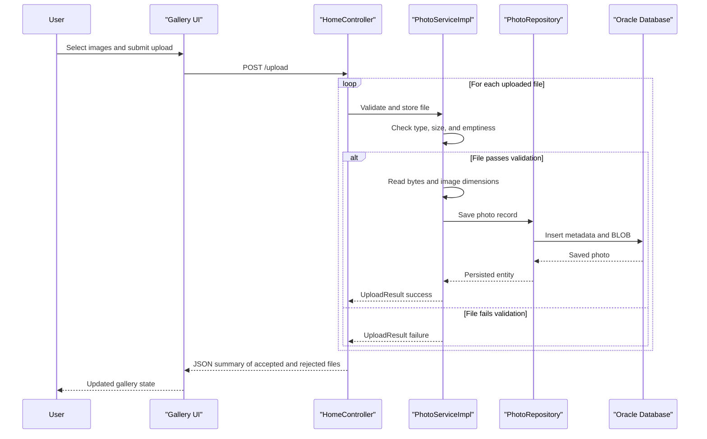

# Core Business Workflows

This application lets users upload image files, browse them in a gallery, inspect a single photo in detail, and remove photos they no longer want to keep. The core workflows revolve around validating uploads, persisting image content, and serving stored photo metadata back into the UI.

## Domain Entities

| Entity | Service / Bounded Context | Description | Key Relationships |
|------|------|------|------|
| `Photo` | `photo-album` / Photo Management | Primary business object representing an uploaded image and its display metadata | Used by gallery, detail, navigation, delete, and file-serving flows |
| `UploadResult` | `photo-album` / Upload Processing | Outcome model describing whether a submitted file was accepted or rejected | Produced during upload workflow and included in the JSON response |

## Service-to-Domain Mapping

| Service | Domain Context | Owned Entities | External Dependencies |
|------|------|------|------|
| `photo-album` | Photo gallery management | `Photo`, `UploadResult` | Oracle database via JPA repository |

## Primary Workflows

### Workflow 1: Upload photos to the gallery

Users submit one or more image files through the gallery page. The application validates each file's presence, MIME type, size, and readability; extracts image dimensions where possible; saves the photo bytes and metadata to the database; and then returns a JSON payload listing successful and failed uploads.

Key business rules involved:
- Uploads fail if no files are provided.
- A file is rejected unless its content type is one of JPEG, PNG, GIF, or WebP.
- A file is rejected if it exceeds the configured size limit or is empty.
- Successfully stored photos are immediately reloaded so the response includes persisted metadata such as the generated identifier.

### Workflow 2: Browse the gallery and open photo details

When users open the home page, the application retrieves all photos sorted by newest upload time and renders them in the gallery. Selecting a photo opens the detail page, where the service loads the current photo plus the next and previous photos to support navigation.

Key business rules involved:
- Missing or blank photo IDs redirect the user back to the gallery.
- Requests for unknown photos also redirect back to the gallery rather than showing a stack trace.
- Navigation depends on upload timestamps so users move chronologically between photos.

### Workflow 3: Delete a photo

From the detail page, users can delete the displayed photo. The service first confirms the record exists, removes it from the database, and then redirects back to the gallery with a success or error flash message.

Key business rules involved:
- A delete request for a nonexistent photo returns a user-visible not-found message.
- Any storage failure is surfaced as a generic retry-friendly error message.

## Cross-Service Data Flows

No cross-service aggregation or composition flow was detected because the repository contains a single deployable application. All business data flows stay inside the same process: controllers orchestrate user interactions, `PhotoServiceImpl` applies the business rules, and `PhotoRepository` persists or retrieves the data from Oracle.

## Business Workflow Sequence

## Business Rules & Decision Logic

- **Validation rules:** Files must be present, non-empty, within the configured size limit, and within the allowed MIME type list.
- **Decision logic:** Upload processing branches on validation success or failure for each file and records both accepted and rejected outcomes in the same response.
- **State transitions:** A photo moves from user-submitted file to persisted gallery item once the service saves it and assigns a UUID identifier.
- **Data integrity:** The service stores both the binary content and its metadata together, ensuring detail views and image serving work from a single source of truth.
- **Transactions:** The service is annotated with `@Transactional`, so photo create and delete operations execute inside Spring-managed transaction boundaries.
- **Authorization:** No business-level authorization rules were detected; all users appear able to upload, view, and delete photos.
