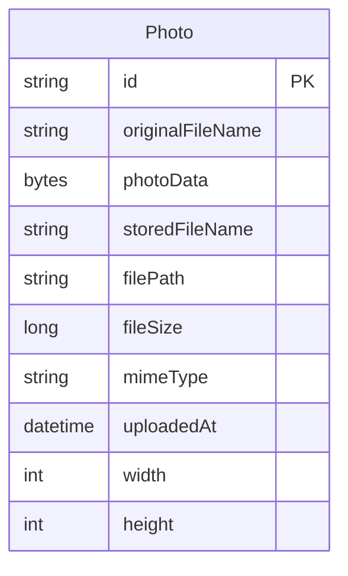

# Data Architecture & Persistence Layer

This application has a compact data layer built around a single JPA entity and one Oracle-backed table. Persistence uses Spring Data JPA with Hibernate for entity management, while repository methods rely heavily on Oracle-specific native SQL for query behavior.

## Database Configuration

| Service/Module | DB Type | Profile | Driver | Connection | Migration Tool |
|------|------|------|------|------|------|
| `photo-album` | Oracle | default | Oracle JDBC (`ojdbc8`) | JDBC URL points to `oracle-db:1521/FREEPDB1` in the main application config | None detected |
| `photo-album` | Oracle | `docker` | Oracle JDBC (`ojdbc8`) | JDBC URL points to `oracle-db:1521:XE` in the Docker profile config | None detected |
| `photo-album` tests | H2 in-memory | test | H2 JDBC driver | In-memory `jdbc:h2:mem:testdb` used for tests | None detected |

## Data Ownership per Service

| Service | Tables Owned | ORM Framework | Caching | Notes |
|------|------|------|------|------|
| `photo-album` | `photos` | JPA/Hibernate via Spring Data JPA | None detected | Single-service ownership; image bytes and metadata are stored together in one table |

## Entity Model

`Photo` is the only persisted entity detected in the application source. It is stored in the `photos` table, includes an index on `uploaded_at`, and uses a UUID string identifier generated inside the entity constructor.

## Key Repository Methods

| Service | Repository | Notable Methods | Purpose |
|------|------|------|------|
| `photo-album` | `PhotoRepository` (`src/main/java/com/photoalbum/repository/PhotoRepository.java`) | `findAllOrderByUploadedAtDesc()` | Returns gallery data sorted newest-first for the home page |
| `photo-album` | `PhotoRepository` | `findPhotosUploadedBefore(LocalDateTime uploadedAt)` | Loads older photos to support previous-photo navigation |
| `photo-album` | `PhotoRepository` | `findPhotosUploadedAfter(LocalDateTime uploadedAt)` | Loads newer photos to support next-photo navigation |
| `photo-album` | `PhotoRepository` | `findPhotosByUploadMonth(String year, String month)` | Oracle-specific query that filters uploads by year and month |
| `photo-album` | `PhotoRepository` | `findPhotosWithPagination(int startRow, int endRow)` | Oracle `ROWNUM` pagination helper |
| `photo-album` | `PhotoRepository` | `findPhotosWithStatistics()` | Oracle analytical query for ranking and running totals |

## Caching Strategy

No application caching layer was detected. There are no `@Cacheable` annotations, cache providers, second-level Hibernate cache configuration, or explicit cache regions in the inspected source and configuration files. Every gallery, detail, delete, and photo-bytes request reads directly from the repository and backing database.

## Data Ownership Boundaries

The data-store topology is simple: one web application owns one shared database schema and does not exchange persisted data with any other first-party service. All reads and writes happen through the in-process service and repository layers; no REST-based data composition or cross-service database access patterns were found.

### Data Classification & Sensitivity

| Entity | Sensitive Fields | Classification (PII/PHI/PCI/None) | Controls in Place |
|------|------|------|------|
| `Photo` | `photoData`, `originalFileName` | None explicitly modeled, though uploaded image content may contain user-provided personal imagery | No application-level encryption, masking, or field-level access control detected |
