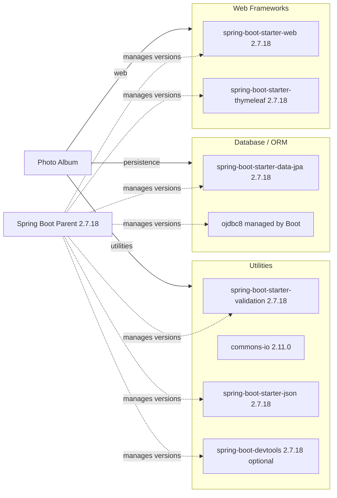

# Dependency Map

This document summarizes the Photo Album application's declared build dependencies. The project uses 8 primary runtime or optional dependencies plus 2 test-scope dependencies declared in Maven.

## Dependencies

### Dependency Summary

| Category | Count | Key Libraries | Notes |
|------|------|------|------|
| Web Frameworks | 2 | Spring Boot Web, Thymeleaf | Server-rendered MVC application with template-based UI |
| Database / ORM | 2 | Spring Data JPA, Oracle JDBC | Oracle-specific persistence with Hibernate and JDBC driver support |
| Utilities | 4 | Validation, Commons IO, Spring JSON, DevTools | Covers validation, JSON handling, local development convenience, and file utilities |

### Version & Compatibility Risks

The application is anchored on Spring Boot 2.7.18 and Java 8, both of which are older baselines for Azure modernization targets and consistent with the AppCAT findings around framework and Java upgrade work. Oracle JDBC usage and Oracle-specific SQL patterns in the codebase also increase migration effort if the application is moved to a different managed database platform.

### Notable Observations

- The Spring Boot parent POM centrally manages most dependency versions, which reduces explicit version drift but ties the stack to the Boot 2.7 line.
- The Oracle JDBC driver is runtime-scoped, reinforcing that production execution depends on an Oracle-compatible environment.
- `commons-io` is the only explicitly version-pinned third-party utility dependency outside the Spring Boot managed set.
- No dedicated logging, caching, messaging, security, or observability libraries are declared beyond what Spring Boot starters bring transitively.

## Test Dependencies

| Framework | Version | Notes |
|------|------|------|
| `spring-boot-starter-test` | 2.7.18 | Primary Spring Boot test stack for application and integration-style tests |
| `h2` | managed by Spring Boot 2.7.18 | In-memory database used by the test profile instead of Oracle |

Total test-scope dependencies: 2

The test setup is lightweight and focused on Spring Boot application startup with an H2-backed test configuration. No additional mocking, container-based integration, or contract-testing library is declared directly in the Maven file.
