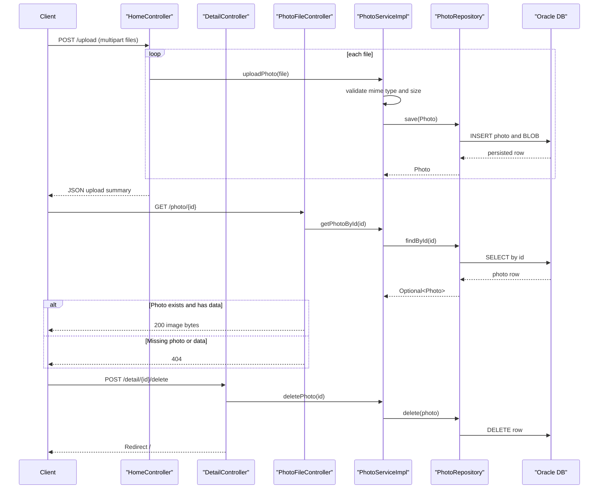

# API & Service Communication Contracts

The application exposes a small MVC and JSON API surface centered on photo listing, upload, retrieval, and deletion. Communication is synchronous in-process controller-to-service-to-repository calls with no message broker usage.

## Service Catalog

| Service | Port | Category | Purpose |
|---|---|---|---|
| photo-album (single Spring Boot module) | 8080 | API Layer + Business | Serves web UI, handles upload workflows, and manages photo persistence |

## API Endpoints Inventory

| Service | Method | Path | Request Type | Response Type |
|---|---|---|---|---|
| photo-album | GET | `/` | None | Thymeleaf `index` view with `photos` model |
| photo-album | POST | `/upload` | Multipart form (`files`: `List<MultipartFile>`) | JSON map with success/uploadedPhotos/failedUploads |
| photo-album | GET | `/detail/{id}` | Path param `id` | Thymeleaf `detail` view with photo/navigation attributes |
| photo-album | POST | `/detail/{id}/delete` | Path param `id` | Redirect to `/` with flash message |
| photo-album | GET | `/photo/{id}` | Path param `id` | Binary image payload (`Resource`) with MIME type |

## Management & Observability Endpoints

| Service | Endpoint | Custom Metrics (if any) |
|---|---|---|
| photo-album | None detected (Actuator not configured) | None detected |

## DTOs & Contracts

- **Request contract models**: Upload uses multipart request data (`MultipartFile`) instead of a typed JSON DTO.
- **Response contract models**:
  - `UploadResult` is used internally to track per-file status and then mapped into JSON response structures.
  - `Photo` instances are passed to server-rendered templates and used in binary serving operations.
- **Gateway vs service DTO split**: No API gateway module is present; all contracts are service-level within one application.
- **Immutability**: Contract models are mutable POJOs (not Java records or immutable value types).
- **OpenAPI/protobuf/graphql**: No OpenAPI spec, protobuf schema, or GraphQL schema found.
- **Serialization**: JSON serialization is handled by Spring Boot Jackson defaults for map-based upload responses.

## Communication Patterns

- **Synchronous patterns**: Controllers invoke `PhotoService` methods directly; service methods call `PhotoRepository` using Spring Data JPA.
- **Asynchronous patterns**: No async messaging or event bus usage detected.
- **Resilience patterns**: No circuit breaker/retry library configuration detected; controllers use try/catch and fallback responses/redirects.
- **Service discovery and gateway**: Not used; single deployable unit with local bean wiring.
- **Startup dependency chain impact**: API availability depends on Oracle database readiness (especially in Docker Compose via health-checked `depends_on`).
- **Security posture**: No explicit authentication, authorization, or TLS enforcement is configured at the application endpoint layer.

## Service Technology Matrix

| Service | Web | Data Access | Discovery | Gateway | Actuator | Cache | Metrics |
|---|---|---|---|---|---|---|---|
| photo-album | Spring MVC + Thymeleaf | Spring Data JPA/Hibernate + Oracle JDBC | none | none | none | none | none |

## Service Communication Sequence

