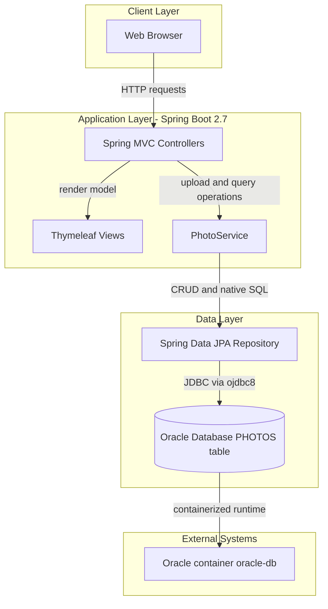
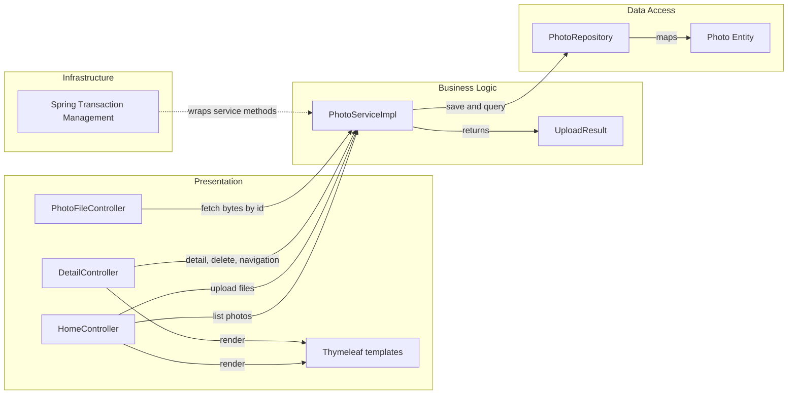

# Architecture Diagram

This document summarizes the Photo Album application's high-level architecture and key component relationships identified from the Java Spring Boot codebase.

## Application Architecture

### Technology Stack Summary

| Layer | Technology | Version | Purpose |
|---|---|---|---|
| Presentation | Spring MVC + Thymeleaf | Spring Boot 2.7.18 | Web pages and upload interactions |
| Business | PhotoService / PhotoServiceImpl | Project code | Photo upload, validation, retrieval, delete workflows |
| Data Access | Spring Data JPA + Hibernate | Spring Boot managed | Repository abstraction and ORM mapping |
| Database | Oracle Database | Oracle Free image (docker compose) | Persistent storage for photo metadata and BLOB content |
| Runtime | Java | 8 | Application runtime |

### Data Storage & External Services

The application stores photo metadata and binary image data in an Oracle `PHOTOS` table via JPA and native SQL queries. No cache, queue, or third-party API integration is defined in the codebase; the main external dependency is the Oracle database container.

### Key Architectural Decisions

- Uses server-side rendered pages (Thymeleaf) instead of SPA API-first architecture.
- Stores uploaded files as Oracle BLOB data in the same transactional datastore as metadata.
- Encapsulates business logic in a single service layer (`PhotoServiceImpl`) with transactional boundaries.

## Component Relationships

### Component Inventory

| Component | Layer | Type | Responsibility |
|---|---|---|---|
| HomeController | Presentation | MVC Controller | Loads gallery page and handles multi-file upload endpoint |
| DetailController | Presentation | MVC Controller | Displays a single photo detail view and deletes photos |
| PhotoFileController | Presentation | MVC Controller | Streams stored image bytes for `/photo/{id}` |
| PhotoServiceImpl | Business | Service | Validation, image metadata extraction, transactional photo operations |
| PhotoRepository | Data Access | Spring Data Repository | Native SQL and CRUD access to `PHOTOS` |
| Photo | Data Access | JPA Entity | Represents persisted photo metadata and BLOB payload |
