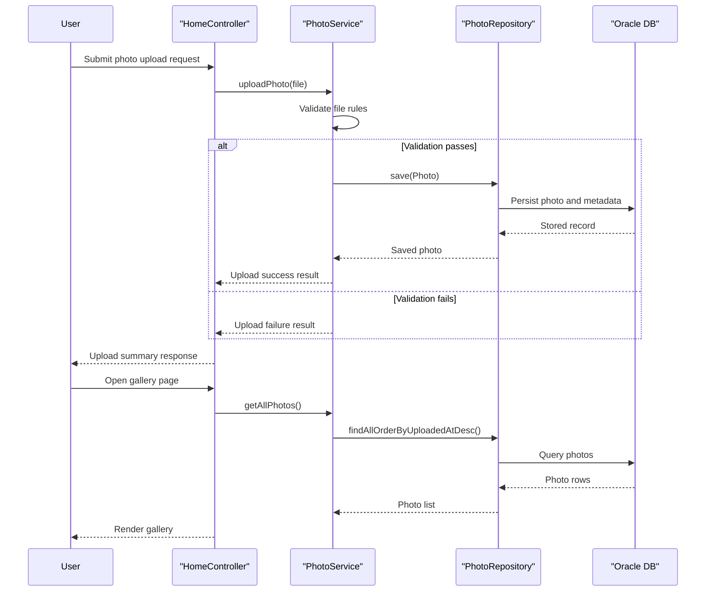

# Core Business Workflows

This application supports a photo gallery domain where users upload, browse, inspect, and delete personal images through a web interface backed by persistent photo storage.

## Domain Entities

| Entity | Service / Bounded Context | Description | Key Relationships |
|---|---|---|---|
| Photo | Photo Management | Represents a stored uploaded image and metadata used for display/navigation | Central aggregate for upload, listing, viewing, and deletion |
| UploadResult | Photo Management | Represents per-file upload outcome used to build user feedback | Produced by upload workflow and returned in upload response |

## Service-to-Domain Mapping

| Service | Domain Context | Owned Entities | External Dependencies |
|---|---|---|---|
| photo-album Spring Boot app | Photo Management | Photo, UploadResult | Oracle database via repository layer |

## Primary Workflows

### Workflow 1: Upload Photos

1. User submits one or more files from gallery page.
2. Controller validates presence of files and delegates each file to service logic.
3. Service applies business validation (allowed MIME types, size limits, non-empty file).
4. Service extracts image dimensions when possible and persists photo metadata plus binary data.
5. Controller returns success and failure details for each attempted upload.

### Workflow 2: Browse Gallery and View Photo Details

1. User opens home page to retrieve all photos ordered by upload date.
2. User selects a photo detail page.
3. Service fetches selected photo and computes previous/next navigation candidates.
4. View renders metadata and navigation controls.

### Workflow 3: Delete Photo

1. User confirms delete action from detail page.
2. Controller requests delete by photo id.
3. Service verifies entity existence and deletes from persistence.
4. User is redirected to home page with success or error flash messaging.

## Cross-Service Data Flows

No cross-service aggregation is present because the solution is a single deployable service. Data composition occurs only within the application when a controller combines repository results (for example detail view + previous/next navigation) before rendering UI responses.

## Business Workflow Sequence

## Business Rules & Decision Logic

- Only JPEG/PNG/GIF/WebP uploads are accepted.
- File size must be non-zero and must not exceed configured max size.
- Deletion only succeeds when target photo id exists.
- Detail navigation computes previous/next photo from upload timestamp ordering.
- Transaction boundaries are enforced at service layer for consistency of write operations.
